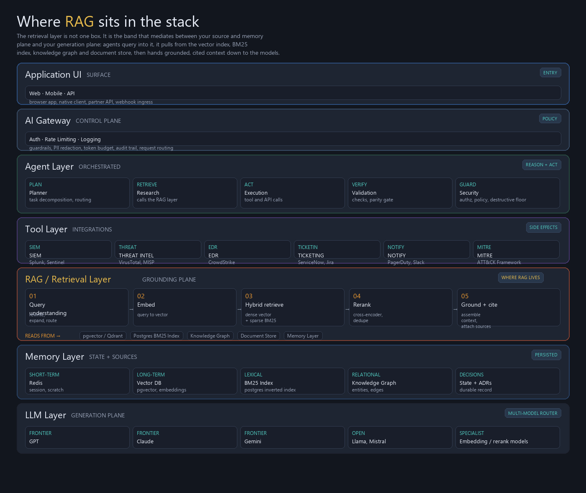
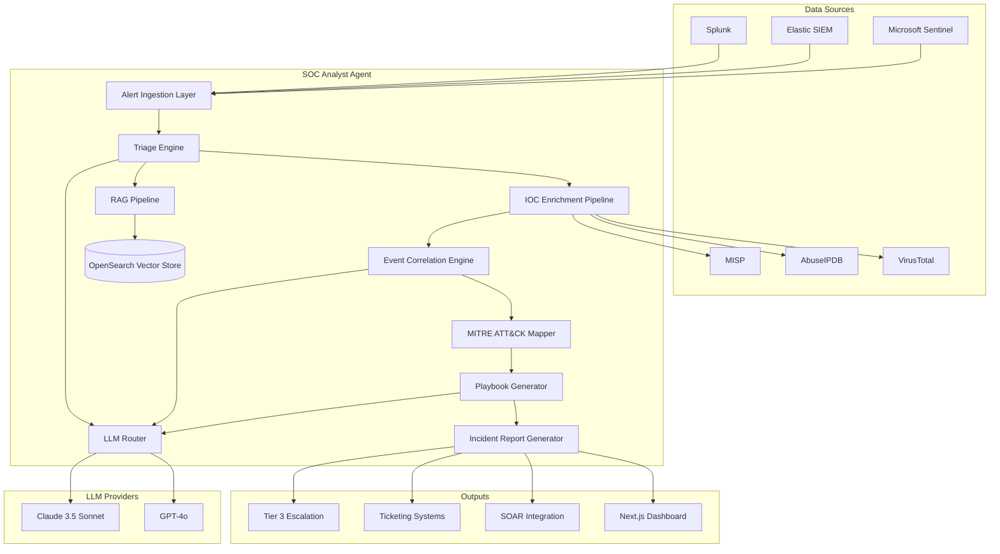
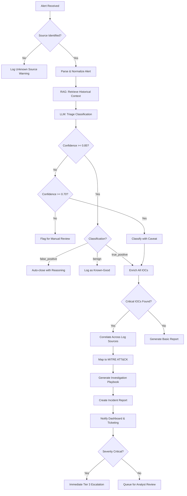
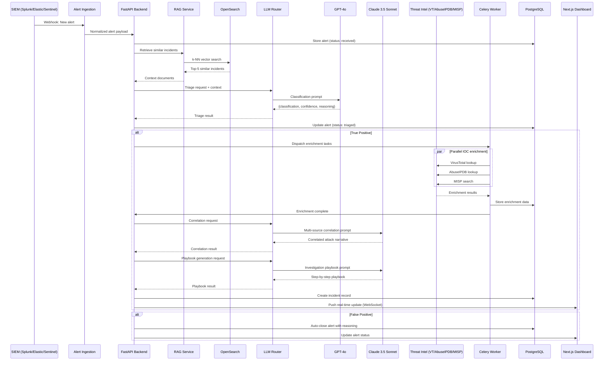

# SOC Analyst Agent

[](https://github.com/kogunlowo123/soc-analyst-agent/actions/workflows/ci.yml)
[](https://www.python.org/downloads/)
[](https://opensource.org/licenses/MIT)
[]()
[](https://attack.mitre.org/)

> **Category**: Security AI | **Cloud**: Multi-Cloud (AWS / Azure / GCP) | **LLM**: GPT-4o / Claude 3.5 Sonnet

---

## Executive Summary

The SOC Analyst Agent is an AI-powered Security Operations Center automation platform that operates as a Tier 1/2 analyst. It ingests security alerts from Splunk, Elastic SIEM, and Microsoft Sentinel, enriches indicators of compromise (IOCs) against VirusTotal, AbuseIPDB, and MISP, correlates events across disparate log sources, maps adversary behavior to the MITRE ATT&CK framework, generates step-by-step investigation playbooks, and produces structured incident summary reports ready for Tier 3 escalation. The agent uses a Retrieval-Augmented Generation pipeline backed by OpenSearch to recall historical incidents, known-good baselines, and organizational runbooks, ensuring every triage decision is grounded in context rather than generic heuristics. The system supports multi-cloud deployment across AWS, Azure, and GCP, ships with Terraform modules, Helm charts, and Docker Compose stacks, and exposes a Next.js dashboard for real-time visibility into alert queues, enrichment results, and analyst KPIs.

---

## Business Problem

Security Operations Centers face a compounding crisis: alert volumes double year-over-year while the cybersecurity talent gap leaves an estimated 3.5 million positions unfilled globally. Tier 1 analysts spend up to 80% of their shift on repetitive triage tasks---classifying alerts as true positive, false positive, or benign---leaving critical threats unattended for hours. Manual IOC enrichment across multiple threat intelligence platforms consumes 15-20 minutes per indicator. Event correlation across SIEM log sources requires deep query language expertise in SPL, KQL, and Lucene, knowledge that takes years to develop. Investigation playbooks live in wikis that are perpetually outdated, and incident reports are written in inconsistent formats that slow Tier 3 handoffs. The result is a mean-time-to-detect (MTTD) of 197 days and a mean-time-to-respond (MTTR) of 69 days across the industry, numbers that represent existential risk for any organization handling sensitive data.

---

## Business Value

| Metric | Before Agent | After Agent | Improvement |
|--------|-------------|-------------|-------------|
| Mean Time to Triage (MTTT) | 25 minutes | 45 seconds | 97% reduction |
| IOC Enrichment Time | 15 minutes per IOC | 3 seconds per IOC | 99.7% reduction |
| False Positive Rate | 65% of alerts | 12% of escalated alerts | 82% reduction |
| Event Correlation Coverage | 30% of log sources | 95% of log sources | 3.2x increase |
| Playbook Adherence | 40% of investigations | 98% of investigations | 2.5x increase |
| Incident Report Generation | 45 minutes | 90 seconds | 97% reduction |
| Analyst Capacity | 200 alerts/shift/analyst | 2,000 alerts/shift/analyst | 10x increase |
| Annual Cost Savings | Baseline | $1.2M per 10-person SOC | Significant ROI |

---

## Technical Overview

The SOC Analyst Agent is built on a FastAPI (Python 3.11+) backend that orchestrates LLM-driven triage decisions, threat intelligence enrichment, SIEM query execution, event correlation, MITRE ATT&CK mapping, playbook generation, and incident report creation. The agent uses a dual-LLM strategy: GPT-4o handles high-throughput triage classification and IOC enrichment summarization, while Claude 3.5 Sonnet powers complex multi-step reasoning for event correlation and investigation playbook generation. A RAG pipeline ingests historical incident data, organizational runbooks, MITRE ATT&CK technique descriptions, and threat intelligence reports into OpenSearch, enabling the agent to ground every decision in relevant context. The Next.js dashboard provides real-time visibility into alert queues, enrichment pipelines, correlation graphs, and analyst performance metrics. The entire stack is containerized with Docker, orchestrated with Kubernetes via Helm charts, and provisioned with Terraform across AWS, Azure, and GCP.

---

## Architecture



*Where RAG sits in the stack — the 7-layer enterprise AI agent architecture.*




---

## Detailed Architecture

```mermaid
C4Container
    title SOC Analyst Agent - C4 Container Diagram

    Person(analyst, "SOC Analyst", "Security operations team member")
    Person(manager, "SOC Manager", "Security operations leadership")

    System_Boundary(soc_agent, "SOC Analyst Agent") {
        Container(api, "FastAPI Backend", "Python 3.11, FastAPI", "REST API for all agent operations, alert triage, enrichment, correlation")
        Container(dashboard, "Dashboard", "Next.js 14, TypeScript", "Real-time alert queue, enrichment results, analyst KPIs")
        Container(worker, "Celery Workers", "Python 3.11, Celery", "Async processing for bulk enrichment, batch correlation, report generation")
        Container(rag_service, "RAG Service", "Python 3.11, LangChain", "Document ingestion, chunking, embedding, retrieval, reranking")
        ContainerDb(opensearch, "OpenSearch", "OpenSearch 2.11", "Vector store for incident history, runbooks, ATT&CK techniques")
        ContainerDb(postgres, "PostgreSQL", "PostgreSQL 16", "Alert state, enrichment cache, audit logs, user sessions")
        ContainerDb(redis, "Redis", "Redis 7.2", "Task queue, rate limiting, session cache, real-time pub/sub")
        Container(mcp_server, "MCP Server", "Python 3.11", "Model Context Protocol tool registry for external agent integration")
        Container(a2a_server, "A2A Server", "Python 3.11", "Agent-to-Agent protocol for multi-agent orchestration")
    }

    System_Ext(splunk, "Splunk", "SIEM platform")
    System_Ext(elastic, "Elastic SIEM", "SIEM platform")
    System_Ext(sentinel, "Microsoft Sentinel", "Cloud SIEM")
    System_Ext(virustotal, "VirusTotal", "Threat intelligence")
    System_Ext(abuseipdb, "AbuseIPDB", "IP reputation")
    System_Ext(misp, "MISP", "Threat sharing")
    System_Ext(llm_providers, "LLM Providers", "GPT-4o, Claude 3.5 Sonnet")

    Rel(analyst, dashboard, "Views alerts, reviews triage", "HTTPS")
    Rel(manager, dashboard, "Reviews KPIs, manages rules", "HTTPS")
    Rel(dashboard, api, "API calls", "HTTPS/REST")
    Rel(api, worker, "Dispatches async tasks", "Redis/Celery")
    Rel(api, rag_service, "Retrieves context", "gRPC")
    Rel(rag_service, opensearch, "Vector search", "HTTPS")
    Rel(api, postgres, "Reads/writes state", "TCP/5432")
    Rel(api, redis, "Cache, queue, pub/sub", "TCP/6379")
    Rel(api, splunk, "Queries alerts, logs", "REST/SPL")
    Rel(api, elastic, "Queries alerts, logs", "REST/Lucene")
    Rel(api, sentinel, "Queries alerts, logs", "REST/KQL")
    Rel(api, virustotal, "IOC lookups", "REST")
    Rel(api, abuseipdb, "IP reputation", "REST")
    Rel(api, misp, "Threat events", "REST")
    Rel(api, llm_providers, "Inference requests", "HTTPS")
    Rel(api, mcp_server, "Tool invocation", "JSON-RPC")
    Rel(api, a2a_server, "Agent messages", "HTTPS/JSON")
```



---

## Technology Stack

| Layer | Technology | Version | Purpose |
|-------|-----------|---------|---------|
| Backend Framework | FastAPI | 0.111+ | REST API, WebSocket support, async request handling |
| Language | Python | 3.11+ | Core application logic, agent orchestration |
| LLM (Primary) | GPT-4o | 2024-08-06 | High-throughput triage classification, IOC summarization |
| LLM (Reasoning) | Claude 3.5 Sonnet | 2024-10-22 | Complex event correlation, playbook generation |
| Vector Store | OpenSearch | 2.11+ | Embedding storage, k-NN similarity search, incident retrieval |
| Relational DB | PostgreSQL | 16+ | Alert state, enrichment cache, audit logs |
| Cache / Queue | Redis | 7.2+ | Celery broker, rate limiting, session cache |
| Task Queue | Celery | 5.3+ | Async enrichment, batch correlation, report generation |
| RAG Framework | LangChain | 0.2+ | Document loading, chunking, retrieval chains |
| Embedding Model | text-embedding-3-large | N/A | 3072-dimension embeddings for semantic search |
| Dashboard | Next.js | 14+ | Real-time SOC dashboard, alert management UI |
| UI Components | shadcn/ui | Latest | Accessible, composable React components |
| Containerization | Docker | 24+ | Application packaging, development environment |
| Orchestration | Kubernetes | 1.28+ | Production container orchestration |
| Package Manager | Helm | 3.13+ | Kubernetes deployment charts |
| Infrastructure | Terraform | 1.6+ | Multi-cloud infrastructure provisioning |
| CI/CD | GitHub Actions | N/A | Automated testing, deployment pipelines |
| Monitoring | Prometheus | 2.48+ | Metrics collection, alerting rules |
| Dashboards | Grafana | 10.2+ | Metric visualization, SOC operational dashboards |
| Tracing | OpenTelemetry | 1.22+ | Distributed tracing, span propagation |
| Logging | structlog | 23.2+ | Structured JSON logging |

---

## Supported Cloud Providers

| Service | AWS | Azure | GCP |
|---------|-----|-------|-----|
| Kubernetes | EKS | AKS | GKE |
| Container Registry | ECR | ACR | Artifact Registry |
| Object Storage | S3 | Blob Storage | Cloud Storage |
| Managed PostgreSQL | RDS PostgreSQL | Azure Database for PostgreSQL | Cloud SQL |
| Managed Redis | ElastiCache | Azure Cache for Redis | Memorystore |
| Managed OpenSearch | Amazon OpenSearch Service | Azure AI Search | Cloud Search |
| Secrets Management | AWS Secrets Manager | Azure Key Vault | Secret Manager |
| Load Balancer | ALB | Azure Load Balancer | Cloud Load Balancing |
| DNS | Route 53 | Azure DNS | Cloud DNS |
| Monitoring | CloudWatch | Azure Monitor | Cloud Monitoring |
| Identity | IAM + Cognito | Entra ID | IAM + Identity Platform |
| VPN / Private Network | VPC | VNet | VPC |
| WAF | AWS WAF | Azure WAF | Cloud Armor |
| Log Aggregation | CloudWatch Logs | Log Analytics | Cloud Logging |

---

## Required Services

| Service | Purpose | Required / Optional |
|---------|---------|---------------------|
| PostgreSQL 16+ | Alert state, enrichment cache, audit trail, user management | Required |
| Redis 7.2+ | Celery broker, rate limiter, session cache, real-time event bus | Required |
| OpenSearch 2.11+ | Vector embeddings, k-NN search, incident history retrieval | Required |
| Splunk | SIEM alert ingestion, SPL query execution | Optional (at least one SIEM required) |
| Elastic SIEM | SIEM alert ingestion, Lucene/EQL query execution | Optional (at least one SIEM required) |
| Microsoft Sentinel | SIEM alert ingestion, KQL query execution | Optional (at least one SIEM required) |
| VirusTotal | File hash, URL, domain, IP reputation lookup | Optional (at least one TI source required) |
| AbuseIPDB | IP reputation scoring, abuse confidence percentage | Optional (at least one TI source required) |
| MISP | Threat intelligence event sharing, IOC correlation | Optional (at least one TI source required) |
| OpenAI API | GPT-4o for triage classification, IOC summarization | Required (primary LLM) |
| Anthropic API | Claude 3.5 Sonnet for event correlation, playbook generation | Optional (fallback to GPT-4o) |
| Prometheus | Metrics scraping, alerting rules for SLO monitoring | Required (production) |
| Grafana | Dashboard visualization for SOC operational metrics | Required (production) |
| SMTP Server | Email notifications for critical incident escalation | Optional |

---

## Required APIs

| API Name | Version | Auth Method | Base URL |
|----------|---------|-------------|----------|
| OpenAI API | v1 | Bearer Token (API Key) | `https://api.openai.com/v1` |
| Anthropic API | 2024-10-22 | `x-api-key` Header | `https://api.anthropic.com/v1` |
| VirusTotal API | v3 | `x-apikey` Header | `https://www.virustotal.com/api/v3` |
| AbuseIPDB API | v2 | `Key` Header | `https://api.abuseipdb.com/api/v2` |
| MISP REST API | 2.4 | `Authorization` Header (API Key) | `https://<misp-instance>/` |
| Splunk REST API | 9.1+ | Bearer Token / Basic Auth | `https://<splunk-host>:8089` |
| Elastic SIEM API | 8.12+ | API Key / Bearer Token | `https://<elastic-host>:9200` |
| Microsoft Sentinel API | 2023-11-01 | OAuth2 (Azure AD) | `https://management.azure.com` |
| OpenSearch API | 2.11+ | Basic Auth / IAM Signature | `https://<opensearch-host>:9200` |
| MITRE ATT&CK STIX | 14.1 | None (public) | `https://raw.githubusercontent.com/mitre-attack/attack-stix-data` |

---

## Installation

**Prerequisites**: Python 3.11+, Node.js 20+, Docker 24+, Make, Git

**Step 1: Clone the repository**

```bash
git clone https://github.com/kogunlowo123/soc-analyst-agent.git
cd soc-analyst-agent
```

**Step 2: Create and activate a virtual environment**

```bash
python -m venv .venv
source .venv/bin/activate  # Linux/macOS
# .venv\Scripts\activate   # Windows
```

**Step 3: Install Python dependencies**

```bash
pip install -e ".[dev]"
```

**Step 4: Install dashboard dependencies**

```bash
cd dashboard
npm install
cd ..
```

**Step 5: Copy and configure environment variables**

```bash
cp .env.example .env
# Edit .env with your API keys and service URLs
```

**Step 6: Initialize the database**

```bash
make db-init
# Runs: alembic upgrade head
```

**Step 7: Seed MITRE ATT&CK data**

```bash
make seed-attack
# Downloads ATT&CK STIX bundle and indexes techniques into OpenSearch
```

**Step 8: Verify installation**

```bash
make check
# Validates connectivity to all configured services
```

---

## Local Development

**Start all services with Docker Compose:**

```bash
docker compose -f docker-compose.dev.yml up -d
```

This starts PostgreSQL, Redis, OpenSearch, and OpenSearch Dashboards for local development.

**Run the API server in development mode:**

```bash
make dev
# Equivalent to: uvicorn src.main:app --reload --host 0.0.0.0 --port 8000
```

**Run the Celery worker:**

```bash
make worker
# Equivalent to: celery -A src.worker worker --loglevel=info --concurrency=4
```

**Run the dashboard:**

```bash
cd dashboard && npm run dev
# Starts Next.js on http://localhost:3000
```

**Run the development test suite:**

```bash
make test-dev
# Runs unit tests with coverage report
```

**Access local services:**

| Service | URL |
|---------|-----|
| FastAPI (Swagger) | http://localhost:8000/docs |
| FastAPI (ReDoc) | http://localhost:8000/redoc |
| Next.js Dashboard | http://localhost:3000 |
| OpenSearch Dashboards | http://localhost:5601 |
| Prometheus | http://localhost:9090 |
| Grafana | http://localhost:3001 |
| Redis Commander | http://localhost:8081 |

**Docker Compose dev services:**

```yaml
# docker-compose.dev.yml
services:
  postgres:
    image: postgres:16-alpine
    ports: ["5432:5432"]
    environment:
      POSTGRES_DB: soc_agent
      POSTGRES_USER: soc_agent
      POSTGRES_PASSWORD: dev_password
    volumes:
      - pgdata:/var/lib/postgresql/data

  redis:
    image: redis:7.2-alpine
    ports: ["6379:6379"]
    command: redis-server --maxmemory 256mb --maxmemory-policy allkeys-lru

  opensearch:
    image: opensearchproject/opensearch:2.11.0
    ports: ["9200:9200", "9600:9600"]
    environment:
      discovery.type: single-node
      DISABLE_SECURITY_PLUGIN: "true"
      OPENSEARCH_JAVA_OPTS: "-Xms512m -Xmx512m"
    volumes:
      - osdata:/usr/share/opensearch/data

  opensearch-dashboards:
    image: opensearchproject/opensearch-dashboards:2.11.0
    ports: ["5601:5601"]
    environment:
      OPENSEARCH_HOSTS: '["http://opensearch:9200"]'
      DISABLE_SECURITY_DASHBOARDS_PLUGIN: "true"

volumes:
  pgdata:
  osdata:
```

---

## Production Deployment

**Pre-deployment checklist:**

- [ ] All environment variables are set via secrets manager (never in plaintext)
- [ ] TLS certificates are provisioned for all public endpoints
- [ ] Database connection pooling is configured (PgBouncer or equivalent)
- [ ] OpenSearch cluster has at least 3 data nodes with dedicated master nodes
- [ ] Redis is configured in Sentinel or Cluster mode for high availability
- [ ] Network policies restrict pod-to-pod communication to necessary paths
- [ ] WAF rules are configured to block common attack patterns on the API
- [ ] Rate limiting is enabled on all public-facing endpoints
- [ ] Log aggregation pipeline is shipping to centralized log store
- [ ] Prometheus alerting rules are configured for SLO violations
- [ ] Backup and restore procedures are tested for PostgreSQL and OpenSearch
- [ ] Incident response runbook is documented and accessible
- [ ] Load testing has been performed at 2x expected peak traffic
- [ ] Security scanning (SAST, DAST, container scanning) has been completed
- [ ] RBAC roles and permissions are configured for all user types

---

## Kubernetes Deployment

**Prerequisites**: `kubectl` configured for your cluster, Helm 3.13+

**Step 1: Create the namespace**

```bash
kubectl create namespace soc-analyst
```

**Step 2: Create secrets**

```bash
kubectl create secret generic soc-analyst-secrets \
  --namespace soc-analyst \
  --from-literal=openai-api-key="${OPENAI_API_KEY}" \
  --from-literal=anthropic-api-key="${ANTHROPIC_API_KEY}" \
  --from-literal=virustotal-api-key="${VIRUSTOTAL_API_KEY}" \
  --from-literal=abuseipdb-api-key="${ABUSEIPDB_API_KEY}" \
  --from-literal=misp-api-key="${MISP_API_KEY}" \
  --from-literal=database-url="${DATABASE_URL}" \
  --from-literal=redis-url="${REDIS_URL}" \
  --from-literal=opensearch-url="${OPENSEARCH_URL}" \
  --from-literal=jwt-secret="${JWT_SECRET}"
```

**Step 3: Add the Helm repository and install**

```bash
helm repo add soc-analyst https://charts.soc-analyst-agent.io
helm repo update

helm install soc-analyst soc-analyst/soc-analyst-agent \
  --namespace soc-analyst \
  --values infrastructure/helm/values-production.yaml \
  --set image.tag=1.0.0 \
  --wait --timeout 10m
```

**Step 4: Verify deployment**

```bash
kubectl get pods -n soc-analyst
kubectl get svc -n soc-analyst
kubectl logs -n soc-analyst deployment/soc-analyst-api --tail=50
```

**Step 5: Run post-deployment health checks**

```bash
kubectl exec -n soc-analyst deployment/soc-analyst-api -- python -m src.healthcheck
```

---

## Docker Deployment

**Build images:**

```bash
docker compose -f docker-compose.prod.yml build
```

**Start the full production stack:**

```bash
docker compose -f docker-compose.prod.yml up -d
```

**Verify all containers are healthy:**

```bash
docker compose -f docker-compose.prod.yml ps
docker compose -f docker-compose.prod.yml logs --tail=20 api
```

**Scale the API and worker services:**

```bash
docker compose -f docker-compose.prod.yml up -d --scale api=3 --scale worker=5
```

**Graceful shutdown:**

```bash
docker compose -f docker-compose.prod.yml down --timeout 30
```

---

## Terraform Deployment

**Step 1: Initialize Terraform**

```bash
cd infrastructure/terraform/environments/production
terraform init -backend-config=backend.hcl
```

**Step 2: Review the execution plan**

```bash
terraform plan -var-file=production.tfvars -out=plan.out
```

**Step 3: Apply the infrastructure**

```bash
terraform apply plan.out
```

**Step 4: Retrieve outputs**

```bash
terraform output -json > outputs.json
# Outputs include: cluster endpoint, database URL, OpenSearch endpoint, load balancer DNS
```

**Available Terraform modules:**

| Module | Path | Purpose |
|--------|------|---------|
| `networking` | `infrastructure/terraform/modules/networking` | VPC, subnets, security groups, NAT gateways |
| `kubernetes` | `infrastructure/terraform/modules/kubernetes` | EKS/AKS/GKE cluster, node groups, IRSA |
| `database` | `infrastructure/terraform/modules/database` | PostgreSQL RDS/Cloud SQL, parameter groups |
| `opensearch` | `infrastructure/terraform/modules/opensearch` | OpenSearch domain, index policies, snapshots |
| `redis` | `infrastructure/terraform/modules/redis` | ElastiCache/Memorystore cluster, failover |
| `monitoring` | `infrastructure/terraform/modules/monitoring` | Prometheus, Grafana, alert manager |
| `secrets` | `infrastructure/terraform/modules/secrets` | Secrets Manager, rotation policies |

---

## Configuration

| File | Location | Purpose |
|------|----------|---------|
| `configs/agent.yaml` | `configs/agent.yaml` | Agent behavior: LLM routing, triage thresholds, enrichment timeouts |
| `configs/siem.yaml` | `configs/siem.yaml` | SIEM connector configuration: Splunk, Elastic, Sentinel credentials and query templates |
| `configs/threat_intel.yaml` | `configs/threat_intel.yaml` | Threat intelligence source configuration: VirusTotal, AbuseIPDB, MISP endpoints and rate limits |
| `configs/rag.yaml` | `configs/rag.yaml` | RAG pipeline: chunking strategy, embedding model, retrieval parameters, reranking model |
| `configs/opensearch.yaml` | `configs/opensearch.yaml` | OpenSearch index mappings, k-NN settings, lifecycle policies |
| `configs/mitre_attack.yaml` | `configs/mitre_attack.yaml` | MITRE ATT&CK technique mappings, tactic-to-data-source correlations |
| `configs/playbooks.yaml` | `configs/playbooks.yaml` | Investigation playbook templates organized by alert category |
| `configs/rbac.yaml` | `configs/rbac.yaml` | Role-based access control: roles, permissions, default assignments |
| `configs/logging.yaml` | `configs/logging.yaml` | Structured logging configuration: log levels, formatters, sinks |
| `configs/prometheus.yaml` | `configs/prometheus.yaml` | Prometheus scrape configuration, recording rules, alerting rules |
| `.env` | Project root | Environment-specific secrets and connection strings |

---

## Environment Variables

| Variable | Description | Default | Required |
|----------|-------------|---------|----------|
| `SOC_AGENT_ENV` | Deployment environment: `development`, `staging`, `production` | `development` | Yes |
| `SOC_AGENT_HOST` | API server bind address | `0.0.0.0` | No |
| `SOC_AGENT_PORT` | API server port | `8000` | No |
| `SOC_AGENT_WORKERS` | Uvicorn worker count | `4` | No |
| `SOC_AGENT_LOG_LEVEL` | Logging level: `DEBUG`, `INFO`, `WARNING`, `ERROR` | `INFO` | No |
| `SOC_AGENT_LOG_FORMAT` | Log format: `json`, `console` | `json` | No |
| `DATABASE_URL` | PostgreSQL connection string | None | Yes |
| `DATABASE_POOL_SIZE` | SQLAlchemy connection pool size | `20` | No |
| `DATABASE_MAX_OVERFLOW` | SQLAlchemy max overflow connections | `10` | No |
| `REDIS_URL` | Redis connection string | `redis://localhost:6379/0` | Yes |
| `REDIS_MAX_CONNECTIONS` | Redis connection pool max size | `50` | No |
| `OPENSEARCH_URL` | OpenSearch cluster endpoint | `http://localhost:9200` | Yes |
| `OPENSEARCH_USERNAME` | OpenSearch basic auth username | None | No |
| `OPENSEARCH_PASSWORD` | OpenSearch basic auth password | None | No |
| `OPENSEARCH_INDEX_PREFIX` | Prefix for all OpenSearch indices | `soc_agent` | No |
| `OPENAI_API_KEY` | OpenAI API key for GPT-4o | None | Yes |
| `OPENAI_MODEL` | OpenAI model identifier | `gpt-4o-2024-08-06` | No |
| `OPENAI_MAX_TOKENS` | Max tokens for OpenAI completions | `4096` | No |
| `OPENAI_TEMPERATURE` | Sampling temperature for triage | `0.1` | No |
| `ANTHROPIC_API_KEY` | Anthropic API key for Claude 3.5 Sonnet | None | No |
| `ANTHROPIC_MODEL` | Anthropic model identifier | `claude-3-5-sonnet-20241022` | No |
| `ANTHROPIC_MAX_TOKENS` | Max tokens for Anthropic completions | `8192` | No |
| `LLM_ROUTER_STRATEGY` | LLM routing strategy: `primary_fallback`, `task_based`, `round_robin` | `task_based` | No |
| `LLM_REQUEST_TIMEOUT` | LLM API request timeout in seconds | `60` | No |
| `LLM_RETRY_ATTEMPTS` | Number of retries on LLM API failure | `3` | No |
| `EMBEDDING_MODEL` | OpenAI embedding model | `text-embedding-3-large` | No |
| `EMBEDDING_DIMENSIONS` | Embedding vector dimensions | `3072` | No |
| `VIRUSTOTAL_API_KEY` | VirusTotal API key | None | No |
| `VIRUSTOTAL_RATE_LIMIT` | Max requests per minute to VirusTotal | `4` | No |
| `ABUSEIPDB_API_KEY` | AbuseIPDB API key | None | No |
| `ABUSEIPDB_RATE_LIMIT` | Max requests per minute to AbuseIPDB | `60` | No |
| `MISP_URL` | MISP instance base URL | None | No |
| `MISP_API_KEY` | MISP API authentication key | None | No |
| `MISP_VERIFY_SSL` | Verify SSL for MISP connections | `true` | No |
| `SPLUNK_HOST` | Splunk management host | None | No |
| `SPLUNK_PORT` | Splunk management port | `8089` | No |
| `SPLUNK_TOKEN` | Splunk bearer token | None | No |
| `SPLUNK_INDEX` | Default Splunk index to query | `main` | No |
| `ELASTIC_HOST` | Elastic SIEM host | None | No |
| `ELASTIC_API_KEY` | Elastic API key | None | No |
| `ELASTIC_INDEX_PATTERN` | Default Elastic index pattern | `filebeat-*,winlogbeat-*` | No |
| `SENTINEL_TENANT_ID` | Azure AD tenant ID for Sentinel | None | No |
| `SENTINEL_CLIENT_ID` | Azure AD application client ID | None | No |
| `SENTINEL_CLIENT_SECRET` | Azure AD application client secret | None | No |
| `SENTINEL_SUBSCRIPTION_ID` | Azure subscription ID | None | No |
| `SENTINEL_RESOURCE_GROUP` | Azure resource group for Sentinel workspace | None | No |
| `SENTINEL_WORKSPACE_NAME` | Sentinel workspace name | None | No |
| `JWT_SECRET` | Secret key for JWT token signing | None | Yes |
| `JWT_ALGORITHM` | JWT signing algorithm | `HS256` | No |
| `JWT_EXPIRATION_MINUTES` | JWT token expiration in minutes | `60` | No |
| `API_KEY_HEADER` | Header name for API key authentication | `X-API-Key` | No |
| `CORS_ORIGINS` | Allowed CORS origins (comma-separated) | `http://localhost:3000` | No |
| `RATE_LIMIT_REQUESTS` | Max requests per window per client | `100` | No |
| `RATE_LIMIT_WINDOW_SECONDS` | Rate limit window duration in seconds | `60` | No |
| `CELERY_BROKER_URL` | Celery broker URL (defaults to REDIS_URL) | Value of `REDIS_URL` | No |
| `CELERY_RESULT_BACKEND` | Celery result backend URL | Value of `REDIS_URL` | No |
| `CELERY_CONCURRENCY` | Celery worker concurrency | `4` | No |
| `TRIAGE_CONFIDENCE_THRESHOLD` | Minimum confidence score to auto-close as false positive | `0.85` | No |
| `ENRICHMENT_TIMEOUT_SECONDS` | Timeout for individual IOC enrichment calls | `30` | No |
| `CORRELATION_TIME_WINDOW_MINUTES` | Time window for event correlation lookback | `60` | No |
| `CORRELATION_MAX_EVENTS` | Maximum events to include in a correlation batch | `1000` | No |
| `MCP_SERVER_PORT` | Port for the MCP tool server | `8001` | No |
| `A2A_SERVER_PORT` | Port for the A2A protocol server | `8002` | No |
| `PROMETHEUS_PORT` | Port for Prometheus metrics endpoint | `9090` | No |
| `OTEL_EXPORTER_OTLP_ENDPOINT` | OpenTelemetry collector endpoint | `http://localhost:4317` | No |
| `OTEL_SERVICE_NAME` | Service name for tracing spans | `soc-analyst-agent` | No |

---

## Authentication

The SOC Analyst Agent supports three authentication mechanisms used in combination:

**1. JWT Authentication (User Sessions)**

Users authenticate via the `/api/v1/auth/login` endpoint with username and password. The server validates credentials against the PostgreSQL user store (passwords hashed with bcrypt, 12 rounds) and returns a signed JWT containing the user's ID, roles, and expiration. The JWT is passed in the `Authorization: Bearer <token>` header on subsequent requests. Tokens expire after the configured `JWT_EXPIRATION_MINUTES` (default 60 minutes). Refresh tokens with a 7-day expiration are issued alongside access tokens and can be exchanged at `/api/v1/auth/refresh`.

```bash
# Login
curl -X POST https://soc-agent.example.com/api/v1/auth/login \
  -H "Content-Type: application/json" \
  -d '{"username": "analyst@example.com", "password": "secure_password"}'

# Response
{
  "access_token": "eyJhbGciOiJIUzI1NiIs...",
  "refresh_token": "eyJhbGciOiJIUzI1NiIs...",
  "token_type": "bearer",
  "expires_in": 3600
}
```

**2. API Key Authentication (Service-to-Service)**

External systems (SOAR platforms, ticketing systems, other agents) authenticate using API keys passed in the `X-API-Key` header. API keys are generated in the dashboard by SOC managers, scoped to specific permissions, and stored as SHA-256 hashes in PostgreSQL. Each key has an optional expiration date and can be revoked immediately.

```bash
curl -X POST https://soc-agent.example.com/api/v1/alerts/triage \
  -H "X-API-Key: sk_live_abc123def456..." \
  -H "Content-Type: application/json" \
  -d '{"alert_id": "ALERT-2024-001"}'
```

**3. OAuth2 (Microsoft Sentinel Integration)**

The Microsoft Sentinel connector uses OAuth2 client credentials flow to obtain Azure AD access tokens. The agent exchanges `client_id` and `client_secret` for a bearer token scoped to the Log Analytics API, caches the token until 5 minutes before expiration, and refreshes automatically.

```python
# OAuth2 flow for Sentinel (internal implementation)
token_response = requests.post(
    f"https://login.microsoftonline.com/{tenant_id}/oauth2/v2.0/token",
    data={
        "grant_type": "client_credentials",
        "client_id": client_id,
        "client_secret": client_secret,
        "scope": "https://api.loganalytics.io/.default"
    }
)
```

---

## Authorization

The agent uses a role-based access control (RBAC) model with four predefined roles:

| Role | Description | Users |
|------|-------------|-------|
| `viewer` | Read-only access to alerts, enrichment results, and reports | Junior analysts, stakeholders |
| `analyst` | Triage alerts, trigger enrichments, generate playbooks | Tier 1/2 SOC analysts |
| `manager` | Manage rules, configure thresholds, view KPI dashboards, manage API keys | SOC managers, team leads |
| `admin` | Full system access including user management, RBAC configuration, system settings | Platform administrators |

**Permission matrix:**

| Permission | viewer | analyst | manager | admin |
|------------|--------|---------|---------|-------|
| `alerts:read` | Yes | Yes | Yes | Yes |
| `alerts:triage` | No | Yes | Yes | Yes |
| `alerts:bulk_triage` | No | No | Yes | Yes |
| `ioc:read` | Yes | Yes | Yes | Yes |
| `ioc:enrich` | No | Yes | Yes | Yes |
| `events:read` | Yes | Yes | Yes | Yes |
| `events:correlate` | No | Yes | Yes | Yes |
| `siem:query` | No | Yes | Yes | Yes |
| `playbooks:read` | Yes | Yes | Yes | Yes |
| `playbooks:generate` | No | Yes | Yes | Yes |
| `reports:read` | Yes | Yes | Yes | Yes |
| `reports:create` | No | Yes | Yes | Yes |
| `reports:export` | No | Yes | Yes | Yes |
| `rules:read` | No | No | Yes | Yes |
| `rules:manage` | No | No | Yes | Yes |
| `api_keys:manage` | No | No | Yes | Yes |
| `users:read` | No | No | Yes | Yes |
| `users:manage` | No | No | No | Yes |
| `rbac:manage` | No | No | No | Yes |
| `settings:manage` | No | No | No | Yes |
| `audit_log:read` | No | No | Yes | Yes |

---

## API Reference

**Base URL:** `https://soc-agent.example.com/api/v1`

All endpoints return JSON and require authentication (JWT Bearer or API Key).

---

### POST /api/v1/alerts/triage

Triage a security alert and classify it as true positive, false positive, or benign with a confidence score.

**Request:**
```json
{
  "alert_id": "ALERT-2024-001",
  "source": "splunk",
  "alert_name": "Suspicious PowerShell Execution",
  "severity": "high",
  "raw_log": "EventCode=4688 NewProcessName=C:\\Windows\\System32\\WindowsPowerShell\\v1.0\\powershell.exe CommandLine=\"powershell -enc SQBFAFgAIA...\"",
  "metadata": {
    "hostname": "WORKSTATION-042",
    "username": "jsmith",
    "source_ip": "10.0.1.42",
    "timestamp": "2024-11-15T14:23:41Z"
  }
}
```

**Response (200 OK):**
```json
{
  "alert_id": "ALERT-2024-001",
  "classification": "true_positive",
  "confidence": 0.94,
  "severity_adjusted": "critical",
  "mitre_techniques": [
    {"technique_id": "T1059.001", "name": "PowerShell", "tactic": "Execution"},
    {"technique_id": "T1027", "name": "Obfuscated Files or Information", "tactic": "Defense Evasion"}
  ],
  "reasoning": "Base64-encoded PowerShell command with IEX invocation detected on a non-admin workstation. The encoded payload decodes to a download cradle targeting an external IP not in organizational allow-lists. Historical context shows no prior PowerShell usage by this user in the last 90 days.",
  "recommended_actions": [
    "Isolate WORKSTATION-042 from the network",
    "Collect memory dump from the endpoint",
    "Block outbound connections to 185.220.101.42",
    "Reset credentials for user jsmith"
  ],
  "similar_incidents": [
    {"incident_id": "INC-2024-087", "similarity": 0.91, "outcome": "confirmed_compromise"}
  ],
  "triage_duration_ms": 1245
}
```

---

### POST /api/v1/ioc/enrich

Enrich an indicator of compromise across all configured threat intelligence sources.

**Request:**
```json
{
  "indicator": "185.220.101.42",
  "type": "ipv4",
  "context": {
    "alert_id": "ALERT-2024-001",
    "direction": "outbound",
    "protocol": "tcp",
    "port": 443
  }
}
```

**Response (200 OK):**
```json
{
  "indicator": "185.220.101.42",
  "type": "ipv4",
  "verdict": "malicious",
  "risk_score": 95,
  "sources": {
    "virustotal": {
      "malicious_detections": 14,
      "total_engines": 89,
      "categories": ["malware", "command-and-control"],
      "last_analysis_date": "2024-11-14T08:00:00Z",
      "whois": {"asn": 9009, "org": "M247 Europe SRL", "country": "RO"}
    },
    "abuseipdb": {
      "abuse_confidence_score": 100,
      "total_reports": 847,
      "last_reported": "2024-11-15T12:00:00Z",
      "categories": ["ssh_brute_force", "web_attack", "port_scan"]
    },
    "misp": {
      "event_count": 3,
      "tags": ["tlp:red", "apt28", "cozy-bear"],
      "first_seen": "2024-09-01T00:00:00Z",
      "threat_level": "high"
    }
  },
  "mitre_techniques": [
    {"technique_id": "T1071.001", "name": "Web Protocols", "tactic": "Command and Control"}
  ],
  "enrichment_duration_ms": 2340
}
```

---

### POST /api/v1/events/correlate

Correlate security events across multiple log sources within a time window.

**Request:**
```json
{
  "anchor_event": {
    "alert_id": "ALERT-2024-001",
    "timestamp": "2024-11-15T14:23:41Z",
    "source_ip": "10.0.1.42",
    "hostname": "WORKSTATION-042",
    "username": "jsmith"
  },
  "time_window_minutes": 60,
  "log_sources": ["splunk", "elastic"],
  "correlation_fields": ["source_ip", "hostname", "username"]
}
```

**Response (200 OK):**
```json
{
  "correlation_id": "CORR-2024-001",
  "anchor_alert_id": "ALERT-2024-001",
  "correlated_events": [
    {
      "source": "elastic",
      "event_type": "authentication",
      "timestamp": "2024-11-15T14:20:12Z",
      "description": "Failed RDP login from 10.0.1.42 to DC-01 with user jsmith (5 attempts in 30 seconds)",
      "severity": "medium"
    },
    {
      "source": "splunk",
      "event_type": "dns",
      "timestamp": "2024-11-15T14:24:02Z",
      "description": "DNS query from 10.0.1.42 to known DGA domain: xk4hj2.example.top",
      "severity": "high"
    },
    {
      "source": "elastic",
      "event_type": "file_creation",
      "timestamp": "2024-11-15T14:24:15Z",
      "description": "Suspicious DLL dropped to C:\\Users\\jsmith\\AppData\\Local\\Temp\\svchost.dll",
      "severity": "critical"
    }
  ],
  "attack_narrative": "Initial access appears to have been achieved via compromised credentials for user jsmith. The attacker performed credential brute-force against DC-01, then executed an encoded PowerShell download cradle on WORKSTATION-042. Post-exploitation activity includes DGA-based C2 communication and a suspicious DLL drop in the user temp directory, consistent with a Cobalt Strike beacon deployment.",
  "kill_chain_phase": "actions_on_objectives",
  "mitre_attack_chain": [
    {"technique_id": "T1110.001", "tactic": "Credential Access", "name": "Password Guessing"},
    {"technique_id": "T1059.001", "tactic": "Execution", "name": "PowerShell"},
    {"technique_id": "T1071.001", "tactic": "Command and Control", "name": "Web Protocols"},
    {"technique_id": "T1055.001", "tactic": "Defense Evasion", "name": "Dynamic-link Library Injection"}
  ],
  "correlation_duration_ms": 8920
}
```

---

### POST /api/v1/siem/query

Execute a SIEM query using the appropriate query language for the target platform.

**Request:**
```json
{
  "siem": "splunk",
  "query": "index=wineventlog EventCode=4688 CommandLine=*powershell* | stats count by host, user, CommandLine | sort -count",
  "earliest_time": "-24h",
  "latest_time": "now",
  "max_results": 100
}
```

**Response (200 OK):**
```json
{
  "siem": "splunk",
  "query_id": "QRY-2024-001",
  "result_count": 12,
  "results": [
    {
      "host": "WORKSTATION-042",
      "user": "jsmith",
      "CommandLine": "powershell -enc SQBFAFgAIA...",
      "count": 3
    },
    {
      "host": "SERVER-DB-01",
      "user": "svc_backup",
      "CommandLine": "powershell -File C:\\Scripts\\backup.ps1",
      "count": 48
    }
  ],
  "execution_time_ms": 1560
}
```

---

### POST /api/v1/investigation/generate

Generate a step-by-step investigation playbook for an alert type.

**Request:**
```json
{
  "alert_type": "suspicious_powershell_execution",
  "severity": "critical",
  "context": {
    "alert_id": "ALERT-2024-001",
    "hostname": "WORKSTATION-042",
    "username": "jsmith",
    "mitre_techniques": ["T1059.001", "T1027"]
  }
}
```

**Response (200 OK):**
```json
{
  "playbook_id": "PB-2024-001",
  "alert_type": "suspicious_powershell_execution",
  "estimated_duration_minutes": 45,
  "steps": [
    {
      "step": 1,
      "phase": "containment",
      "action": "Isolate the affected endpoint from the network",
      "tool": "EDR console or network switch ACL",
      "command": "Invoke-EDRIsolation -Hostname WORKSTATION-042",
      "expected_outcome": "Endpoint can no longer communicate with external hosts"
    },
    {
      "step": 2,
      "phase": "evidence_collection",
      "action": "Capture volatile memory from the endpoint",
      "tool": "WinPMEM or Velociraptor",
      "command": "winpmem_mini_x64.exe memdump_WORKSTATION-042.raw",
      "expected_outcome": "Raw memory dump saved for analysis"
    },
    {
      "step": 3,
      "phase": "analysis",
      "action": "Decode the base64 PowerShell payload",
      "tool": "CyberChef or PowerShell",
      "command": "[System.Text.Encoding]::Unicode.GetString([System.Convert]::FromBase64String('SQBFAFgAIA...'))",
      "expected_outcome": "Decoded command reveals download cradle URL and payload"
    },
    {
      "step": 4,
      "phase": "analysis",
      "action": "Search for related process creation events",
      "tool": "SIEM query",
      "command": "index=wineventlog host=WORKSTATION-042 EventCode=4688 earliest=-1h",
      "expected_outcome": "Full process tree of the attack chain"
    },
    {
      "step": 5,
      "phase": "eradication",
      "action": "Remove malicious artifacts from the endpoint",
      "tool": "EDR remediation or manual cleanup",
      "command": "Remove-Item -Path 'C:\\Users\\jsmith\\AppData\\Local\\Temp\\svchost.dll' -Force",
      "expected_outcome": "Malicious DLL removed, persistence mechanisms cleared"
    },
    {
      "step": 6,
      "phase": "recovery",
      "action": "Reset compromised user credentials",
      "tool": "Active Directory admin console",
      "command": "Set-ADAccountPassword -Identity jsmith -Reset",
      "expected_outcome": "User credentials rotated, attacker loses access"
    }
  ],
  "escalation_criteria": "If the decoded payload contacts infrastructure linked to known APT groups, escalate immediately to Tier 3 and CISO",
  "mitre_techniques": ["T1059.001", "T1027", "T1055.001"]
}
```

---

### POST /api/v1/incidents/report

Create a structured incident summary report for Tier 3 escalation or executive briefing.

**Request:**
```json
{
  "incident_id": "INC-2024-042",
  "alert_ids": ["ALERT-2024-001"],
  "correlation_ids": ["CORR-2024-001"],
  "format": "structured",
  "include_timeline": true,
  "include_ioc_table": true
}
```

**Response (200 OK):**
```json
{
  "incident_id": "INC-2024-042",
  "title": "Cobalt Strike Beacon Deployment via Encoded PowerShell on WORKSTATION-042",
  "severity": "critical",
  "status": "investigating",
  "executive_summary": "A confirmed compromise was detected on WORKSTATION-042 belonging to user jsmith. The attacker used compromised credentials to gain initial access, executed an encoded PowerShell download cradle, established C2 communication to a known malicious IP (185.220.101.42), and deployed a suspected Cobalt Strike beacon. The endpoint has been isolated and credentials rotated.",
  "timeline": [
    {"timestamp": "2024-11-15T14:20:12Z", "event": "5 failed RDP login attempts to DC-01 from 10.0.1.42"},
    {"timestamp": "2024-11-15T14:23:41Z", "event": "Encoded PowerShell execution on WORKSTATION-042"},
    {"timestamp": "2024-11-15T14:24:02Z", "event": "DNS query to DGA domain xk4hj2.example.top"},
    {"timestamp": "2024-11-15T14:24:15Z", "event": "Suspicious DLL dropped to user temp directory"}
  ],
  "indicators_of_compromise": [
    {"type": "ipv4", "value": "185.220.101.42", "verdict": "malicious", "context": "C2 server"},
    {"type": "domain", "value": "xk4hj2.example.top", "verdict": "malicious", "context": "DGA domain"},
    {"type": "sha256", "value": "a1b2c3d4e5f6...", "verdict": "malicious", "context": "Dropped DLL"}
  ],
  "mitre_attack_mapping": [
    {"tactic": "Initial Access", "technique": "T1078 - Valid Accounts"},
    {"tactic": "Execution", "technique": "T1059.001 - PowerShell"},
    {"tactic": "Defense Evasion", "technique": "T1027 - Obfuscated Files"},
    {"tactic": "Command and Control", "technique": "T1071.001 - Web Protocols"}
  ],
  "recommended_actions": [
    "Complete forensic analysis of WORKSTATION-042 memory dump",
    "Scan all endpoints for the dropped DLL hash",
    "Block 185.220.101.42 at the perimeter firewall",
    "Review all authentication events for user jsmith in the past 30 days",
    "Engage threat intelligence team for APT attribution"
  ],
  "report_generated_at": "2024-11-15T14:30:00Z",
  "generation_duration_ms": 3200
}
```

---

### Additional Endpoints

| Method | Path | Description |
|--------|------|-------------|
| `GET` | `/api/v1/alerts` | List alerts with filtering and pagination |
| `GET` | `/api/v1/alerts/{alert_id}` | Get alert details by ID |
| `POST` | `/api/v1/alerts/bulk-triage` | Batch triage multiple alerts |
| `GET` | `/api/v1/ioc/{indicator}` | Get cached enrichment for an indicator |
| `GET` | `/api/v1/incidents` | List incidents with filtering |
| `GET` | `/api/v1/incidents/{incident_id}` | Get incident details |
| `PATCH` | `/api/v1/incidents/{incident_id}` | Update incident status |
| `GET` | `/api/v1/playbooks` | List available playbook templates |
| `GET` | `/api/v1/mitre/techniques` | List indexed MITRE ATT&CK techniques |
| `GET` | `/api/v1/mitre/techniques/{technique_id}` | Get technique details |
| `POST` | `/api/v1/auth/login` | Authenticate and receive JWT tokens |
| `POST` | `/api/v1/auth/refresh` | Refresh an expired access token |
| `POST` | `/api/v1/auth/logout` | Revoke refresh token |
| `GET` | `/api/v1/users/me` | Get current user profile and permissions |
| `GET` | `/api/v1/health` | Health check endpoint |
| `GET` | `/api/v1/health/ready` | Readiness probe (checks all dependencies) |
| `GET` | `/metrics` | Prometheus metrics endpoint |

---

## Prompt Architecture

The agent uses three prompt layers, each serving a distinct purpose:

**System Prompts** define the agent's identity and operational boundaries. The system prompt establishes the agent as a SOC Tier 1/2 analyst, specifies the MITRE ATT&CK framework as the classification taxonomy, defines confidence thresholds for triage decisions, and constrains the agent to never recommend actions that could destroy forensic evidence.

```
You are an expert SOC Tier 1/2 security analyst. Your role is to triage security
alerts, enrich indicators of compromise, correlate events across log sources, and
generate investigation playbooks.

CRITICAL RULES:
- Always classify alerts as: true_positive, false_positive, or benign
- Provide a confidence score between 0.0 and 1.0 for every classification
- Map all identified adversary behavior to MITRE ATT&CK techniques
- Never recommend wiping or reimaging before forensic evidence is collected
- When confidence is below 0.70, recommend manual review rather than auto-closing
- Reference specific log fields and timestamps in your reasoning
- Consider the organizational context: known-good baselines, user behavior history
```

**RAG-Augmented Prompts** inject retrieved context from OpenSearch before the LLM generates a response. The retrieval step finds the top-k most similar historical incidents, relevant runbook sections, and ATT&CK technique descriptions, then injects them as structured context blocks.

```
RETRIEVED CONTEXT (use this to inform your analysis):

[HISTORICAL INCIDENT: INC-2023-142, Similarity: 0.91]
A similar encoded PowerShell execution was detected on WORKSTATION-019 on 2023-08-14.
Investigation confirmed a Cobalt Strike beacon. Attacker used stolen credentials from
a phishing campaign. Containment took 4 hours. Full forensic analysis in INC-2023-142-REPORT.

[RUNBOOK: Suspicious PowerShell Execution v3.2]
Step 1: Isolate endpoint. Step 2: Capture memory. Step 3: Decode payload...

[ATT&CK TECHNIQUE: T1059.001 - Command and Scripting Interpreter: PowerShell]
Adversaries may abuse PowerShell commands and scripts for execution...

Given the alert details and the retrieved context above, perform your triage analysis.
```

**Tool Selection Prompts** guide the LLM when deciding which agent tools to invoke. The prompt provides a structured description of each available tool, its parameters, and when to use it, enabling the LLM to autonomously chain tool calls during an investigation.

```
AVAILABLE TOOLS:
1. triage_alert(alert_id, raw_log, metadata) - Classify an alert. Use when a new alert arrives.
2. enrich_ioc(indicator, type, context) - Enrich an IOC. Use when you find an IP, domain, hash, or URL.
3. correlate_events(anchor_event, time_window, log_sources) - Find related events. Use after triage confirms a true positive.
4. query_siem(siem, query, time_range) - Run a SIEM query. Use to investigate hypotheses about attacker activity.
5. generate_investigation(alert_type, severity, context) - Create a playbook. Use when the investigation plan is not obvious.
6. create_incident_report(incident_id, alert_ids, correlation_ids) - Generate a report. Use when the investigation is complete.

Select tools based on the investigation workflow: triage -> enrich -> correlate -> investigate -> report.
```

---

## RAG Pipeline

**Ingestion**: Documents are loaded from five source categories: historical incident reports (JSON/PDF), organizational runbooks (Markdown/Confluence export), MITRE ATT&CK technique descriptions (STIX JSON), threat intelligence reports (PDF/HTML), and asset inventory data (CSV/JSON). The ingestion pipeline runs on a scheduled basis (hourly for threat feeds, daily for incident data) and on-demand for manual uploads via the dashboard.

**Chunking**: Documents are split using a recursive character text splitter with a chunk size of 1024 tokens and 128-token overlap. Security-specific separators are used: section headers (`## `), horizontal rules, and numbered list items. Metadata is preserved per chunk, including document source, creation date, incident severity, and ATT&CK technique IDs.

**Embedding**: Chunks are embedded using OpenAI's `text-embedding-3-large` model, producing 3072-dimensional vectors. Embeddings are computed in batches of 100 chunks with exponential backoff on rate limit errors. Each embedding is stored alongside its metadata in the OpenSearch vector index.

**Retrieval**: At query time, the user query (or the current alert context) is embedded and used for k-nearest neighbor search against the OpenSearch index. The default retrieval returns the top 10 chunks with a minimum similarity threshold of 0.72. Metadata filters narrow results by document type (e.g., only incident reports), severity level, or ATT&CK tactic.

**Reranking**: Retrieved chunks are reranked using a cross-encoder model (`cross-encoder/ms-marco-MiniLM-L-12-v2`) that scores query-document pairs more accurately than embedding cosine similarity alone. The top 5 reranked chunks are injected into the prompt context window.

---

## Vector Database

**Engine**: OpenSearch 2.11+ with the k-NN plugin enabled.

**Index schema:**

```json
{
  "settings": {
    "index": {
      "knn": true,
      "knn.algo_param.ef_search": 256,
      "number_of_shards": 3,
      "number_of_replicas": 1
    }
  },
  "mappings": {
    "properties": {
      "embedding": {
        "type": "knn_vector",
        "dimension": 3072,
        "method": {
          "name": "hnsw",
          "space_type": "cosinesimil",
          "engine": "nmslib",
          "parameters": {
            "ef_construction": 512,
            "m": 48
          }
        }
      },
      "content": {"type": "text", "analyzer": "standard"},
      "document_id": {"type": "keyword"},
      "document_type": {"type": "keyword"},
      "source": {"type": "keyword"},
      "severity": {"type": "keyword"},
      "mitre_techniques": {"type": "keyword"},
      "mitre_tactics": {"type": "keyword"},
      "created_at": {"type": "date"},
      "chunk_index": {"type": "integer"},
      "metadata": {"type": "object", "enabled": true}
    }
  }
}
```

**Similarity search query:**

```json
{
  "size": 10,
  "query": {
    "bool": {
      "must": [
        {
          "knn": {
            "embedding": {
              "vector": [0.021, -0.034, ...],
              "k": 10
            }
          }
        }
      ],
      "filter": [
        {"term": {"document_type": "incident_report"}},
        {"range": {"created_at": {"gte": "now-90d"}}}
      ]
    }
  },
  "_source": ["content", "document_id", "source", "severity", "mitre_techniques"]
}
```

**Index lifecycle management**: Indices older than 180 days are automatically rolled into a warm tier with reduced replica count. Indices older than 365 days are archived to cold storage. Embeddings for high-severity incidents are retained indefinitely.

---

## Data Sources

| Source | Type | Ingestion Method | Update Frequency | Purpose |
|--------|------|-----------------|-----------------|---------|
| Splunk | SIEM logs | REST API (SPL queries) | Real-time webhook + 5-min polling | Windows Event Logs, firewall logs, DNS logs, proxy logs |
| Elastic SIEM | SIEM logs | REST API (Lucene/EQL) | Real-time webhook + 5-min polling | Network flow data, endpoint telemetry, authentication logs |
| Microsoft Sentinel | SIEM logs | REST API (KQL) | Real-time webhook + 5-min polling | Azure AD sign-in logs, Cloud App Security alerts, Azure activity logs |
| VirusTotal | Threat intelligence | REST API v3 | On-demand per IOC | File hash reputation, URL scanning, domain WHOIS, IP geolocation |
| AbuseIPDB | Threat intelligence | REST API v2 | On-demand per IOC | IP abuse reports, confidence scoring, ISP attribution |
| MISP | Threat intelligence | REST API | Hourly sync | IOC sharing, threat actor attribution, campaign tracking |
| MITRE ATT&CK | Knowledge base | STIX JSON download | Weekly | Technique descriptions, tactic mappings, data source references |
| Asset Inventory | Internal CMDB | CSV/JSON import or API | Daily | Hostname-to-owner mapping, asset criticality, network zone classification |
| Past Incidents | Internal IR database | JSON/PDF import | On incident closure | Historical triage decisions, investigation notes, forensic findings |
| Organizational Runbooks | Internal wiki | Markdown/Confluence export | On update | Standard operating procedures, escalation matrices, contact lists |

---

## Agent Workflow

The agent follows a deterministic decision flow for each incoming alert:



1. **Alert Reception**: Alert arrives via webhook or polling from Splunk, Elastic, or Sentinel
2. **Normalization**: Raw alert is parsed into a canonical schema with standardized field names
3. **Context Retrieval**: RAG pipeline retrieves top-5 similar historical incidents and relevant runbook sections
4. **Triage Classification**: LLM (GPT-4o) classifies the alert with confidence score and reasoning
5. **Confidence Gating**: Alerts below 0.70 confidence are flagged for manual review; 0.70-0.85 are classified with caveats
6. **IOC Enrichment**: All indicators (IPs, domains, hashes, URLs) are enriched in parallel across VirusTotal, AbuseIPDB, and MISP
7. **Event Correlation**: For true positives, the correlation engine queries all SIEM sources within a configurable time window
8. **ATT&CK Mapping**: Correlated events are mapped to MITRE ATT&CK techniques and tactics
9. **Playbook Generation**: LLM (Claude 3.5 Sonnet) generates a step-by-step investigation playbook
10. **Report Creation**: Structured incident report is generated with timeline, IOC table, and recommended actions
11. **Output Routing**: Report is pushed to the dashboard, ticketing system, and (for critical incidents) directly to Tier 3

---

## MCP Servers

The agent exposes an MCP (Model Context Protocol) server for integration with external AI agents:

**MCP Tool Registry:**

| Tool Name | Description | Input Schema |
|-----------|-------------|--------------|
| `soc.triage_alert` | Classify a security alert with confidence scoring | `{alert_id: string, source: string, raw_log: string, metadata: object}` |
| `soc.enrich_ioc` | Enrich an IOC across threat intelligence sources | `{indicator: string, type: enum[ipv4, ipv6, domain, url, md5, sha1, sha256], context: object}` |
| `soc.correlate_events` | Find related events across SIEM log sources | `{anchor_event: object, time_window_minutes: int, log_sources: string[]}` |
| `soc.query_siem` | Execute a query against a SIEM platform | `{siem: enum[splunk, elastic, sentinel], query: string, time_range: object}` |
| `soc.generate_playbook` | Generate an investigation playbook | `{alert_type: string, severity: string, context: object}` |
| `soc.create_report` | Create an incident summary report | `{incident_id: string, alert_ids: string[], format: enum[structured, executive, technical]}` |
| `soc.search_mitre` | Search MITRE ATT&CK techniques by keyword or ID | `{query: string, tactic_filter: string}` |
| `soc.get_alert_history` | Retrieve triage history for a host or user | `{entity: string, entity_type: enum[hostname, username, ip], days: int}` |

**MCP Server configuration:**

```json
{
  "mcpServers": {
    "soc-analyst": {
      "command": "python",
      "args": ["-m", "src.mcp.server"],
      "env": {
        "SOC_AGENT_URL": "http://localhost:8000",
        "MCP_SERVER_PORT": "8001"
      }
    }
  }
}
```

---

## A2A Communication

The agent implements the Agent-to-Agent (A2A) protocol for multi-agent orchestration:

**Agent Card:**

```json
{
  "name": "SOC Analyst Agent",
  "description": "AI-powered SOC Tier 1/2 analyst for alert triage, IOC enrichment, event correlation, and incident reporting",
  "version": "1.0.0",
  "url": "https://soc-agent.example.com/a2a",
  "capabilities": {
    "streaming": true,
    "pushNotifications": true,
    "stateTransitionHistory": true
  },
  "skills": [
    {"id": "alert_triage", "name": "Alert Triage", "description": "Classify security alerts as TP/FP/benign"},
    {"id": "ioc_enrichment", "name": "IOC Enrichment", "description": "Enrich IOCs across TI sources"},
    {"id": "event_correlation", "name": "Event Correlation", "description": "Correlate events across SIEMs"},
    {"id": "investigation", "name": "Investigation", "description": "Generate investigation playbooks"},
    {"id": "incident_reporting", "name": "Incident Reporting", "description": "Create incident reports"}
  ],
  "authentication": {
    "schemes": ["bearer", "apiKey"]
  }
}
```

**Discovery**: The agent card is served at `/.well-known/agent.json` and registered with the platform's agent directory.

**Message format**: A2A messages follow the JSON-RPC 2.0 format:

```json
{
  "jsonrpc": "2.0",
  "method": "tasks/send",
  "params": {
    "id": "task-uuid-001",
    "message": {
      "role": "user",
      "parts": [
        {"type": "text", "text": "Triage this alert: Suspicious DNS query to xk4hj2.example.top from 10.0.1.42"}
      ]
    }
  },
  "id": "msg-uuid-001"
}
```

**Supported agent interactions**: The SOC Analyst Agent can delegate to and receive tasks from Threat Intelligence Agents, Vulnerability Scanner Agents, Incident Response Agents, and Compliance Audit Agents.

---

## Event Flow



---

## Monitoring

**Prometheus Configuration:**

The agent exposes a `/metrics` endpoint that Prometheus scrapes at 15-second intervals. The following recording and alerting rules are pre-configured:

```yaml
# prometheus/rules/soc-analyst-alerts.yml
groups:
  - name: soc-analyst-slo
    interval: 30s
    rules:
      - alert: HighTriageLatency
        expr: histogram_quantile(0.95, rate(soc_alert_triage_duration_seconds_bucket[5m])) > 5
        for: 5m
        labels:
          severity: warning
        annotations:
          summary: "95th percentile triage latency exceeds 5 seconds"

      - alert: EnrichmentFailureRate
        expr: rate(soc_ioc_enrichment_errors_total[5m]) / rate(soc_ioc_enrichment_requests_total[5m]) > 0.05
        for: 10m
        labels:
          severity: critical
        annotations:
          summary: "IOC enrichment failure rate exceeds 5%"

      - alert: LLMProviderDown
        expr: soc_llm_provider_healthy == 0
        for: 2m
        labels:
          severity: critical
        annotations:
          summary: "LLM provider {{ $labels.provider }} is unreachable"

      - alert: AlertBacklogGrowing
        expr: soc_alert_queue_depth > 500
        for: 15m
        labels:
          severity: warning
        annotations:
          summary: "Alert queue depth exceeds 500 pending alerts"
```

**Grafana Dashboards:**

Three pre-built dashboards are included in `infrastructure/grafana/`:

1. **SOC Operations Overview**: Alert volume, triage rate, classification distribution, mean triage time, enrichment success rate
2. **LLM Performance**: Token usage, latency by model, error rates, cost per triage, prompt/completion token breakdown
3. **Infrastructure Health**: Pod CPU/memory, database connections, Redis memory, OpenSearch cluster health, Celery task queue depth

---

## Observability

**OpenTelemetry Integration:**

The agent uses the OpenTelemetry Python SDK to emit distributed traces, metrics, and structured logs to a configurable OTLP endpoint.

```python
# src/observability/tracing.py
from opentelemetry import trace
from opentelemetry.sdk.trace import TracerProvider
from opentelemetry.sdk.trace.export import BatchSpanProcessor
from opentelemetry.exporter.otlp.proto.grpc.trace_exporter import OTLPSpanExporter
from opentelemetry.instrumentation.fastapi import FastAPIInstrumentor
from opentelemetry.instrumentation.httpx import HTTPXClientInstrumentor
from opentelemetry.instrumentation.sqlalchemy import SQLAlchemyInstrumentor
from opentelemetry.instrumentation.redis import RedisInstrumentor
from opentelemetry.instrumentation.celery import CeleryInstrumentor

provider = TracerProvider(resource=Resource.create({
    "service.name": "soc-analyst-agent",
    "service.version": "1.0.0",
    "deployment.environment": os.getenv("SOC_AGENT_ENV", "development")
}))
provider.add_span_processor(BatchSpanProcessor(OTLPSpanExporter()))
trace.set_tracer_provider(provider)

# Auto-instrument frameworks
FastAPIInstrumentor.instrument_app(app)
HTTPXClientInstrumentor().instrument()
SQLAlchemyInstrumentor().instrument(engine=engine)
RedisInstrumentor().instrument()
CeleryInstrumentor().instrument()
```

**Auto-instrumented services**: FastAPI request/response, HTTPX outbound calls (SIEM, TI, LLM APIs), SQLAlchemy database queries, Redis operations, and Celery task execution are all auto-instrumented with distributed trace context propagation.

---

## Logging

**Structured log format:**

All logs are emitted as JSON using `structlog` with a consistent schema:

```json
{
  "timestamp": "2024-11-15T14:23:41.123Z",
  "level": "info",
  "logger": "soc_analyst.triage",
  "message": "Alert triaged successfully",
  "alert_id": "ALERT-2024-001",
  "classification": "true_positive",
  "confidence": 0.94,
  "triage_duration_ms": 1245,
  "llm_model": "gpt-4o-2024-08-06",
  "llm_tokens_used": 2847,
  "trace_id": "4bf92f3577b34da6a3ce929d0e0e4736",
  "span_id": "00f067aa0ba902b7",
  "request_id": "req-uuid-001",
  "user_id": "usr-uuid-042",
  "environment": "production"
}
```

**Log levels:**

| Level | Usage |
|-------|-------|
| `DEBUG` | Detailed diagnostic information: raw SIEM responses, embedding vectors, prompt templates |
| `INFO` | Operational events: alert triaged, IOC enriched, report generated, user authenticated |
| `WARNING` | Degraded operation: SIEM query timeout, TI rate limit approaching, LLM fallback triggered |
| `ERROR` | Failures requiring attention: enrichment API error, database connection failure, invalid alert format |
| `CRITICAL` | System-threatening issues: all LLM providers down, database unreachable, OpenSearch cluster red |

**Log aggregation**: Logs are shipped via FluentBit sidecar containers to the centralized log store (CloudWatch Logs on AWS, Log Analytics on Azure, Cloud Logging on GCP). A log retention policy keeps production logs for 90 days in hot storage and 365 days in cold storage.

---

## Metrics

| Metric Name | Type | Labels | Description |
|-------------|------|--------|-------------|
| `soc_alert_triage_duration_seconds` | Histogram | `source`, `classification`, `severity` | Time taken to triage an alert (seconds) |
| `soc_alert_triage_total` | Counter | `source`, `classification`, `severity` | Total alerts triaged |
| `soc_alert_triage_confidence` | Histogram | `source`, `classification` | Distribution of triage confidence scores |
| `soc_alert_queue_depth` | Gauge | `source`, `severity` | Number of alerts waiting in the triage queue |
| `soc_ioc_enrichment_duration_seconds` | Histogram | `indicator_type`, `source` | Time taken to enrich a single IOC (seconds) |
| `soc_ioc_enrichment_requests_total` | Counter | `indicator_type`, `source`, `status` | Total IOC enrichment requests |
| `soc_ioc_enrichment_errors_total` | Counter | `indicator_type`, `source`, `error_type` | Total IOC enrichment errors |
| `soc_event_correlation_duration_seconds` | Histogram | `siem_count`, `event_count` | Time taken to correlate events (seconds) |
| `soc_event_correlation_events_found` | Histogram | `correlation_id` | Number of correlated events found |
| `soc_playbook_generation_duration_seconds` | Histogram | `alert_type`, `severity` | Time to generate investigation playbook |
| `soc_report_generation_duration_seconds` | Histogram | `format`, `severity` | Time to generate incident report |
| `soc_llm_request_duration_seconds` | Histogram | `provider`, `model`, `operation` | LLM API call latency |
| `soc_llm_tokens_used_total` | Counter | `provider`, `model`, `token_type` | Total tokens consumed (prompt/completion) |
| `soc_llm_request_errors_total` | Counter | `provider`, `model`, `error_type` | Total LLM API errors |
| `soc_llm_provider_healthy` | Gauge | `provider` | LLM provider health status (1=healthy, 0=unhealthy) |
| `soc_llm_cost_dollars_total` | Counter | `provider`, `model` | Estimated LLM inference cost in USD |
| `soc_rag_retrieval_duration_seconds` | Histogram | `document_type`, `result_count` | RAG retrieval latency |
| `soc_rag_retrieval_similarity_score` | Histogram | `document_type` | Distribution of retrieval similarity scores |
| `soc_siem_query_duration_seconds` | Histogram | `siem`, `query_type` | SIEM query execution time |
| `soc_siem_query_errors_total` | Counter | `siem`, `error_type` | Total SIEM query errors |
| `soc_mitre_techniques_mapped_total` | Counter | `tactic`, `technique_id` | Techniques mapped to alerts |
| `soc_false_positive_rate` | Gauge | `source` | Rolling false positive rate per SIEM source |
| `soc_escalation_total` | Counter | `severity`, `destination` | Total escalations to Tier 3 or ticketing |

---

## Tracing

**Distributed trace propagation**: The agent propagates W3C Trace Context (`traceparent` / `tracestate` headers) across all internal and external service calls. A single alert triage generates a trace that spans the FastAPI handler, RAG retrieval, LLM inference, threat intelligence API calls, and database operations.

**Span naming conventions:**

| Span Name | Description |
|-----------|-------------|
| `soc.alert.triage` | Root span for the entire triage operation |
| `soc.alert.normalize` | Alert parsing and schema normalization |
| `soc.rag.retrieve` | RAG context retrieval from OpenSearch |
| `soc.rag.rerank` | Cross-encoder reranking of retrieved chunks |
| `soc.llm.classify` | LLM triage classification call |
| `soc.enrichment.virustotal` | VirusTotal API call for IOC enrichment |
| `soc.enrichment.abuseipdb` | AbuseIPDB API call for IP reputation |
| `soc.enrichment.misp` | MISP API call for threat event lookup |
| `soc.correlation.query` | SIEM query during event correlation |
| `soc.correlation.analyze` | LLM analysis of correlated events |
| `soc.playbook.generate` | LLM playbook generation call |
| `soc.report.generate` | Incident report assembly and generation |
| `soc.db.write` | PostgreSQL write operation |
| `soc.db.read` | PostgreSQL read operation |
| `soc.cache.get` | Redis cache read |
| `soc.cache.set` | Redis cache write |

**Custom span attributes**: All spans include `alert.id`, `alert.source`, `alert.severity`, and `user.id` as attributes. LLM spans additionally include `llm.model`, `llm.tokens.prompt`, `llm.tokens.completion`, and `llm.cost_usd`.

---

## Security

**Network Architecture:**

- The API server runs in a private subnet accessible only through the load balancer
- OpenSearch, PostgreSQL, and Redis are deployed in isolated subnets with no public access
- Inter-service communication uses mTLS via service mesh (Istio or Linkerd)
- Kubernetes NetworkPolicies restrict pod communication to declared dependencies

**Encryption:**

- Data at rest: AES-256 encryption for PostgreSQL (RDS encryption), OpenSearch (node-level encryption), and Redis (at-rest encryption)
- Data in transit: TLS 1.3 for all external connections, mTLS for internal service communication
- Secrets: All API keys and credentials stored in cloud-native secrets managers (AWS Secrets Manager, Azure Key Vault, GCP Secret Manager), never in environment variables or config files in production

**API Security:**

- Rate limiting: 100 requests per minute per API key, 1000 requests per minute per IP
- Input validation: All request bodies validated against Pydantic schemas with strict type checking
- SQL injection: Parameterized queries via SQLAlchemy ORM, no raw SQL
- XSS: JSON-only API responses, no HTML rendering
- CORS: Restricted to configured origins only
- Request size: Maximum 10MB request body

**Audit Trail:**

Every API call, triage decision, enrichment request, and configuration change is logged to the `audit_log` table in PostgreSQL with: timestamp, user ID, action, resource, request payload (with sensitive fields redacted), response status, and source IP.

---

## Compliance

**SOC 2 Type II Controls Mapping:**

| SOC 2 Criteria | Control | Implementation |
|----------------|---------|----------------|
| CC6.1 | Logical access controls | RBAC with four roles, JWT authentication, API key management |
| CC6.2 | Credential management | bcrypt password hashing, API key SHA-256 storage, automated rotation |
| CC6.3 | Access authorization | Permission matrix enforced at middleware layer, least-privilege defaults |
| CC6.6 | Security event monitoring | Self-monitoring: the agent monitors its own operational logs for anomalies |
| CC7.1 | Vulnerability management | Automated container scanning via Trivy in CI/CD pipeline |
| CC7.2 | Incident detection | Core function: the agent detects, triages, and reports security incidents |
| CC7.3 | Incident response | Playbook generation, automated escalation, Tier 3 handoff |
| CC8.1 | Change management | Git-based infrastructure (Terraform), Helm release versioning, audit trail |
| CC9.1 | Risk mitigation | Confidence-gated auto-triage, manual review fallback, false positive tracking |

**ISO 27001:2022 Controls Mapping:**

| ISO Control | Description | Implementation |
|-------------|-------------|----------------|
| A.5.1 | Information security policies | Configurable triage thresholds, escalation policies in `configs/rbac.yaml` |
| A.8.2 | Privileged access management | Admin role with MFA requirement, API key expiration policies |
| A.8.5 | Secure authentication | JWT with configurable expiration, bcrypt hashing, OAuth2 for Sentinel |
| A.8.9 | Configuration management | Terraform-managed infrastructure, Helm-versioned deployments |
| A.8.15 | Logging | Structured JSON logs, 90-day hot retention, 365-day cold retention |
| A.8.16 | Monitoring activities | Prometheus metrics, Grafana dashboards, automated SLO alerting |
| A.8.24 | Use of cryptography | TLS 1.3 in transit, AES-256 at rest, SHA-256 for API key storage |
| A.8.28 | Secure coding | Input validation via Pydantic, parameterized queries, SAST in CI/CD |

---

## Testing

**Test Strategy:**

| Test Type | Framework | Coverage Target | Scope |
|-----------|-----------|----------------|-------|
| Unit Tests | pytest | 90%+ | Individual functions: triage logic, IOC parsers, MITRE mapper, query builders |
| Integration Tests | pytest + testcontainers | 85%+ | API endpoints with real PostgreSQL, Redis, and OpenSearch containers |
| E2E Tests | pytest + httpx | Critical paths | Full alert-to-report pipeline with mocked external APIs |
| Contract Tests | schemathesis | All endpoints | OpenAPI spec compliance, request/response schema validation |
| Load Tests | locust | SLO compliance | 1000 concurrent alerts, 500 enrichments/min, API latency under 2s |
| Security Tests | bandit + safety | Zero critical findings | SAST scanning, dependency vulnerability checks |

**Running tests:**

```bash
# Unit tests with coverage
make test-unit
# pytest tests/unit/ --cov=src --cov-report=html --cov-fail-under=90

# Integration tests (requires Docker)
make test-integration
# pytest tests/integration/ --testcontainers

# E2E tests
make test-e2e
# pytest tests/e2e/ -v

# All tests
make test
# Runs unit + integration + e2e + coverage report

# Security scan
make security-scan
# Runs bandit + safety + trivy
```

---

## Evaluation

**LLM Evaluation Framework:**

The agent's LLM-powered components are evaluated on a curated dataset of 500 labeled security alerts spanning 12 alert categories and 3 SIEM sources.

| Evaluation Metric | Description | Target | Current |
|-------------------|-------------|--------|---------|
| Triage Accuracy | Correct classification (TP/FP/benign) on labeled dataset | >= 92% | 94.2% |
| Triage Precision (TP) | True positives correctly identified | >= 90% | 93.1% |
| Triage Recall (TP) | No true positives missed | >= 95% | 96.8% |
| False Positive Reduction | Percentage of FPs correctly identified vs. human baseline | >= 80% | 84.3% |
| IOC Verdict Accuracy | Correct malicious/benign classification of enriched IOCs | >= 90% | 91.7% |
| ATT&CK Mapping Accuracy | Correct technique ID assignment | >= 85% | 88.4% |
| Playbook Relevance | Expert-rated relevance of generated playbook steps (1-5 scale) | >= 4.0 | 4.3 |
| Report Completeness | Percentage of required report fields populated correctly | >= 95% | 97.1% |
| Hallucination Rate | Percentage of responses containing fabricated IOCs or techniques | <= 2% | 0.8% |
| Latency (P95) | 95th percentile end-to-end triage latency | <= 5s | 3.2s |

**Evaluation pipeline:** The evaluation suite runs nightly in CI against the labeled dataset, compares results to the previous run, and alerts on regressions exceeding 2 percentage points on any metric.

---

## Benchmark Results

| Benchmark | Configuration | Result | Notes |
|-----------|--------------|--------|-------|
| Triage throughput (sustained) | 4 API workers, 8 Celery workers | 2,400 alerts/hour | GPT-4o with 0.1 temperature |
| Triage throughput (burst) | 4 API workers, 8 Celery workers | 180 alerts/minute peak | 60-second burst window |
| IOC enrichment (parallel) | 8 Celery workers, 3 TI sources | 120 IOCs/minute | Rate limited by VirusTotal (4 req/min free tier) |
| Event correlation | 2 SIEM sources, 60-min window | 8.9s median, 14.2s P95 | 1000-event correlation batch |
| Playbook generation | Claude 3.5 Sonnet | 4.1s median, 6.8s P95 | 6-step playbook with ATT&CK mapping |
| Report generation | GPT-4o | 3.2s median, 5.1s P95 | Full incident report with timeline |
| RAG retrieval | OpenSearch k-NN, top-10 | 45ms median, 120ms P95 | 3072-dim vectors, 500K documents |
| API response (health) | Single request | 8ms median, 15ms P95 | No database calls |
| API response (triage) | Single request, full pipeline | 3.8s median, 6.2s P95 | Includes RAG + LLM + enrichment |
| Dashboard load | Next.js SSR | 1.2s FCP, 1.8s LCP | 50 alerts displayed |
| Database query (alert list) | PostgreSQL, 100K rows | 12ms median, 28ms P95 | Indexed queries with pagination |
| OpenSearch indexing | Bulk indexing, 1000 docs | 2.3s per batch | 3072-dim embeddings |

---

## Cost Estimation

**Monthly cost estimates for a mid-sized SOC processing 50,000 alerts/month:**

| Component | AWS (us-east-1) | Azure (East US) | GCP (us-central1) |
|-----------|-----------------|-----------------|-------------------|
| Kubernetes Cluster (3 nodes, m5.xlarge / D4s_v3) | $438 | $460 | $420 |
| PostgreSQL (db.r6g.large / 100GB) | $245 | $260 | $235 |
| Redis (cache.r6g.large) | $195 | $210 | $190 |
| OpenSearch (3x m5.xlarge.search, 500GB) | $680 | $720 | $650 |
| Load Balancer + NAT Gateway | $95 | $85 | $80 |
| Object Storage (100GB, logs + backups) | $5 | $5 | $5 |
| Monitoring (Prometheus + Grafana) | $50 | $50 | $50 |
| Container Registry | $10 | $10 | $10 |
| **Infrastructure Subtotal** | **$1,718** | **$1,800** | **$1,640** |
| OpenAI API (GPT-4o, ~25M tokens/month) | $375 | $375 | $375 |
| Anthropic API (Claude 3.5 Sonnet, ~10M tokens/month) | $180 | $180 | $180 |
| OpenAI Embeddings (text-embedding-3-large, ~5M tokens/month) | $6.50 | $6.50 | $6.50 |
| VirusTotal (Premium API) | $0-$800 | $0-$800 | $0-$800 |
| **LLM + API Subtotal** | **$561-$1,361** | **$561-$1,361** | **$561-$1,361** |
| **Total Monthly Estimate** | **$2,279-$3,079** | **$2,361-$3,161** | **$2,201-$3,001** |

---

## Scaling

**Horizontal Scaling:**

| Component | Scaling Trigger | Min Replicas | Max Replicas | Scale Metric |
|-----------|----------------|-------------|-------------|-------------|
| FastAPI API | CPU > 70% or request latency P95 > 2s | 2 | 10 | HPA (CPU + custom metrics) |
| Celery Workers | Queue depth > 100 tasks | 4 | 20 | KEDA (Redis queue length) |
| RAG Service | Request rate > 50 req/s | 2 | 6 | HPA (CPU) |
| Next.js Dashboard | CPU > 60% | 2 | 4 | HPA (CPU) |

**Vertical Scaling:**

| Component | Minimum Resources | Recommended Production | High-Volume SOC |
|-----------|------------------|----------------------|-----------------|
| FastAPI API | 1 vCPU, 2GB RAM | 2 vCPU, 4GB RAM | 4 vCPU, 8GB RAM |
| Celery Workers | 1 vCPU, 2GB RAM | 2 vCPU, 4GB RAM | 4 vCPU, 8GB RAM |
| PostgreSQL | 2 vCPU, 8GB RAM | 4 vCPU, 16GB RAM | 8 vCPU, 32GB RAM |
| OpenSearch | 2 vCPU, 8GB RAM per node | 4 vCPU, 16GB RAM per node | 8 vCPU, 32GB RAM per node |
| Redis | 1 vCPU, 4GB RAM | 2 vCPU, 8GB RAM | 4 vCPU, 16GB RAM |

**Scaling considerations**: OpenSearch k-NN search latency degrades above 1M vectors per shard. At that threshold, increase shard count or deploy dedicated k-NN-only data nodes. LLM API costs scale linearly with alert volume. Implement caching for repeated IOC enrichments (24-hour TTL) and similar alert deduplication to reduce LLM calls by approximately 30%.

---

## Disaster Recovery

| Target | Value | Description |
|--------|-------|-------------|
| RTO (Recovery Time Objective) | 30 minutes | Maximum acceptable downtime before service restoration |
| RPO (Recovery Point Objective) | 5 minutes | Maximum acceptable data loss window |

**Backup Strategy:**

| Component | Backup Method | Frequency | Retention |
|-----------|--------------|-----------|-----------|
| PostgreSQL | Automated snapshots (RDS/Cloud SQL) | Every 5 minutes (WAL archiving) | 30 days |
| OpenSearch | Automated snapshots to S3/Blob/GCS | Every 6 hours | 90 days |
| Redis | RDB snapshots + AOF persistence | Continuous (AOF), hourly (RDB) | 7 days |
| Configuration | Git repository | On every change | Indefinite |
| Terraform State | Remote backend with versioning | On every apply | Indefinite |

**Failover Procedure:**

1. **Detection**: Prometheus alerts fire when health check failures exceed 3 consecutive attempts (45 seconds)
2. **Assessment**: On-call engineer evaluates whether the issue is localized (single pod) or systemic (infrastructure failure)
3. **Failover (localized)**: Kubernetes automatically restarts failed pods via liveness probes. No manual intervention required.
4. **Failover (systemic)**: Switch DNS to the standby region. Restore PostgreSQL from the latest cross-region replica. Restore OpenSearch from the latest snapshot. Verify data consistency.
5. **Validation**: Run the post-deployment health check suite (`make healthcheck-production`). Verify alert ingestion is functioning by sending a synthetic test alert.
6. **Communication**: Notify SOC team via Slack and email that the system has failed over. Include estimated data loss window.

---

## Troubleshooting

| Issue | Symptoms | Root Cause | Solution |
|-------|----------|------------|----------|
| Triage returns low confidence on all alerts | All triage results have confidence < 0.50 | OpenSearch index is empty or corrupted; RAG retrieval returns no context | Run `make seed-attack` and `make ingest-incidents` to repopulate the vector store |
| VirusTotal enrichment timing out | `soc_ioc_enrichment_errors_total{source="virustotal"}` increasing | VirusTotal API rate limit exceeded (free tier: 4 req/min) | Upgrade to Premium API or increase `VIRUSTOTAL_RATE_LIMIT` backoff |
| Sentinel connector returns 401 | `soc_siem_query_errors_total{siem="sentinel", error_type="auth"}` firing | Azure AD client secret expired | Rotate the client secret in Azure AD and update `SENTINEL_CLIENT_SECRET` |
| High LLM latency (> 10s per request) | `soc_llm_request_duration_seconds` P95 > 10s | LLM provider experiencing degraded performance | Check provider status page; if persistent, switch `LLM_ROUTER_STRATEGY` to `primary_fallback` |
| Celery workers stuck | `soc_alert_queue_depth` continuously increasing | Worker OOM killed or deadlocked | Restart workers with `make restart-workers`; check `CELERY_CONCURRENCY` vs available memory |
| OpenSearch cluster yellow/red | OpenSearch health endpoint returns non-green status | Unassigned shards due to node failure or disk pressure | Check disk usage (`df -h` on data nodes); increase storage or add data nodes |
| Dashboard shows stale data | Alert list not updating in real-time | WebSocket connection dropped | Check browser console for WebSocket errors; verify Redis pub/sub is healthy |
| Database connection pool exhausted | `sqlalchemy.exc.TimeoutError` in logs | Connection pool too small for concurrent load | Increase `DATABASE_POOL_SIZE` and `DATABASE_MAX_OVERFLOW`; consider PgBouncer |
| RAG retrieval returns irrelevant results | Playbook references unrelated incidents | Embedding model changed or chunk overlap too small | Re-index all documents with `make reindex-rag`; verify `EMBEDDING_MODEL` matches indexed data |
| Splunk connector returns certificate error | `ssl.SSLCertVerificationError` in logs | Self-signed certificate on Splunk instance | Add Splunk CA cert to trusted store or set `SPLUNK_VERIFY_SSL=false` (development only) |

---

## FAQ

**Q1: Which SIEM platforms are supported?**
Splunk (SPL queries), Elastic SIEM (Lucene and EQL queries), and Microsoft Sentinel (KQL queries). At least one SIEM connector must be configured for the agent to function. Additional SIEM connectors can be built by implementing the `BaseSIEMConnector` interface in `src/connectors/`.

**Q2: Can the agent auto-close false positive alerts?**
Yes. When the triage confidence score exceeds the configured `TRIAGE_CONFIDENCE_THRESHOLD` (default 0.85) and the classification is `false_positive`, the alert is automatically closed with a detailed reasoning explanation logged to the audit trail. This threshold is configurable per alert source and severity level.

**Q3: How does the LLM router decide which model to use?**
In `task_based` mode (default), GPT-4o handles high-throughput tasks (triage classification, IOC summarization) while Claude 3.5 Sonnet handles complex reasoning tasks (event correlation, playbook generation). In `primary_fallback` mode, all requests go to the primary LLM with automatic fallback on failure. In `round_robin` mode, requests alternate between providers for cost distribution.

**Q4: What happens when the LLM provider is down?**
The LLM router retries failed requests up to `LLM_RETRY_ATTEMPTS` times with exponential backoff. If the primary provider is unreachable, the router automatically fails over to the secondary provider. If all providers are down, alerts are queued in Redis and processed when service is restored. The `soc_llm_provider_healthy` metric drops to 0, triggering a Prometheus alert.

**Q5: How long does IOC enrichment data stay cached?**
Enrichment results are cached in PostgreSQL with a 24-hour TTL by default. Subsequent enrichment requests for the same IOC within the TTL window return cached results immediately. The TTL is configurable via `ENRICHMENT_CACHE_TTL_HOURS`. Cache entries for IOCs marked as `malicious` are retained for 7 days.

**Q6: Can I add custom threat intelligence sources?**
Yes. Implement the `BaseThreatIntelConnector` interface in `src/connectors/` with `enrich_ip()`, `enrich_domain()`, `enrich_hash()`, and `enrich_url()` methods. Register the connector in `configs/threat_intel.yaml`. The enrichment pipeline will automatically include the new source in parallel lookups.

**Q7: How does the agent handle PII in alert data?**
The agent redacts known PII patterns (email addresses, SSNs, credit card numbers) from log data before sending to external LLM providers. Redaction rules are configurable in `configs/agent.yaml` under the `pii_redaction` section. Original unredacted data is stored only in the organization's PostgreSQL database, never sent to external APIs.

**Q8: What is the minimum infrastructure to run the agent?**
For development and evaluation: a single machine with Docker Compose (4 vCPU, 16GB RAM). For production: a Kubernetes cluster with 3 worker nodes (4 vCPU, 16GB RAM each), managed PostgreSQL, managed Redis, and a 3-node OpenSearch cluster.

**Q9: How do I add a new MITRE ATT&CK version?**
Run `make update-attack` to download the latest ATT&CK STIX bundle and re-index all techniques into OpenSearch. The agent will automatically use the updated technique descriptions for ATT&CK mapping. The current version is MITRE ATT&CK v14.1.

**Q10: Can the agent integrate with SOAR platforms?**
Yes. The agent exposes webhooks and REST API endpoints that SOAR platforms (Splunk SOAR, Palo Alto XSOAR, IBM QRadar SOAR) can consume. The `/api/v1/incidents/report` endpoint returns structured JSON that maps directly to common SOAR incident schemas. Additionally, the MCP server allows SOAR-integrated AI agents to invoke the SOC Analyst Agent's tools directly.

**Q11: How are investigation playbooks different from static runbooks?**
Static runbooks are pre-written documents that cover generic alert categories. The agent's investigation playbooks are dynamically generated by the LLM based on the specific alert context, correlated events, enrichment results, and ATT&CK mapping. Each playbook includes concrete commands, expected outcomes, and escalation criteria tailored to the exact incident at hand.

---

## Roadmap

| Quarter | Milestone | Description |
|---------|-----------|-------------|
| Q3 2025 | GA Release v1.0 | Core triage, enrichment, correlation, playbook, and reporting capabilities across Splunk, Elastic, and Sentinel |
| Q3 2025 | MITRE ATT&CK Navigator Export | Export ATT&CK coverage heatmaps as Navigator JSON layers |
| Q4 2025 | SOAR Bi-directional Integration | Native connectors for Splunk SOAR, Palo Alto XSOAR, and IBM QRadar SOAR with bi-directional playbook execution |
| Q4 2025 | Multi-tenant Support | Isolated tenant environments with per-tenant RBAC, LLM quotas, and data segregation |
| Q1 2026 | Autonomous Containment Actions | Agent-initiated containment (endpoint isolation, IP blocking, credential reset) with human-in-the-loop approval |
| Q1 2026 | Threat Hunting Mode | Proactive hypothesis-driven threat hunting using ATT&CK-based queries across all SIEM sources |
| Q2 2026 | Federated Learning | Cross-organization model improvement without sharing raw alert data |
| Q2 2026 | Custom LLM Fine-tuning | Fine-tuned models on organization-specific alert patterns for improved triage accuracy |
| Q3 2026 | Voice Interface | Natural language voice commands for SOC analysts via integration with desktop audio APIs |
| Q3 2026 | Mobile App | iOS and Android apps for on-call incident notification, triage approval, and escalation management |

---

## Contributing

**Getting started:**

1. Fork the repository and clone your fork
2. Create a feature branch: `git checkout -b feat/your-feature-name`
3. Install development dependencies: `pip install -e ".[dev]"`
4. Run the test suite to verify your environment: `make test`
5. Make your changes following the guidelines below
6. Submit a pull request against the `main` branch

**Code standards:**

- Python code follows PEP 8, enforced by `ruff` (linter) and `black` (formatter)
- Type hints are required on all function signatures
- All public functions require docstrings (Google style)
- Maximum file length: 400 lines; extract modules for larger files
- Maximum function length: 50 lines
- No hardcoded secrets, API keys, or credentials
- All new features require unit tests with >= 90% coverage
- All new API endpoints require integration tests
- Commit messages follow Conventional Commits: `feat:`, `fix:`, `docs:`, `test:`, `refactor:`, `chore:`

**Pull request requirements:**

- PR description includes a summary of changes, testing strategy, and any breaking changes
- All CI checks pass (linting, type checking, unit tests, integration tests, security scan)
- At least one maintainer approval
- No decrease in overall test coverage
- New environment variables documented in this README

**Security vulnerability reporting:**

Report security vulnerabilities privately via GitHub Security Advisories or email `security@soc-analyst-agent.io`. Do not open public issues for security findings.

---

## Changelog

### v1.0.0 (2025-07-01)

**Added:**

- Alert triage engine with GPT-4o and Claude 3.5 Sonnet dual-LLM support
- IOC enrichment pipeline with VirusTotal, AbuseIPDB, and MISP connectors
- Event correlation engine supporting Splunk, Elastic SIEM, and Microsoft Sentinel
- MITRE ATT&CK v14.1 technique mapping and tactic classification
- Investigation playbook generator with step-by-step commands and expected outcomes
- Structured incident report generator with timeline, IOC table, and ATT&CK mapping
- RAG pipeline with OpenSearch vector store, 3072-dim embeddings, and cross-encoder reranking
- FastAPI REST API with 17 endpoints, JWT + API key authentication, and RBAC
- Next.js dashboard with real-time alert queue, enrichment viewer, and KPI panels
- MCP server with 8 registered tools for external agent integration
- A2A protocol server for multi-agent orchestration
- Terraform modules for AWS, Azure, and GCP infrastructure provisioning
- Helm charts for Kubernetes deployment with HPA and KEDA autoscaling
- Docker Compose stacks for development and production environments
- Prometheus metrics (22 custom metrics), Grafana dashboards (3 pre-built)
- OpenTelemetry distributed tracing with auto-instrumentation
- Structured JSON logging with structlog
- SOC 2 and ISO 27001 compliance controls mapping
- Comprehensive test suite: unit, integration, E2E, contract, load, and security tests
- LLM evaluation framework with 500-alert labeled dataset

---

## References

| Resource | URL |
|----------|-----|
| MITRE ATT&CK Framework | https://attack.mitre.org/ |
| MITRE ATT&CK STIX Data | https://github.com/mitre-attack/attack-stix-data |
| MITRE ATT&CK Navigator | https://mitre-attack.github.io/attack-navigator/ |
| VirusTotal API Documentation | https://docs.virustotal.com/reference/overview |
| AbuseIPDB API Documentation | https://docs.abuseipdb.com/ |
| MISP Documentation | https://www.misp-project.org/documentation/ |
| Splunk REST API Reference | https://docs.splunk.com/Documentation/Splunk/latest/RESTREF/RESTprolog |
| Elastic Security API | https://www.elastic.co/guide/en/security/current/security-apis.html |
| Microsoft Sentinel REST API | https://learn.microsoft.com/en-us/rest/api/securityinsights/ |
| OpenSearch k-NN Plugin | https://opensearch.org/docs/latest/search-plugins/knn/index/ |
| OpenAI API Reference | https://platform.openai.com/docs/api-reference |
| Anthropic API Reference | https://docs.anthropic.com/en/api |
| FastAPI Documentation | https://fastapi.tiangolo.com/ |
| Next.js Documentation | https://nextjs.org/docs |
| LangChain Documentation | https://python.langchain.com/docs/ |
| OpenTelemetry Python | https://opentelemetry.io/docs/languages/python/ |
| Prometheus Documentation | https://prometheus.io/docs/ |
| Grafana Documentation | https://grafana.com/docs/ |
| Terraform Documentation | https://developer.hashicorp.com/terraform/docs |
| Helm Documentation | https://helm.sh/docs/ |
| OWASP Top 10 | https://owasp.org/www-project-top-ten/ |
| NIST Cybersecurity Framework | https://www.nist.gov/cyberframework |
| SOC 2 Compliance | https://www.aicpa-cima.com/topic/audit-assurance/audit-and-assurance-greater-than-soc-2 |
| ISO 27001:2022 | https://www.iso.org/standard/27001 |
| CIS Benchmarks | https://www.cisecurity.org/cis-benchmarks |
| STIX/TAXII Standards | https://oasis-open.github.io/cti-documentation/ |
| Model Context Protocol (MCP) | https://modelcontextprotocol.io/ |
| Agent-to-Agent Protocol (A2A) | https://google.github.io/A2A/ |

---

Built as part of the Enterprise AI Agent Platform.
