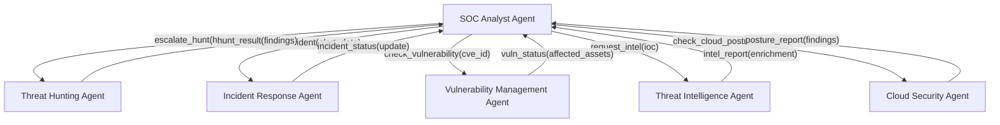
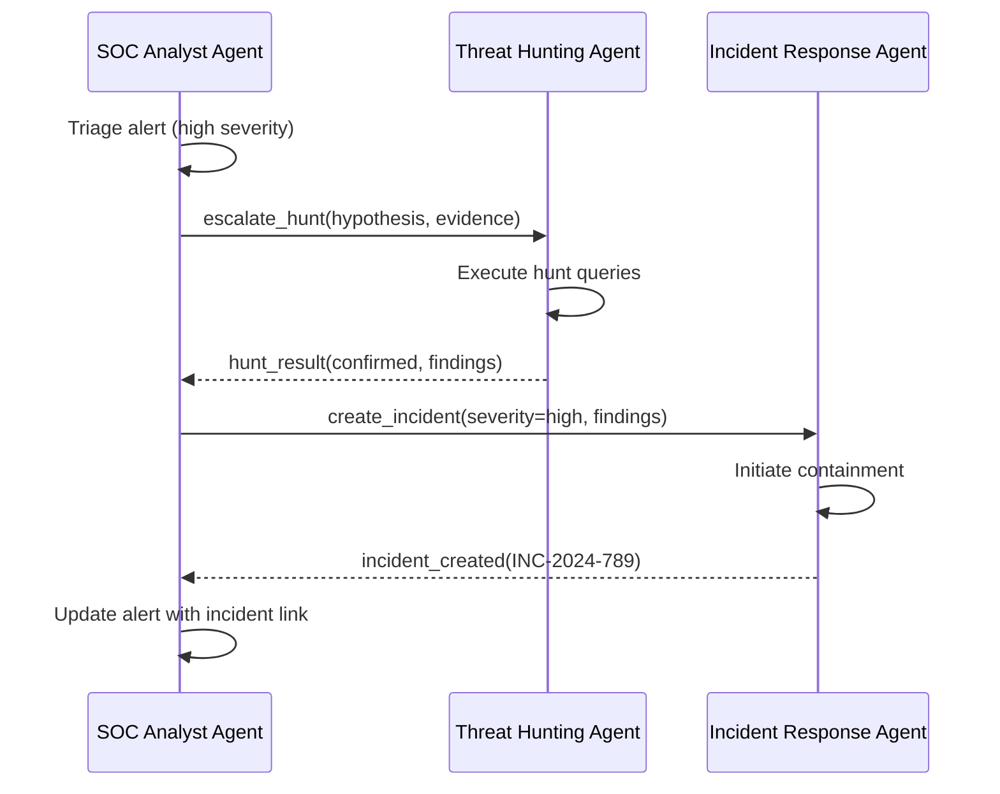
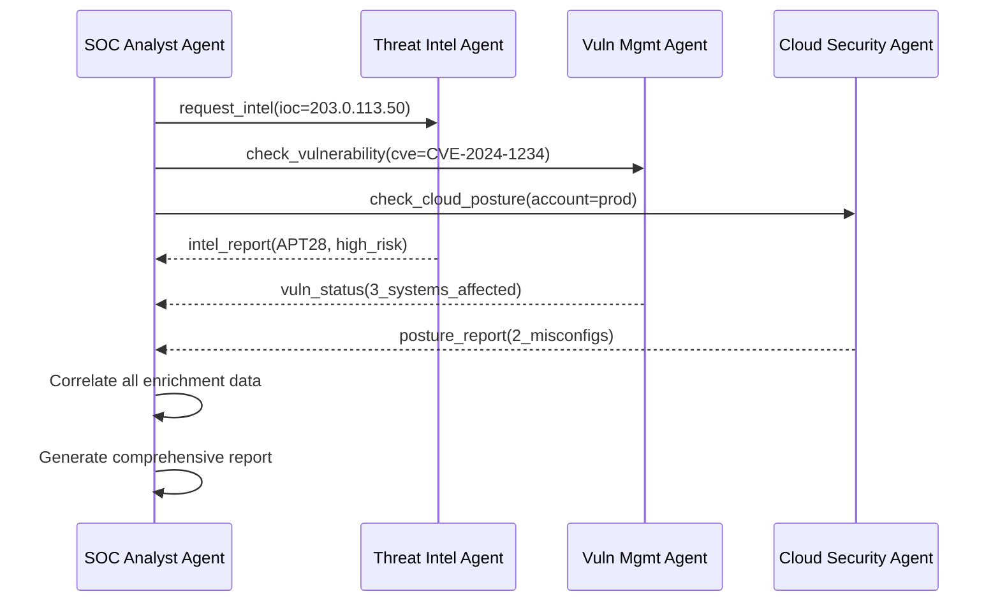

# SOC Analyst Agent — Agent-to-Agent (A2A) Communication

## Overview

The SOC Analyst Agent communicates with other security agents using the Agent-to-Agent (A2A) protocol. This enables multi-agent collaboration for complex investigations that span multiple security domains.

## Agent Network



## A2A Protocol

### Agent Card (Discovery)

Each agent publishes an agent card at `/.well-known/agent.json`:

```json
{
  "name": "soc-analyst-agent",
  "version": "1.0.0",
  "description": "AI-powered SOC Tier 1/2 analyst for alert triage and investigation",
  "url": "https://soc-analyst-agent.example.com",
  "capabilities": [
    "alert_triage",
    "ioc_enrichment",
    "event_correlation",
    "investigation_playbook",
    "incident_reporting"
  ],
  "input_modes": ["text", "json"],
  "output_modes": ["text", "json"],
  "authentication": {
    "type": "bearer",
    "token_url": "https://auth.example.com/oauth/token"
  },
  "skills": [
    {
      "name": "triage_alert",
      "description": "Triage a security alert",
      "input_schema": { "type": "object", "required": ["alert_id", "alert_data"] }
    },
    {
      "name": "enrich_ioc",
      "description": "Enrich an IOC with threat intelligence",
      "input_schema": { "type": "object", "required": ["indicator", "indicator_type"] }
    }
  ]
}
```

### Message Format

```json
{
  "id": "msg-2024-12-15-001",
  "from": "soc-analyst-agent",
  "to": "threat-hunting-agent",
  "type": "task",
  "skill": "execute_hunt",
  "payload": {
    "hypothesis": "APT28 lateral movement via RDP from compromised workstation",
    "evidence": {
      "source_host": "WORKSTATION-42",
      "destination_ips": ["10.0.3.15", "10.0.3.22"],
      "time_range": "2024-12-15T14:00:00Z/2024-12-15T18:00:00Z"
    }
  },
  "priority": "high",
  "timeout_seconds": 300,
  "callback_url": "https://soc-analyst-agent.example.com/api/v1/a2a/callback"
}
```

### Response Format

```json
{
  "id": "resp-2024-12-15-001",
  "in_reply_to": "msg-2024-12-15-001",
  "from": "threat-hunting-agent",
  "to": "soc-analyst-agent",
  "type": "result",
  "status": "completed",
  "payload": {
    "hunt_result": "confirmed",
    "findings": [
      {
        "description": "RDP lateral movement detected from WORKSTATION-42 to 3 additional hosts",
        "hosts_affected": ["SERVER-DB-01", "SERVER-APP-03", "WORKSTATION-55"],
        "mitre_technique": "T1021.001",
        "evidence_count": 47,
        "confidence": 0.94
      }
    ],
    "recommended_actions": [
      "Isolate all affected hosts immediately",
      "Reset credentials for all users who logged into affected systems",
      "Enable enhanced monitoring on the subnet 10.0.3.0/24"
    ]
  }
}
```

## Communication Patterns

### Escalation Pattern

SOC Analyst identifies a complex threat and escalates to a specialized agent:



### Enrichment Pattern

SOC Analyst requests enrichment from multiple agents in parallel:



## Configuration

### Agent Discovery

```yaml
# configs/a2a.yaml
discovery:
  method: "static"  # Options: static, dns, consul
  agents:
    - name: threat-hunting-agent
      url: https://threat-hunting-agent.example.com
      skills: [execute_hunt, generate_hypothesis]
    - name: incident-response-agent
      url: https://incident-response-agent.example.com
      skills: [create_incident, escalate, contain]
    - name: vulnerability-management-agent
      url: https://vulnerability-management-agent.example.com
      skills: [check_vulnerability, get_patch_status]
    - name: threat-intelligence-agent
      url: https://threat-intelligence-agent.example.com
      skills: [request_intel, search_campaigns]
    - name: cloud-security-agent
      url: https://cloud-security-agent.example.com
      skills: [check_cloud_posture, scan_config]

communication:
  timeout_seconds: 300
  retry_attempts: 3
  retry_delay_seconds: 5
  circuit_breaker:
    failure_threshold: 5
    recovery_timeout_seconds: 60
```

## Error Handling

| Error | Handling |
|-------|---------|
| Agent unreachable | Retry 3 times with exponential backoff, then circuit break |
| Timeout | Return partial results with warning, log for follow-up |
| Authentication failure | Refresh token and retry once |
| Invalid response | Log error, return degraded response without enrichment |
| Circuit breaker open | Skip agent, note unavailability in response |

## Security

- All A2A communication uses mTLS
- Messages are signed with the sending agent's private key
- Payload encryption for sensitive data (IOCs, credentials)
- Rate limiting per agent pair (100 messages/minute)
- Audit log of all inter-agent communication
