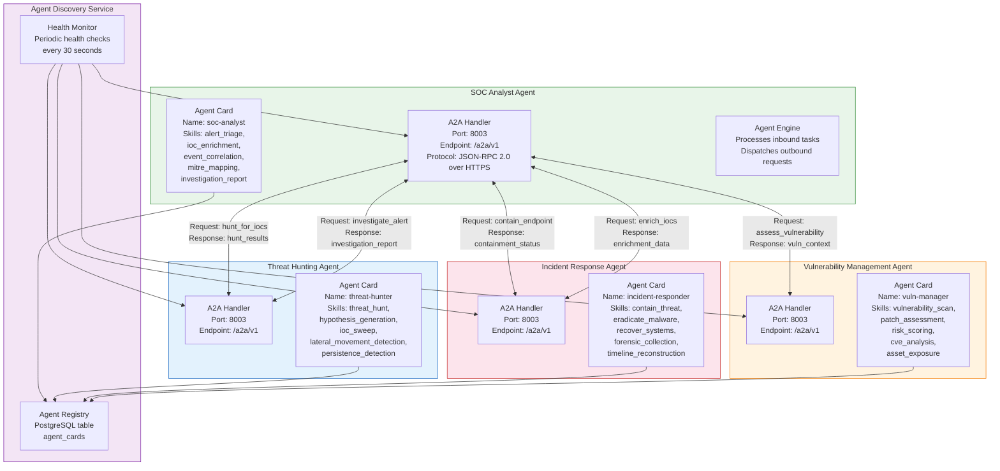
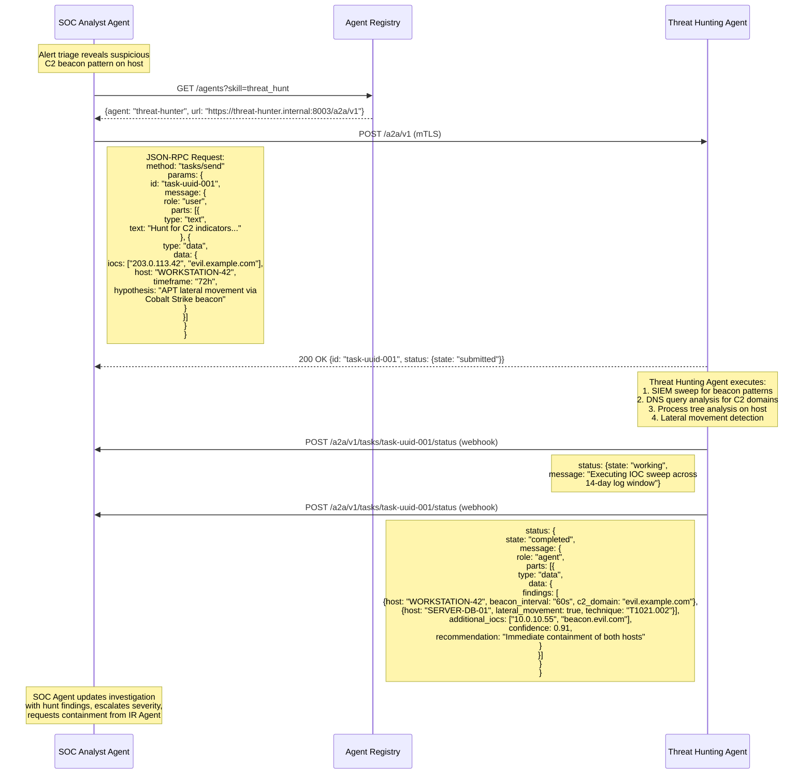
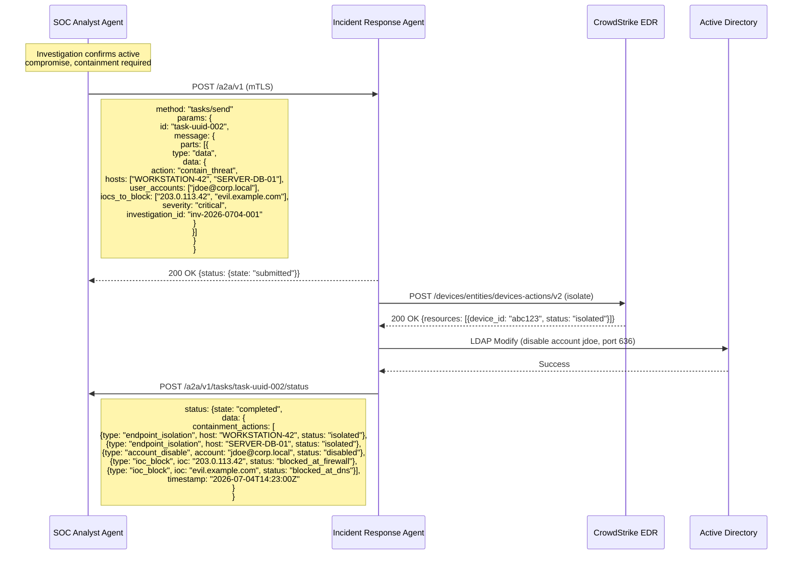
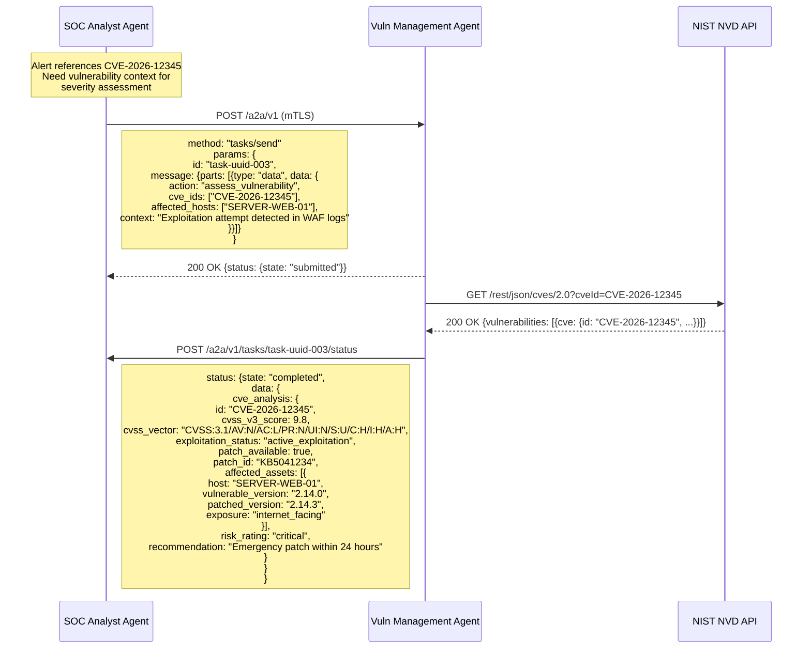
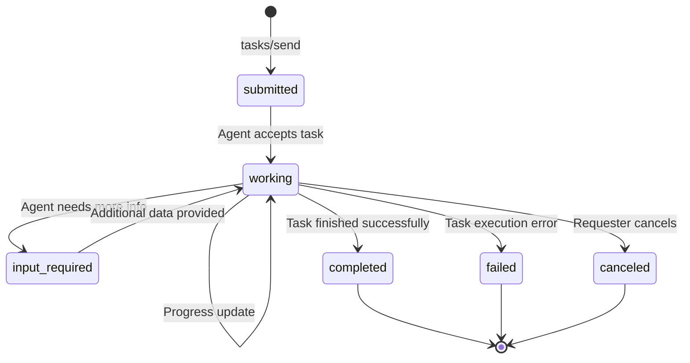

# A2A Communication Architecture

## Overview

The SOC Analyst Agent communicates with peer security agents using the Agent-to-Agent (A2A) protocol, enabling collaborative investigation workflows across specialized agents. Each agent publishes an Agent Card describing its capabilities, and agents exchange tasks via JSON-RPC over HTTPS with mutual TLS authentication.

## A2A Agent Network Diagram



## Agent Card Definitions

### SOC Analyst Agent Card

```json
{
  "name": "soc-analyst",
  "description": "AI-powered SOC analyst that triages security alerts, enriches IOCs with threat intelligence, correlates events, maps to MITRE ATT&CK, and generates investigation playbooks.",
  "url": "https://soc-agent.internal:8003/a2a/v1",
  "version": "1.0.0",
  "capabilities": {
    "streaming": false,
    "pushNotifications": true,
    "stateTransitionHistory": true
  },
  "authentication": {
    "schemes": ["mtls"],
    "mtls": {
      "ca_cert": "/certs/ca.pem",
      "client_cert_required": true
    }
  },
  "skills": [
    {
      "id": "alert_triage",
      "name": "Alert Triage",
      "description": "Classify and prioritize security alerts from SIEM platforms with severity scoring (Critical/High/Medium/Low/Info) and investigation depth determination.",
      "inputModes": ["application/json"],
      "outputModes": ["application/json"]
    },
    {
      "id": "ioc_enrichment",
      "name": "IOC Enrichment",
      "description": "Extract and enrich IOCs (IPs, domains, hashes, URLs) with threat intelligence from VirusTotal, AbuseIPDB, MISP, and Shodan. Returns composite risk scores.",
      "inputModes": ["application/json"],
      "outputModes": ["application/json"]
    },
    {
      "id": "event_correlation",
      "name": "Event Correlation",
      "description": "Correlate security alerts by shared IOCs, affected assets, temporal proximity, and kill chain progression. Returns incident clusters with confidence scores.",
      "inputModes": ["application/json"],
      "outputModes": ["application/json"]
    },
    {
      "id": "mitre_mapping",
      "name": "MITRE ATT&CK Mapping",
      "description": "Map observed attacker behaviors to MITRE ATT&CK tactics and techniques with confidence scoring.",
      "inputModes": ["application/json"],
      "outputModes": ["application/json"]
    },
    {
      "id": "investigation_report",
      "name": "Investigation Report",
      "description": "Generate structured incident investigation reports with executive summary, IOC tables, MITRE mapping, timeline, and recommended actions.",
      "inputModes": ["application/json"],
      "outputModes": ["application/json", "text/html", "application/pdf"]
    }
  ]
}
```

## Inter-Agent Communication Flows

### Flow 1: SOC Agent to Threat Hunting Agent



### Flow 2: SOC Agent to Incident Response Agent



### Flow 3: SOC Agent to Vulnerability Management Agent



## Task Lifecycle States



| State | Description | Transitions From | Transitions To |
|-------|-------------|-----------------|----------------|
| `submitted` | Task received and queued | Initial state | `working` |
| `working` | Agent actively processing the task | `submitted`, `input_required` | `completed`, `failed`, `canceled`, `input_required` |
| `input_required` | Agent needs additional information from requester | `working` | `working` (after input provided) |
| `completed` | Task finished successfully with results | `working` | Terminal state |
| `failed` | Task failed with error details | `working` | Terminal state |
| `canceled` | Task canceled by requester | `working` | Terminal state |

## Security Configuration

| Parameter | Value |
|-----------|-------|
| Transport | HTTPS with mutual TLS (mTLS) |
| Certificate Authority | Internal PKI (AWS Private CA) |
| Certificate Rotation | 90-day automatic rotation |
| Authentication | X.509 client certificate + Agent ID validation |
| Authorization | Agent capability allowlist (which agents can invoke which skills) |
| Message Signing | HMAC-SHA256 on request body for integrity verification |
| Rate Limiting | 30 requests/minute per peer agent |
| Timeout | 120 seconds for task submission, 3600 seconds for task completion |
| Retry Policy | 3 retries with exponential backoff (base 5s, max 60s) |
| Circuit Breaker | Open after 5 consecutive failures, half-open after 120s |

## Agent Authorization Matrix

| Requesting Agent | Allowed Skills on SOC Agent | Denied Skills |
|-----------------|----------------------------|---------------|
| threat-hunter | `ioc_enrichment`, `event_correlation`, `mitre_mapping` | `alert_triage` (internal only) |
| incident-responder | `ioc_enrichment`, `investigation_report`, `event_correlation` | `alert_triage` (internal only) |
| vuln-manager | `ioc_enrichment`, `mitre_mapping` | `alert_triage`, `investigation_report` |
| External/Unknown | None (rejected at mTLS handshake) | All |
