# Agent Workflow Architecture

## Overview

The SOC Analyst Agent follows a structured investigation workflow that processes each security alert through a series of stages: triage, IOC extraction, enrichment, correlation, MITRE ATT&CK mapping, severity reassessment, and response action determination. This document details the decision logic, branching conditions, and data transformations at each stage.

## End-to-End Investigation Workflow

```mermaid
flowchart TD
    start([Alert Received]) --> validate{Validate Alert<br/>Schema}
    validate -->|Invalid| reject[Reject Alert<br/>Log Parse Error]
    validate -->|Valid| dedup{Deduplication<br/>Check}
    dedup -->|Duplicate| merge[Merge with<br/>Existing Alert]
    dedup -->|New| suppress{Suppression<br/>Rule Match?}
    suppress -->|Suppressed| auto_close_suppress[Auto-Close<br/>Log Suppression Reason]
    suppress -->|Not Suppressed| triage

    subgraph Triage["Stage 1: Alert Triage"]
        triage[Classify Alert] --> severity_check{Initial<br/>Severity?}
        severity_check -->|Critical 90-100| priority_critical[Priority: P1<br/>Investigation Depth: Full<br/>SLA: 15 min]
        severity_check -->|High 70-89| priority_high[Priority: P2<br/>Investigation Depth: Full<br/>SLA: 1 hour]
        severity_check -->|Medium 40-69| priority_medium[Priority: P3<br/>Investigation Depth: Standard<br/>SLA: 4 hours]
        severity_check -->|Low 10-39| priority_low[Priority: P4<br/>Investigation Depth: Quick Review<br/>SLA: 24 hours]
        severity_check -->|Info 0-9| auto_close_info[Auto-Close<br/>Archive for Metrics]
    end

    priority_critical --> extract
    priority_high --> extract
    priority_medium --> extract
    priority_low --> extract

    subgraph Extract["Stage 2: IOC Extraction"]
        extract[Parse Alert Payload] --> extract_ips[Extract IP Addresses<br/>IPv4 / IPv6]
        extract --> extract_domains[Extract Domains<br/>FQDN / subdomain]
        extract --> extract_hashes[Extract File Hashes<br/>MD5 / SHA1 / SHA256]
        extract --> extract_urls[Extract URLs<br/>Defang reversal]
        extract --> extract_emails[Extract Email Addresses]
        extract --> extract_cves[Extract CVE IDs]
        extract_ips --> ioc_list[Consolidated IOC List<br/>Deduplicated, Typed]
        extract_domains --> ioc_list
        extract_hashes --> ioc_list
        extract_urls --> ioc_list
        extract_emails --> ioc_list
        extract_cves --> ioc_list
    end

    ioc_list --> enrich_check{IOCs Found?}
    enrich_check -->|No IOCs| skip_enrich[Skip Enrichment<br/>Proceed to Correlation]
    enrich_check -->|IOCs Found| enrich

    subgraph Enrich["Stage 3: IOC Enrichment"]
        enrich[Fan-Out Enrichment] --> cache_check{Cache Hit?<br/>TTL: 3600s}
        cache_check -->|Hit| use_cached[Use Cached<br/>Enrichment]
        cache_check -->|Miss| query_vt[Query VirusTotal<br/>Hash / URL / IP / Domain]
        cache_check -->|Miss| query_abuse[Query AbuseIPDB<br/>IP Confidence Score]
        cache_check -->|Miss| query_misp[Query MISP<br/>Event / Attribute Match]
        cache_check -->|Miss| query_shodan[Query Shodan<br/>Port / Service / Banner]
        query_vt --> aggregate[Aggregate Results<br/>Composite Risk Score]
        query_abuse --> aggregate
        query_misp --> aggregate
        query_shodan --> aggregate
        use_cached --> aggregate
        aggregate --> cache_store[Store in Redis Cache<br/>TTL: 3600s]
    end

    cache_store --> correlate
    skip_enrich --> correlate

    subgraph Correlate["Stage 4: Event Correlation"]
        correlate[Query Historical Alerts] --> ioc_overlap{Shared IOCs<br/>Found?}
        ioc_overlap -->|Yes| link_ioc[Link by IOC Overlap<br/>Weight: 0.9]
        ioc_overlap -->|No| temporal_check{Alerts within<br/>4-hour window?}
        temporal_check -->|Yes| link_temporal[Link by Temporal<br/>Proximity, Weight: 0.5]
        temporal_check -->|No| asset_check{Same Asset<br/>Affected?}
        asset_check -->|Yes| link_asset[Link by Asset<br/>Affinity, Weight: 0.7]
        asset_check -->|No| no_correlation[No Correlation<br/>Standalone Alert]
        link_ioc --> build_graph[Build Correlation<br/>Graph]
        link_temporal --> build_graph
        link_asset --> build_graph
        build_graph --> cluster_check{Cluster Weight<br/>> 2.0?}
        cluster_check -->|Yes| incident_cluster[Form Incident<br/>Cluster]
        cluster_check -->|No| standalone[Treat as<br/>Standalone Alert]
    end

    incident_cluster --> mitre_map
    standalone --> mitre_map
    no_correlation --> mitre_map

    subgraph MITRE["Stage 5: MITRE ATT&CK Mapping"]
        mitre_map[Analyze Behaviors] --> keyword_match[Keyword Match<br/>ATT&CK Technique DB]
        keyword_match --> llm_classify[LLM Classification<br/>Structured Output]
        llm_classify --> confidence_check{Mapping<br/>Confidence?}
        confidence_check -->|High > 0.8| accept_mapping[Accept Mapping<br/>Tactics + Techniques]
        confidence_check -->|Medium 0.5-0.8| review_mapping[Flag for Analyst<br/>Review]
        confidence_check -->|Low < 0.5| discard_mapping[Discard Low<br/>Confidence Mappings]
        accept_mapping --> kill_chain[Determine Kill<br/>Chain Phase]
        review_mapping --> kill_chain
    end

    kill_chain --> reassess

    subgraph Reassess["Stage 6: Severity Reassessment"]
        reassess[Compute Composite<br/>Risk Score] --> factor_enrich[Factor: IOC Risk Scores<br/>Weight: 0.30]
        reassess --> factor_corr[Factor: Correlation Cluster Size<br/>Weight: 0.20]
        reassess --> factor_mitre[Factor: Kill Chain Progression<br/>Weight: 0.25]
        reassess --> factor_asset[Factor: Asset Criticality<br/>Weight: 0.15]
        reassess --> factor_context[Factor: Threat Intel Context<br/>Weight: 0.10]
        factor_enrich --> composite[Composite Score<br/>0-100]
        factor_corr --> composite
        factor_mitre --> composite
        factor_asset --> composite
        factor_context --> composite
        composite --> severity_change{Severity<br/>Changed?}
        severity_change -->|Yes| update_severity[Update Alert Severity<br/>Log Reassessment Reason]
        severity_change -->|No| keep_severity[Keep Original<br/>Severity]
    end

    update_severity --> decide
    keep_severity --> decide

    subgraph Decide["Stage 7: Action Decision"]
        decide{Final Severity +<br/>Composite Score} -->|Critical + Score > 90| action_contain[ACTION: Contain<br/>Isolate endpoint<br/>Block IOCs at firewall<br/>Lock user account<br/>Page IR team]
        decide -->|High + Score 70-89| action_escalate[ACTION: Escalate<br/>Create P1 incident ticket<br/>Notify SOC Manager<br/>Generate playbook<br/>Assign to senior analyst]
        decide -->|Medium + Score 40-69| action_investigate[ACTION: Investigate<br/>Create P3 incident ticket<br/>Generate playbook<br/>Add to analyst queue]
        decide -->|Low + Score 10-39| action_monitor[ACTION: Monitor<br/>Add to watchlist<br/>Set 24h review timer<br/>Auto-close if no recurrence]
        decide -->|Info + Score < 10| action_close[ACTION: Close<br/>Archive alert<br/>Update metrics<br/>No further action]
    end

    action_contain --> generate_playbook[Generate<br/>Investigation Playbook]
    action_escalate --> generate_playbook
    action_investigate --> generate_playbook
    action_monitor --> generate_report
    action_close --> generate_report

    generate_playbook --> execute_actions[Execute<br/>Response Actions]
    execute_actions --> generate_report[Generate<br/>Investigation Report]
    generate_report --> audit_log[Write to<br/>Audit Log]
    audit_log --> notify[Send Notifications<br/>Slack / Teams / Email]
    notify --> done([Investigation Complete])

    style Triage fill:#e8f5e9,stroke:#388e3c
    style Extract fill:#e3f2fd,stroke:#1565c0
    style Enrich fill:#fff3e0,stroke:#f57c00
    style Correlate fill:#f3e5f5,stroke:#7b1fa2
    style MITRE fill:#fce4ec,stroke:#c62828
    style Reassess fill:#e0f7fa,stroke:#00838f
    style Decide fill:#fff9c4,stroke:#f9a825
```



## Stage Details

### Stage 1: Alert Triage

**Input**: Raw alert payload from SIEM (JSON format)

**Processing Steps**:
1. Schema validation against expected SIEM-specific alert format
2. Deduplication via SHA-256 hash of normalized fields (source IP, dest IP, rule name, 15-min window)
3. Suppression rule evaluation against configurable rule set (known false positives)
4. LLM-assisted severity classification with structured output schema
5. Alert type categorization (Malware, Phishing, Intrusion, etc.)

**Output**: Triaged alert with severity, priority, investigation depth, and SLA target

### Stage 2: IOC Extraction

**Input**: Triaged alert payload

**IOC Extraction Rules**:
| IOC Type | Pattern | Validation |
|----------|---------|------------|
| IPv4 | `\b(?:(?:25[0-5]\|2[0-4]\d\|[01]?\d\d?)\.){3}(?:25[0-5]\|2[0-4]\d\|[01]?\d\d?)\b` | Exclude private ranges (RFC 1918), loopback, multicast |
| IPv6 | `\b(?:[0-9a-fA-F]{1,4}:){7}[0-9a-fA-F]{1,4}\b` | Exclude link-local, loopback |
| Domain | FQDN regex + TLD validation | Exclude internal domains, CDN domains |
| MD5 | `\b[a-fA-F0-9]{32}\b` | Validate not a known false positive hash |
| SHA1 | `\b[a-fA-F0-9]{40}\b` | Validate not a known false positive hash |
| SHA256 | `\b[a-fA-F0-9]{64}\b` | Validate not a known false positive hash |
| URL | URL parser with defang reversal (`hxxp` -> `http`) | Validate scheme, host, path |
| Email | RFC 5322 pattern | Validate domain exists |
| CVE | `CVE-\d{4}-\d{4,7}` | Validate against NVD API |

### Stage 3: IOC Enrichment

**Input**: Deduplicated IOC list with types

**Enrichment Sources and Rate Limits**:
| Source | Rate Limit | Timeout | Retry Policy |
|--------|------------|---------|--------------|
| VirusTotal | 4 req/min (free), 500 req/min (premium) | 30s | 3 retries, exponential backoff |
| AbuseIPDB | 1000 req/day | 10s | 2 retries, linear backoff |
| MISP | No hard limit (self-hosted) | 15s | 3 retries, exponential backoff |
| Shodan | 1 req/sec | 10s | 2 retries, linear backoff |

**Composite Risk Score**:
```
risk_score = (vt_malicious_ratio * 35) + (abuse_confidence * 0.25) + (misp_event_count * 5, max 25) + (shodan_vulns * 3, max 15)
```

### Stage 4: Event Correlation

**Input**: Current alert + enriched IOCs + historical alert database

**Correlation Windows and Weights**:
| Correlation Type | Time Window | Edge Weight | Description |
|-----------------|-------------|-------------|-------------|
| IOC Overlap | 7 days | 0.9 | Shared IP, domain, or hash across alerts |
| Temporal Proximity | 4 hours | 0.5 | Alerts within time window from same source |
| Asset Affinity | 24 hours | 0.7 | Same host, user, or network segment affected |
| Kill Chain Sequence | 72 hours | 0.8 | Sequential ATT&CK techniques observed |
| Campaign Match | 30 days | 0.85 | Alerts matching known campaign IOCs/TTPs |

### Stage 5: MITRE ATT&CK Mapping

**Input**: Alert behaviors, enrichment results, correlation context

**Mapping Pipeline**:
1. Extract behavioral indicators (process execution, network connection, file modification, registry change)
2. Match against ATT&CK technique keyword index (fast filter, ~2ms)
3. LLM classification with technique list as constrained output schema
4. Cross-reference procedure examples from ATT&CK STIX data
5. Assign confidence scores based on evidence strength

### Stage 6: Severity Reassessment

**Composite Score Formula**:
```
composite = (ioc_risk * 0.30) + (cluster_factor * 0.20) + (kill_chain_factor * 0.25) + (asset_criticality * 0.15) + (threat_context * 0.10)
```

Where:
- `ioc_risk`: Maximum IOC risk score from enrichment (0-100)
- `cluster_factor`: `min(100, correlated_alerts * 15)` (0-100)
- `kill_chain_factor`: `kill_chain_stages_observed * 20` (0-100)
- `asset_criticality`: From CMDB lookup (0-100, based on business impact)
- `threat_context`: APT group association score (0-100)

### Stage 7: Action Decision

| Action | Trigger | Automated Steps | Human Steps |
|--------|---------|-----------------|-------------|
| **Contain** | Critical + Score > 90 | Block IOCs at firewall, isolate endpoint via EDR API, lock AD account, create P1 ticket, page IR team | IR Lead reviews containment scope, authorizes eradication |
| **Escalate** | High + Score 70-89 | Create P1 ticket, generate playbook, notify SOC Manager via Slack/Teams | Senior analyst follows playbook, validates findings |
| **Investigate** | Medium + Score 40-69 | Create P3 ticket, generate playbook, add to analyst queue | Analyst investigates within SLA window |
| **Monitor** | Low + Score 10-39 | Add IOCs to watchlist, schedule 24h re-check | Analyst reviews if alert recurs |
| **Close** | Info + Score < 10 | Archive alert, update false positive metrics | No action required |

## Processing Time Targets

| Stage | Target (p95) | Notes |
|-------|-------------|-------|
| Alert Triage | < 2s | LLM classification + rule evaluation |
| IOC Extraction | < 500ms | Regex parsing + validation |
| IOC Enrichment | < 10s | Parallel API calls with caching |
| Event Correlation | < 3s | Graph construction + database queries |
| MITRE Mapping | < 5s | Keyword match + LLM classification |
| Severity Reassessment | < 1s | Score computation |
| Action Decision | < 1s | Rule evaluation |
| Playbook Generation | < 8s | LLM-generated with template selection |
| Report Generation | < 5s | Template rendering + PDF generation |
| **Total End-to-End** | **< 30s** | **Full investigation pipeline** |
