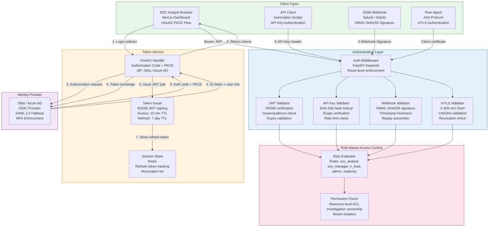
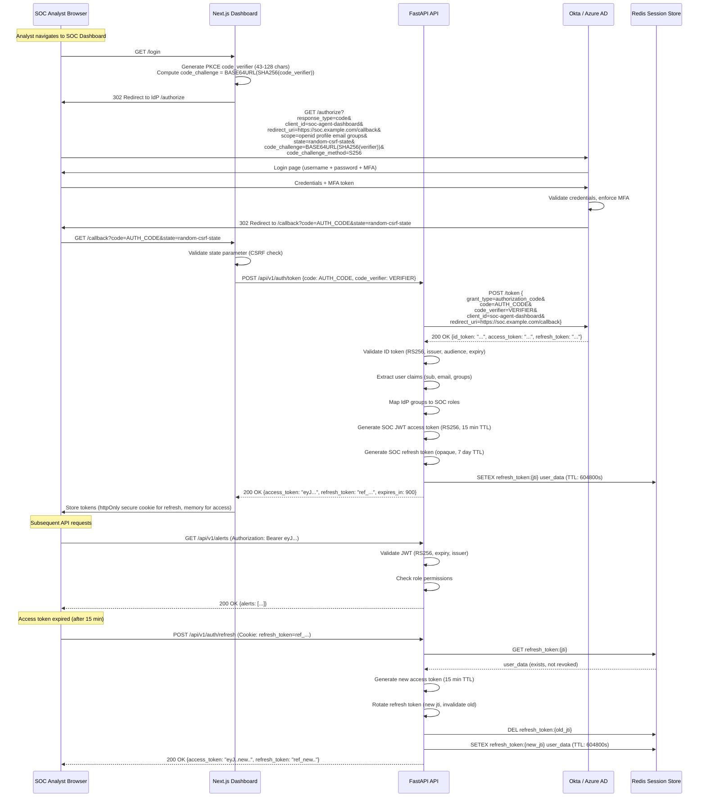
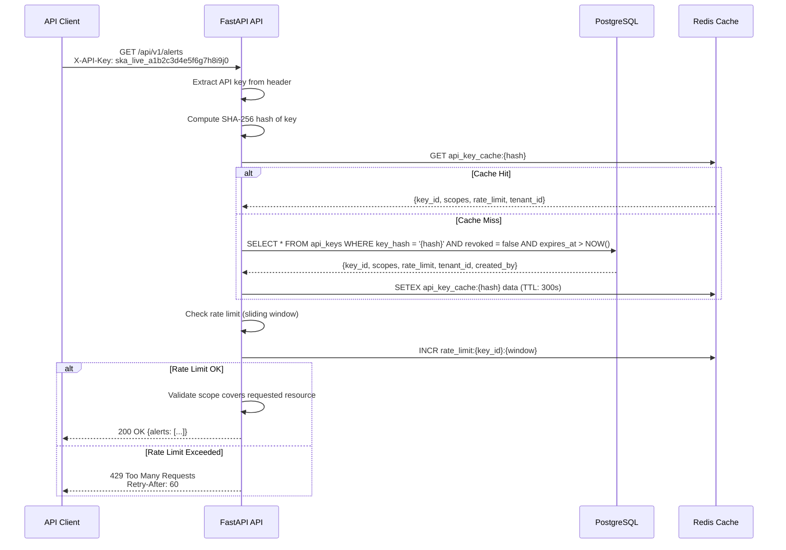
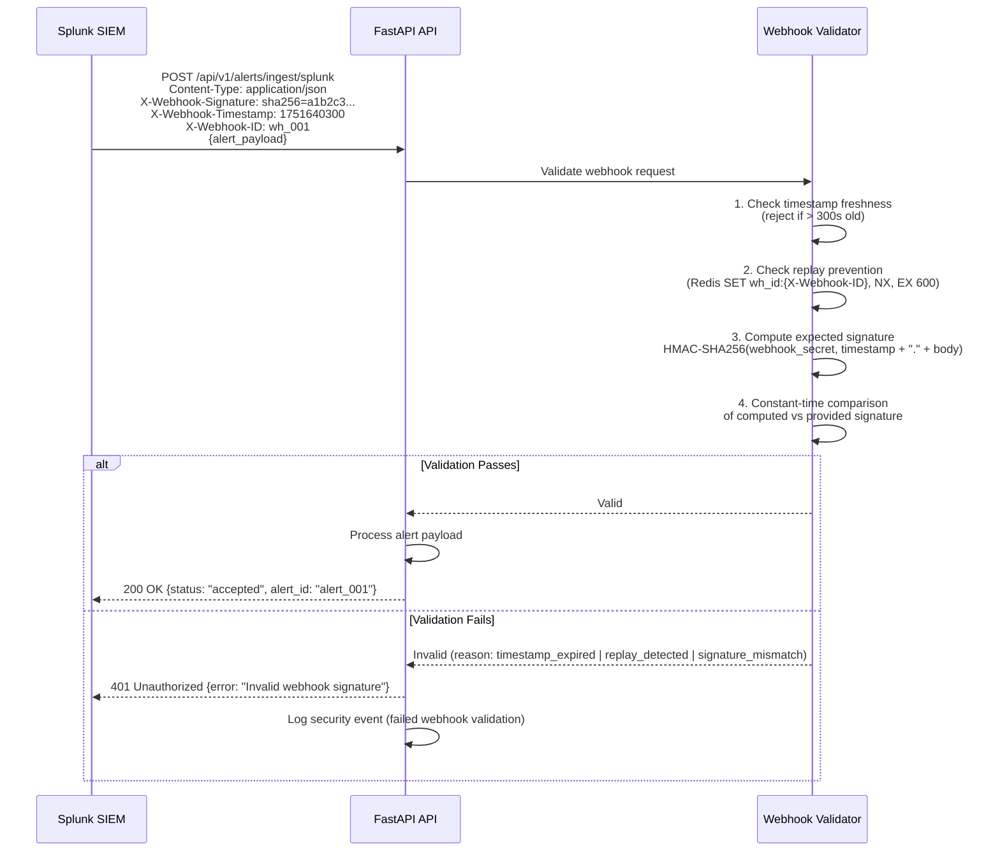
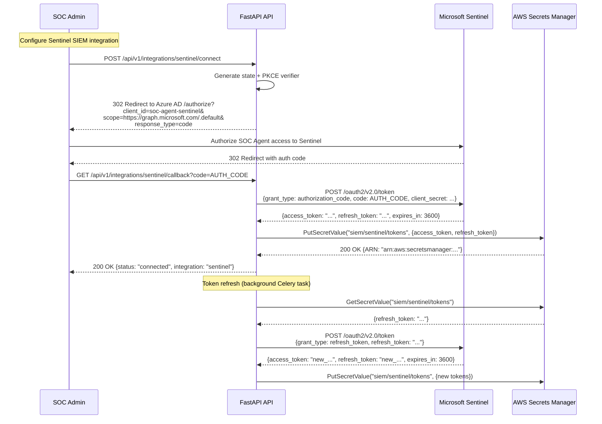

# Authentication Flow Architecture

## Overview

The SOC Analyst Agent implements a layered authentication architecture supporting JWT token-based authentication for human users (SOC analysts accessing the dashboard), API key validation for machine-to-machine integrations (SIEM webhooks, automated tooling), and OAuth2 authorization code flow for connecting to external SIEM platforms and third-party services.

## Authentication Architecture Diagram



## OAuth2 Authorization Code Flow with PKCE



## JWT Token Structure

### Access Token Claims

```json
{
  "header": {
    "alg": "RS256",
    "typ": "JWT",
    "kid": "soc-agent-signing-key-2026"
  },
  "payload": {
    "iss": "https://soc.example.com",
    "sub": "user:okta:00u1234567890",
    "aud": "soc-agent-api",
    "exp": 1751641200,
    "iat": 1751640300,
    "jti": "tok_a1b2c3d4e5f6",
    "email": "jdoe@example.com",
    "name": "Jane Doe",
    "role": "soc_analyst",
    "permissions": ["alerts:read", "alerts:triage", "investigations:read", "investigations:create", "playbooks:read"],
    "tenant_id": "tenant_001",
    "session_id": "sess_xyz789"
  }
}
```

### Role Definitions

| Role | Permissions | Use Case |
|------|-------------|----------|
| `soc_analyst` | `alerts:read`, `alerts:triage`, `investigations:read`, `investigations:create`, `playbooks:read` | Day-to-day alert triage and investigation |
| `soc_manager` | All analyst permissions + `alerts:configure`, `investigations:assign`, `reports:read`, `config:read`, `metrics:read` | SOC operations management |
| `ir_lead` | All manager permissions + `investigations:escalate`, `containment:approve`, `reports:create`, `config:write` | Incident response leadership |
| `admin` | All permissions + `users:manage`, `api_keys:manage`, `config:admin`, `audit:read` | System administration |
| `readonly` | `alerts:read`, `investigations:read`, `reports:read`, `metrics:read` | Auditors, compliance reviewers |
| `service` | Scoped per API key: specific resource + action combinations | Automated integrations |

## API Key Authentication



### API Key Format

| Component | Format | Example |
|-----------|--------|---------|
| Prefix | `ska_` (SOC Key API) | `ska_` |
| Environment | `live_` or `test_` | `live_` |
| Key Body | 32 random alphanumeric chars | `a1b2c3d4e5f6g7h8i9j0k1l2m3n4o5p6` |
| Full Key | `{prefix}{env}{body}` | `ska_live_a1b2c3d4e5f6g7h8i9j0k1l2m3n4o5p6` |

### API Key Scopes

| Scope | Description | Allowed Operations |
|-------|-------------|-------------------|
| `alerts:ingest` | SIEM webhook alert ingestion | POST /api/v1/alerts/ingest |
| `alerts:read` | Read alert data | GET /api/v1/alerts/* |
| `investigations:read` | Read investigation data | GET /api/v1/investigations/* |
| `reports:read` | Download investigation reports | GET /api/v1/reports/* |
| `ioc:enrich` | IOC enrichment API access | POST /api/v1/ioc/enrich |
| `admin:full` | Full administrative access | All endpoints |

## SIEM Webhook Validation



## OAuth2 SIEM Platform Authorization



## Security Controls Summary

| Control | Implementation | Standard |
|---------|---------------|----------|
| Password Policy | Enforced by IdP (Okta/Azure AD): 12+ chars, complexity, no reuse | NIST SP 800-63B |
| Multi-Factor Authentication | Required for all human users via IdP (TOTP, WebAuthn, push) | NIST SP 800-63B AAL2 |
| Token Signing | RS256 (RSA 2048-bit key pair), rotated annually | RFC 7519 |
| Token Storage | Access token in memory only, refresh token in httpOnly secure cookie | OWASP |
| CSRF Protection | State parameter + PKCE for OAuth2, SameSite=Strict cookies | OWASP |
| API Key Hashing | SHA-256 (only hash stored in database, plaintext never persisted) | OWASP |
| Webhook Integrity | HMAC-SHA256 with shared secret, timestamp validation, replay prevention | Industry standard |
| mTLS | X.509 certificates from internal PKI, 90-day rotation | RFC 5246 |
| Session Management | Absolute timeout: 8 hours, idle timeout: 30 minutes, concurrent session limit: 3 | OWASP |
| Credential Storage | AWS Secrets Manager with KMS encryption, 30-day rotation | AWS Security Best Practices |
| Audit Logging | All authentication events logged with IP, user agent, outcome | SOC 2 Type II |
