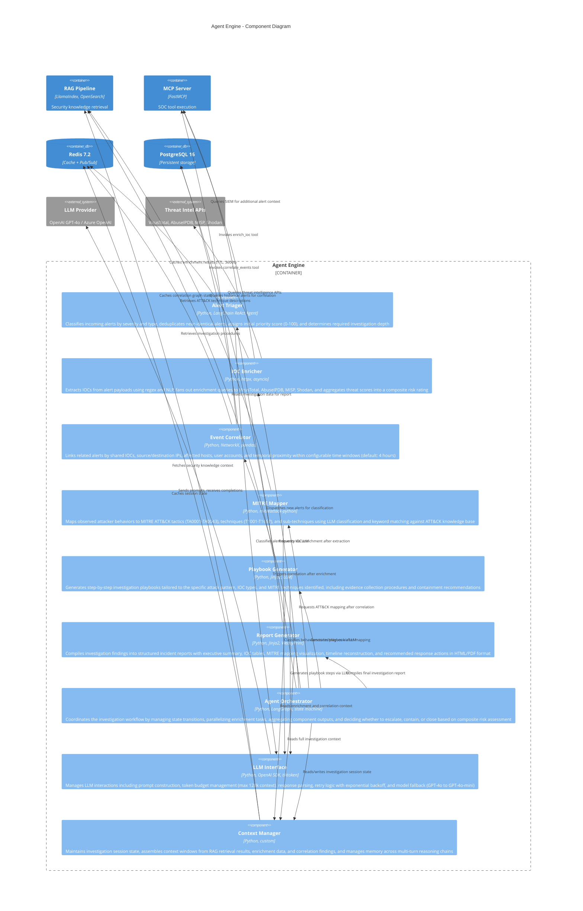

# C4 Component Diagram - Agent Engine

## Overview

The Agent Engine is the core AI reasoning component of the SOC Analyst Agent. It orchestrates the full alert investigation lifecycle: triage, IOC extraction, enrichment, correlation, MITRE ATT&CK mapping, and playbook generation. This diagram decomposes the Agent Engine into its internal components, showing how each module collaborates to produce actionable security analysis.

## Component Diagram



## Component Descriptions

### Agent Orchestrator

The orchestrator is the central coordinator that manages the investigation workflow as a state machine using LangGraph. It determines the sequence and parallelism of investigation steps based on the alert type and severity.

**State Machine Transitions:**

| Current State | Event | Next State | Action |
|---------------|-------|------------|--------|
| `alert_received` | New alert ingested | `triaging` | Dispatch to Alert Triager |
| `triaging` | Severity classified | `extracting_iocs` | Parse IOCs from payload |
| `extracting_iocs` | IOCs extracted | `enriching` | Fan-out to IOC Enricher |
| `enriching` | All IOCs enriched | `correlating` | Dispatch to Event Correlator |
| `correlating` | Correlation complete | `mapping_mitre` | Dispatch to MITRE Mapper |
| `mapping_mitre` | Techniques mapped | `assessing_severity` | Reassess composite severity |
| `assessing_severity` | Risk score calculated | `generating_playbook` | Generate investigation playbook |
| `generating_playbook` | Playbook complete | `deciding_action` | Determine response action |
| `deciding_action` | Action decided | `executing_action` | Execute contain/escalate/close |
| `executing_action` | Action completed | `generating_report` | Compile investigation report |
| `generating_report` | Report generated | `completed` | Archive investigation |

### Alert Triager

Classifies incoming alerts using a combination of rule-based heuristics and LLM-guided analysis.

**Classification Outputs:**
- **Severity**: Critical (90-100), High (70-89), Medium (40-69), Low (10-39), Informational (0-9)
- **Alert Type**: Malware, Phishing, Intrusion, Data Exfiltration, Privilege Escalation, Lateral Movement, C2 Communication, Policy Violation, Reconnaissance, Denial of Service
- **Deduplication**: SHA-256 hash of normalized alert fields with a 15-minute sliding window
- **Investigation Depth**: Full (Critical/High), Standard (Medium), Quick Review (Low), Auto-Close (Informational)

**Key Logic:**
- Rule-based pre-filter for known false positive patterns (configurable suppression rules)
- LLM classification with structured output (JSON schema validation)
- Confidence scoring with automatic escalation when confidence < 0.7

### IOC Enricher

Extracts and enriches Indicators of Compromise from alert payloads.

**Supported IOC Types:**
| IOC Type | Extraction Method | Enrichment Sources |
|----------|-------------------|-------------------|
| IPv4/IPv6 Address | Regex `\b\d{1,3}\.\d{1,3}\.\d{1,3}\.\d{1,3}\b` | AbuseIPDB, Shodan, VirusTotal, MISP |
| Domain Name | Regex + TLD validation | VirusTotal, MISP, Shodan |
| File Hash (MD5/SHA1/SHA256) | Regex `[a-fA-F0-9]{32,64}` | VirusTotal, MISP |
| URL | URL parser with defanging reversal | VirusTotal, MISP |
| Email Address | RFC 5322 regex | MISP, internal watchlist |
| CVE ID | Regex `CVE-\d{4}-\d{4,7}` | NIST NVD, MISP |

**Composite Risk Score Formula:**
```
risk_score = (vt_score * 0.35) + (abuse_score * 0.25) + (misp_score * 0.25) + (shodan_score * 0.15)
```

### Event Correlator

Links related alerts into incident clusters using graph-based correlation.

**Correlation Dimensions:**
- **IOC Overlap**: Shared IP addresses, domains, file hashes across alerts
- **Temporal Proximity**: Alerts within configurable time window (default: 4 hours)
- **Asset Affinity**: Same source/destination host, user account, or network segment
- **Kill Chain Progression**: Sequential MITRE ATT&CK techniques suggesting attack progression
- **Campaign Clustering**: Alerts matching known threat actor TTPs or campaign IOCs

**Graph Construction:**
- Alerts are nodes; correlation links are weighted edges
- Edge weight = correlation confidence (0.0 to 1.0)
- Connected components with aggregate weight > threshold (default: 2.0) form incident clusters
- Uses NetworkX for graph algorithms (connected_components, pagerank for alert prioritization)

### MITRE Mapper

Maps observed behaviors to the MITRE ATT&CK framework.

**Mapping Pipeline:**
1. Extract behavioral indicators from alert payload and enrichment data
2. Keyword match against ATT&CK technique descriptions (primary filter)
3. LLM classification with ATT&CK technique list as structured output schema
4. Cross-reference with MITRE ATT&CK STIX data via mitreattack-python library
5. Generate confidence score per mapping (High > 0.8, Medium 0.5-0.8, Low < 0.5)

**Output Structure:**
```json
{
  "tactics": ["TA0001 Initial Access", "TA0002 Execution"],
  "techniques": [
    {"id": "T1566.001", "name": "Spearphishing Attachment", "confidence": 0.92},
    {"id": "T1059.001", "name": "PowerShell", "confidence": 0.87}
  ],
  "kill_chain_phase": "delivery",
  "attack_pattern": "Spearphishing with macro-enabled document"
}
```

### Playbook Generator

Generates investigation playbooks tailored to the specific attack scenario.

**Playbook Sections:**
1. **Alert Summary**: Source, severity, affected assets, key IOCs
2. **Investigation Steps**: Ordered checklist with SIEM queries and evidence collection commands
3. **Enrichment Results**: IOC reputation scores, threat intelligence context
4. **Containment Actions**: Network isolation, account lockout, endpoint quarantine procedures
5. **Eradication Steps**: Malware removal, credential reset, vulnerability patching
6. **Recovery Procedures**: Service restoration, monitoring enhancement, post-incident review
7. **Evidence Preservation**: Disk image, memory dump, log export instructions

**Template Selection:** Playbook templates are selected based on MITRE ATT&CK technique mapping and customized with investigation-specific data via Jinja2 templating.

### Report Generator

Compiles investigation findings into structured incident reports.

**Report Sections:**
- Executive Summary (1-2 paragraphs for SOC Manager / IR Lead)
- Alert Details Table (source, timestamp, severity, raw payload excerpt)
- IOC Table (type, value, risk score, enrichment sources, first/last seen)
- MITRE ATT&CK Mapping (tactics/techniques with confidence levels)
- Investigation Timeline (chronological event reconstruction)
- Correlation Graph (visual representation of related alerts)
- Recommended Actions (prioritized containment and remediation steps)
- Appendices (raw SIEM queries, API responses, evidence artifacts)

**Output Formats:** HTML (interactive, for dashboard embedding), PDF (via WeasyPrint, for email distribution), JSON (for API consumption and SIEM integration).
