# Data Flow Architecture

## Overview

This document traces the complete data flow through the SOC Analyst Agent system, from initial alert ingestion through SIEM platforms to final response action execution and audit logging. Each data transformation, enrichment step, and persistence point is documented with data formats, protocols, and retention policies.

## End-to-End Data Flow Diagram

```mermaid
graph TB
    subgraph Ingestion["1. Alert Ingestion"]
        splunk_alert["Splunk Alert<br/>Webhook POST<br/>JSON payload<br/>HMAC-SHA256 signed"]
        elastic_alert["Elastic Detection<br/>Webhook POST<br/>ECS format<br/>API key auth"]
        sentinel_alert["Sentinel Incident<br/>Polled via Graph API<br/>Every 60 seconds<br/>OAuth2 auth"]
        siem_poll["Celery Beat Poller<br/>Scheduled SIEM queries<br/>SPL / KQL / EQL<br/>Configurable interval"]
    end

    subgraph Normalize["2. Alert Normalization"]
        normalizer["Alert Normalizer<br/>Unified schema mapping<br/>Field extraction<br/>Timestamp normalization<br/>Source attribution"]
        schema["Unified Alert Schema<br/>{alert_id, source, severity,<br/>raw_payload, timestamp,<br/>src_ip, dst_ip, rule_name,<br/>description, raw_log}"]
    end

    subgraph Triage["3. Alert Triage"]
        dedup["Deduplication Engine<br/>SHA-256 hash of<br/>normalized fields<br/>15-min sliding window<br/>Redis SET NX"]
        classifier["LLM Classifier<br/>GPT-4o structured output<br/>Severity: 0-100<br/>Type: 10 categories<br/>Confidence: 0.0-1.0"]
        suppressor["Suppression Engine<br/>PostgreSQL rule table<br/>Regex pattern matching<br/>Auto-close + log reason"]
    end

    subgraph Extract["4. IOC Extraction"]
        ioc_parser["IOC Parser<br/>Regex extraction<br/>IPv4, IPv6, domains,<br/>hashes, URLs, emails, CVEs<br/>Private range filtering"]
        ioc_store["IOC Registry<br/>PostgreSQL ioc_sightings table<br/>First/last seen timestamps<br/>Sighting count per IOC"]
    end

    subgraph Enrich["5. IOC Enrichment"]
        cache_layer["Redis Cache Layer<br/>Key: ioc:{type}:{value}<br/>TTL: 3600 seconds<br/>Cache-aside pattern"]
        vt_query["VirusTotal API v3<br/>GET /ip_addresses/{ip}<br/>GET /files/{hash}<br/>Rate: 4 req/min"]
        abuse_query["AbuseIPDB API v2<br/>GET /check?ipAddress={ip}<br/>Confidence score 0-100<br/>Rate: 1000 req/day"]
        misp_query["MISP REST API<br/>POST /attributes/restSearch<br/>Event correlation<br/>Galaxy cluster tags"]
        shodan_query["Shodan REST API<br/>GET /shodan/host/{ip}<br/>Open ports, services<br/>Rate: 1 req/sec"]
        score_calc["Risk Score Calculator<br/>Weighted aggregation<br/>VT: 0.35, Abuse: 0.25<br/>MISP: 0.25, Shodan: 0.15"]
    end

    subgraph Correlate["6. Event Correlation"]
        hist_query["Historical Alert Query<br/>PostgreSQL + OpenSearch<br/>Time window: 4-72 hours<br/>IOC, asset, user matching"]
        graph_builder["Correlation Graph<br/>NetworkX directed graph<br/>Nodes: alerts<br/>Edges: correlation links<br/>Weights: confidence scores"]
        cluster_detector["Cluster Detector<br/>Connected components<br/>PageRank for priority<br/>Threshold: weight > 2.0"]
    end

    subgraph MITRE["7. MITRE ATT&CK Mapping"]
        keyword_index["ATT&CK Keyword Index<br/>OpenSearch text search<br/>Technique descriptions<br/>Procedure examples"]
        llm_mapper["LLM Technique Mapper<br/>GPT-4o structured output<br/>Constrained to ATT&CK IDs<br/>Confidence scoring"]
        stix_lookup["STIX Data Lookup<br/>mitreattack-python<br/>Tactic/technique metadata<br/>Group/software association"]
    end

    subgraph Analysis["8. LLM Analysis"]
        rag_context["RAG Context Retrieval<br/>OpenSearch hybrid search<br/>BM25 + k-NN vector<br/>Top-5 reranked results"]
        llm_engine["LLM Reasoning Engine<br/>GPT-4o, temp: 0.1<br/>System + context + query<br/>Structured JSON output"]
        action_decision["Action Decision<br/>Contain / Escalate /<br/>Investigate / Monitor / Close<br/>Based on composite score"]
    end

    subgraph Response["9. Response Actions"]
        ticket_create["Ticket Creation<br/>ServiceNow / Jira<br/>POST /api/now/table/incident<br/>or POST /rest/api/3/issue"]
        notification["Notification Dispatch<br/>Slack: Bot API POST<br/>Teams: Graph API POST<br/>Email: SMTP port 587"]
        containment["Containment Actions<br/>CrowdStrike: isolate endpoint<br/>AD: disable account (LDAPS/636)<br/>Firewall: block IOC"]
        playbook_out["Investigation Playbook<br/>Jinja2 template rendering<br/>HTML + PDF generation<br/>S3 artifact storage"]
    end

    subgraph Audit["10. Audit & Persistence"]
        audit_log["Audit Log<br/>PostgreSQL audit_logs table<br/>Immutable append-only<br/>actor, action, target,<br/>timestamp, details"]
        alert_index["Alert Index<br/>OpenSearch alerts-* index<br/>Daily rollover<br/>ILM: 7d hot, 30d warm, 90d delete"]
        report_store["Report Storage<br/>S3 soc-agent-artifacts<br/>HTML + PDF reports<br/>SSE-S3 encryption<br/>90d retention"]
        metrics["Metrics Export<br/>Prometheus /metrics endpoint<br/>Alert counts by severity<br/>Enrichment latency histograms<br/>Triage throughput counters"]
    end

    splunk_alert --> normalizer
    elastic_alert --> normalizer
    sentinel_alert --> normalizer
    siem_poll --> normalizer
    normalizer --> schema
    schema --> dedup
    dedup -->|New| classifier
    dedup -->|Duplicate| merge_existing["Merge with<br/>existing alert"]
    classifier --> suppressor
    suppressor -->|Not suppressed| ioc_parser
    suppressor -->|Suppressed| audit_log
    ioc_parser --> ioc_store
    ioc_store --> cache_layer
    cache_layer -->|Miss| vt_query
    cache_layer -->|Miss| abuse_query
    cache_layer -->|Miss| misp_query
    cache_layer -->|Miss| shodan_query
    vt_query --> score_calc
    abuse_query --> score_calc
    misp_query --> score_calc
    shodan_query --> score_calc
    score_calc --> hist_query
    hist_query --> graph_builder
    graph_builder --> cluster_detector
    cluster_detector --> keyword_index
    keyword_index --> llm_mapper
    llm_mapper --> stix_lookup
    stix_lookup --> rag_context
    rag_context --> llm_engine
    llm_engine --> action_decision
    action_decision -->|Contain| containment
    action_decision -->|Escalate| ticket_create
    action_decision -->|Escalate| notification
    action_decision -->|Investigate| ticket_create
    action_decision -->|Investigate| playbook_out
    action_decision -->|Monitor| audit_log
    action_decision -->|Close| audit_log
    containment --> audit_log
    ticket_create --> audit_log
    notification --> audit_log
    playbook_out --> report_store

    schema --> alert_index
    score_calc --> cache_layer
    classifier --> metrics
    score_calc --> metrics

    style Ingestion fill:#e8f5e9,stroke:#388e3c
    style Normalize fill:#e3f2fd,stroke:#1565c0
    style Triage fill:#fff3e0,stroke:#f57c00
    style Extract fill:#f3e5f5,stroke:#7b1fa2
    style Enrich fill:#fce4ec,stroke:#c62828
    style Correlate fill:#e0f7fa,stroke:#00838f
    style MITRE fill:#fff9c4,stroke:#f9a825
    style Analysis fill:#e8eaf6,stroke:#283593
    style Response fill:#fbe9e7,stroke:#bf360c
    style Audit fill:#efebe9,stroke:#4e342e
```



## Data Schemas

### Unified Alert Schema (Stage 2 Output)

```json
{
  "alert_id": "alert_2026070401_splunk_001",
  "source": "splunk",
  "source_alert_id": "SLK-98765",
  "rule_name": "Suspicious PowerShell Execution",
  "severity_original": "high",
  "severity_score": 0,
  "timestamp": "2026-07-04T10:30:00Z",
  "ingested_at": "2026-07-04T10:30:05Z",
  "src_ip": "10.0.10.42",
  "dst_ip": "203.0.113.100",
  "src_host": "WORKSTATION-42",
  "dst_host": null,
  "src_user": "jdoe",
  "src_port": 49152,
  "dst_port": 443,
  "protocol": "TCP",
  "description": "PowerShell.exe executed encoded command downloading remote payload",
  "raw_log": "Jul  4 10:30:00 WORKSTATION-42 powershell.exe -enc SQBFAFgA...",
  "raw_payload": {},
  "status": "new",
  "dedup_hash": "a1b2c3d4e5f6..."
}
```

### Enrichment Result Schema (Stage 5 Output)

```json
{
  "ioc_type": "ipv4",
  "ioc_value": "203.0.113.100",
  "composite_risk_score": 82,
  "sources": {
    "virustotal": {
      "malicious_detections": 15,
      "total_engines": 94,
      "score": 67,
      "last_analysis_date": "2026-07-03T18:00:00Z",
      "tags": ["malware", "c2", "cobalt-strike"]
    },
    "abuseipdb": {
      "confidence_score": 95,
      "total_reports": 342,
      "last_reported": "2026-07-04T08:00:00Z",
      "categories": [14, 18, 22]
    },
    "misp": {
      "event_count": 3,
      "event_ids": ["evt-001", "evt-002", "evt-003"],
      "galaxy_clusters": ["Cobalt Strike", "APT29"],
      "tags": ["tlp:amber", "type:c2"]
    },
    "shodan": {
      "open_ports": [80, 443, 8443],
      "os": "Linux",
      "organization": "Suspicious Hosting LLC",
      "country": "RU",
      "vulns": ["CVE-2024-1234"]
    }
  },
  "cached": false,
  "enriched_at": "2026-07-04T10:30:15Z",
  "cache_expires_at": "2026-07-04T11:30:15Z"
}
```

### Investigation Report Schema (Stage 9 Output)

```json
{
  "investigation_id": "inv-2026-0704-001",
  "created_at": "2026-07-04T10:31:00Z",
  "completed_at": "2026-07-04T10:31:28Z",
  "alert_ids": ["alert_2026070401_splunk_001"],
  "severity": "critical",
  "composite_score": 92,
  "executive_summary": "Active Cobalt Strike C2 beacon detected on WORKSTATION-42...",
  "iocs": [
    {"type": "ipv4", "value": "203.0.113.100", "risk_score": 82, "context": "C2 server"},
    {"type": "sha256", "value": "a1b2...", "risk_score": 95, "context": "Cobalt Strike beacon DLL"}
  ],
  "mitre_mapping": {
    "tactics": ["TA0002 Execution", "TA0011 Command and Control"],
    "techniques": [
      {"id": "T1059.001", "name": "PowerShell", "confidence": 0.95},
      {"id": "T1071.001", "name": "Web Protocols", "confidence": 0.88}
    ]
  },
  "correlated_alerts": ["alert_2026070301_elastic_042"],
  "action_taken": "contain",
  "containment_actions": [
    {"type": "endpoint_isolation", "target": "WORKSTATION-42", "status": "completed"},
    {"type": "ioc_block", "target": "203.0.113.100", "status": "completed"}
  ],
  "playbook_id": "pb-2026-0704-001",
  "report_url": "s3://soc-agent-artifacts/reports/inv-2026-0704-001.pdf"
}
```

## Data Retention Policies

| Data Store | Data Type | Hot Retention | Warm Retention | Cold/Archive | Delete |
|------------|-----------|---------------|----------------|--------------|--------|
| PostgreSQL | Alerts | 30 days | 90 days | - | 365 days |
| PostgreSQL | Investigations | 90 days | 365 days | - | 7 years |
| PostgreSQL | Audit Logs | 365 days | - | - | 7 years (compliance) |
| PostgreSQL | IOC Sightings | 90 days | - | - | 365 days |
| Redis | IOC Cache | 1 hour (TTL) | - | - | Auto-evicted |
| Redis | Session Data | 8 hours (TTL) | - | - | Auto-evicted |
| OpenSearch | Alert Index | 7 days | 30 days | - | 90 days |
| OpenSearch | Knowledge Embeddings | Indefinite | - | - | On re-index |
| S3 | Investigation Reports | 90 days (Standard) | 90-365 days (IA) | 365d+ (Glacier) | 7 years |
| S3 | Evidence Archives | 30 days (Standard) | 30-90 days (IA) | 90d+ (Glacier Deep) | 7 years |

## Data Classification

| Classification | Description | Applied To | Handling |
|----------------|-------------|-----------|----------|
| Restricted | Contains active IOCs, credentials, PII | Raw SIEM logs, enrichment API responses | Encrypted at rest + in transit, audit logged, role-restricted |
| Confidential | Investigation details, internal analysis | Investigation reports, playbooks, MITRE mappings | Encrypted at rest, role-restricted access |
| Internal | Operational metrics, configuration | Alert counts, dashboard data, agent config | Standard access controls |
| Public | Published IOCs for sharing | MISP shared indicators, STIX exports | Reviewed before publication |

## Data Encryption

| Layer | Method | Key Management |
|-------|--------|---------------|
| In Transit (External) | TLS 1.3 (ECDHE-ECDSA-AES256-GCM-SHA384) | ACM-managed certificates |
| In Transit (Internal) | TLS 1.3 (pod-to-pod via service mesh) | cert-manager with internal CA |
| At Rest (RDS) | AES-256 via KMS CMK | AWS KMS with yearly rotation |
| At Rest (ElastiCache) | AES-256 via KMS CMK | AWS KMS with yearly rotation |
| At Rest (OpenSearch) | AES-256 via KMS CMK | AWS KMS with yearly rotation |
| At Rest (S3) | SSE-S3 (AES-256) | AWS-managed keys |
| Secrets | AWS Secrets Manager + KMS envelope encryption | KMS CMK with yearly rotation |
