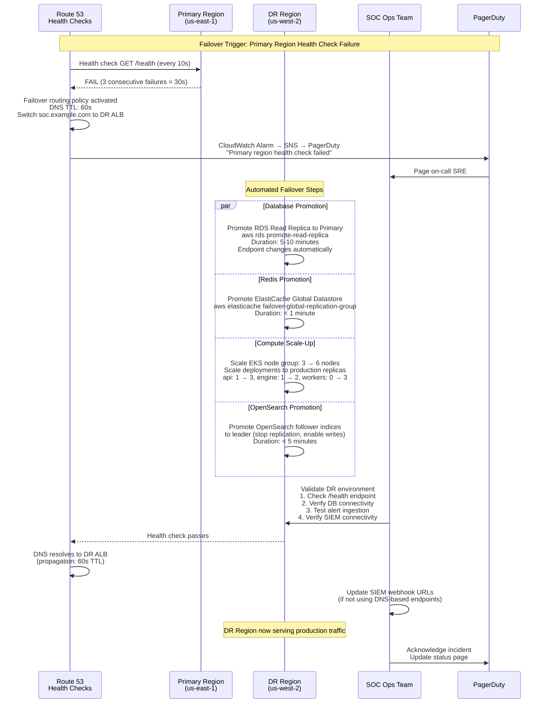
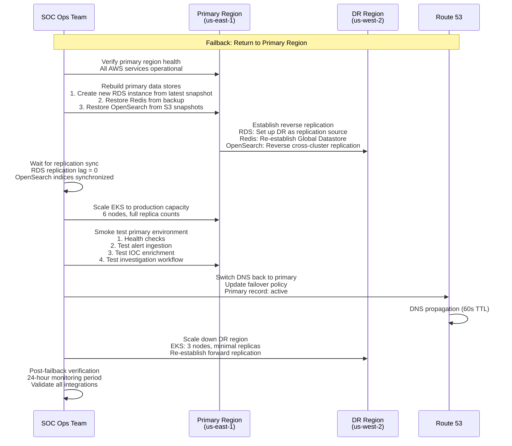

# Disaster Recovery Architecture

## Overview

The SOC Analyst Agent disaster recovery (DR) architecture ensures continuous availability of security operations through an active-passive failover strategy across two AWS regions. The primary region (us-east-1) handles all production traffic, while the DR region (us-west-2) maintains warm standby resources that can be promoted within the defined Recovery Time Objective (RTO) and Recovery Point Objective (RPO).

## DR Architecture Diagram

```mermaid
graph TB
    subgraph Primary["Primary Region: us-east-1 (Active)"]
        subgraph Primary_Compute["Compute"]
            eks_primary["EKS Cluster<br/>soc-agent-prod<br/>6 nodes (c5.2xlarge)<br/>All workloads active"]
        end
        subgraph Primary_Data["Data Stores"]
            rds_primary["RDS PostgreSQL Primary<br/>db.r6g.xlarge<br/>Multi-AZ (sync standby)<br/>Automated backups: 35 days"]
            redis_primary["ElastiCache Redis<br/>3-shard cluster<br/>Multi-AZ replication<br/>AOF persistence"]
            os_primary["OpenSearch 2.11<br/>3-node cluster<br/>Automated snapshots: daily"]
            s3_primary["S3: soc-agent-artifacts<br/>Versioning enabled<br/>Cross-region replication"]
        end
        subgraph Primary_Network["Networking"]
            alb_primary["ALB (Primary)<br/>soc.example.com<br/>Health checks: /health"]
            r53_primary["Route 53<br/>Failover routing policy<br/>Primary record<br/>Health check: 10s interval"]
        end
    end

    subgraph DR["DR Region: us-west-2 (Passive/Warm Standby)"]
        subgraph DR_Compute["Compute (Scaled Down)"]
            eks_dr["EKS Cluster<br/>soc-agent-dr<br/>3 nodes (c5.xlarge)<br/>API + Engine only<br/>Workers scaled to 0"]
        end
        subgraph DR_Data["Data Stores (Replicated)"]
            rds_dr["RDS Read Replica<br/>db.r6g.large<br/>Async replication<br/>Promotable to primary<br/>Replication lag: < 1s"]
            redis_dr["ElastiCache Redis<br/>Global Datastore<br/>Cross-region replication<br/>Read-only until failover"]
            os_dr["OpenSearch<br/>Cross-cluster replication<br/>Index-level replication<br/>Lag: < 5 minutes"]
            s3_dr["S3: soc-agent-artifacts-dr<br/>Cross-region replication<br/>15-min replication SLA"]
        end
        subgraph DR_Network["Networking"]
            alb_dr["ALB (DR)<br/>soc-dr.example.com<br/>Health checks: /health"]
            r53_dr["Route 53<br/>Failover routing policy<br/>Secondary record<br/>Activated on primary failure"]
        end
    end

    subgraph Backup["Backup Strategy"]
        rds_snapshots["RDS Automated Snapshots<br/>Daily at 03:00 UTC<br/>Retained: 35 days<br/>Cross-region copy: daily"]
        rds_pitr["RDS Point-in-Time Recovery<br/>Continuous WAL archival<br/>5-minute granularity<br/>Retention: 35 days"]
        os_snapshots["OpenSearch Snapshots<br/>Hourly to S3<br/>Retained: 30 days<br/>Cross-region S3 replication"]
        redis_backup["Redis RDB Snapshots<br/>Daily at 04:00 UTC<br/>Retained: 7 days<br/>Stored in S3"]
        tf_state["Terraform State<br/>S3 backend with versioning<br/>DynamoDB locking<br/>Cross-region replicated"]
        ecr_replication["ECR Image Replication<br/>Cross-region replication rule<br/>All images mirrored to us-west-2<br/>< 5 min replication"]
    end

    rds_primary -->|Async replication<br/>< 1s lag| rds_dr
    redis_primary -->|Global Datastore<br/>cross-region sync| redis_dr
    os_primary -->|Cross-cluster<br/>replication| os_dr
    s3_primary -->|S3 Cross-Region<br/>Replication| s3_dr

    r53_primary -->|Active| alb_primary
    r53_dr -->|Standby| alb_dr

    rds_primary --> rds_snapshots
    rds_primary --> rds_pitr
    os_primary --> os_snapshots
    redis_primary --> redis_backup

    style Primary fill:#e8f5e9,stroke:#388e3c
    style DR fill:#fff3e0,stroke:#f57c00
    style Backup fill:#e3f2fd,stroke:#1565c0
```



## Recovery Objectives

| Metric | Target | Justification |
|--------|--------|---------------|
| **RTO (Recovery Time Objective)** | 30 minutes | SOC operations can tolerate 30 min of downtime during regional failure; analysts fall back to manual SIEM queries |
| **RPO (Recovery Point Objective)** | 5 minutes | Maximum acceptable data loss; RDS async replication lag < 1s, OpenSearch replication lag < 5 min |
| **MTTR (Mean Time to Recover)** | 20 minutes | Automated failover + manual validation |
| **RTO for Database** | 15 minutes | RDS replica promotion takes 5-10 min, application reconnection 5 min |
| **RTO for Compute** | 10 minutes | EKS DR cluster pre-provisioned, scale-up via Karpenter |
| **RPO for Audit Logs** | 0 (zero data loss) | Audit logs written to multi-AZ RDS with synchronous replication |

## Failover Procedure



## Failback Procedure



## Backup Schedule

| Resource | Backup Type | Frequency | Retention | Storage | Cross-Region |
|----------|------------|-----------|-----------|---------|-------------|
| RDS PostgreSQL | Automated Snapshot | Daily 03:00 UTC | 35 days | S3 (AWS-managed) | Daily copy to us-west-2 |
| RDS PostgreSQL | Point-in-Time Recovery | Continuous (WAL) | 35 days | S3 (AWS-managed) | Via async replication |
| RDS PostgreSQL | Manual Snapshot | Weekly (Sunday) | 90 days | S3 (AWS-managed) | Copied to us-west-2 |
| ElastiCache Redis | RDB Snapshot | Daily 04:00 UTC | 7 days | S3 | Cross-region via Global Datastore |
| OpenSearch | Automated Snapshot | Hourly | 30 days (168 snapshots) | S3 soc-agent-os-snapshots | S3 cross-region replication |
| S3 Artifacts | Versioning | Continuous | 365 days | S3 | Cross-region replication |
| Terraform State | S3 Versioning | On every apply | 90 days | S3 + DynamoDB | Cross-region replication |
| Container Images | ECR Replication | On push | Latest 50 images | ECR | Replication rule to us-west-2 |
| Kubernetes Manifests | Git Repository | On commit | Indefinite | GitHub | Geo-redundant (GitHub) |

## DR Testing Schedule

| Test Type | Frequency | Duration | Scope | Success Criteria |
|-----------|-----------|----------|-------|-----------------|
| Backup Restore Test | Monthly | 2 hours | Restore RDS snapshot to isolated instance, verify data integrity | All tables present, row counts match, checksums valid |
| Failover Simulation | Quarterly | 4 hours | Full regional failover to DR region (non-production traffic) | RTO < 30 min, RPO < 5 min, all health checks pass |
| Tabletop Exercise | Semi-annually | 2 hours | Walk through DR runbook with SOC and SRE teams | All steps documented, roles clear, contact info current |
| Full DR Drill | Annually | 8 hours | Route production traffic to DR region for 4 hours | All functionality works, SLAs met, successful failback |
| Chaos Engineering | Monthly | 1 hour | Inject failures (pod kill, node drain, network partition) | System self-heals within 5 minutes, no data loss |

## Component Recovery Procedures

### PostgreSQL Recovery

| Scenario | Procedure | RTO | RPO |
|----------|-----------|-----|-----|
| Single AZ failure | Automatic Multi-AZ failover (synchronous standby) | < 2 min | 0 (synchronous) |
| Regional failure | Promote cross-region read replica | 10-15 min | < 1s (async lag) |
| Data corruption | Point-in-Time Recovery to pre-corruption timestamp | 15-30 min | 5 min granularity |
| Accidental deletion | Restore from automated snapshot | 30-60 min | Up to 24h (snapshot interval) |
| Complete loss | Restore from manual weekly snapshot + WAL replay | 1-2 hours | Up to 7 days |

### Redis Recovery

| Scenario | Procedure | RTO | RPO |
|----------|-----------|-----|-----|
| Node failure | Automatic replica promotion (Multi-AZ) | < 1 min | 0 (synchronous replica) |
| Regional failure | ElastiCache Global Datastore failover | < 1 min | < 1s (async) |
| Data corruption | Restore from RDB snapshot | 5-10 min | Up to 24h (snapshot interval) |
| Complete loss | Rebuild from RDB snapshot; cache warms organically | 10-15 min | Cache rebuild: gradual over hours |

### OpenSearch Recovery

| Scenario | Procedure | RTO | RPO |
|----------|-----------|-----|-----|
| Node failure | Automatic shard rebalancing (1 replica per shard) | < 5 min | 0 (replica exists) |
| Regional failure | Promote cross-cluster replication follower indices | 5-10 min | < 5 min (replication lag) |
| Index corruption | Restore from hourly S3 snapshot | 15-30 min | < 1 hour (snapshot interval) |
| Complete loss | Restore from S3 snapshot + re-index knowledge base | 1-2 hours | Data re-indexed from source |

### EKS Recovery

| Scenario | Procedure | RTO | RPO |
|----------|-----------|-----|-----|
| Pod failure | Automatic restart (liveness probe) | < 1 min | 0 (stateless pods) |
| Node failure | Karpenter provisions replacement node | 2-5 min | 0 (pods rescheduled) |
| AZ failure | Pods rescheduled to other AZ nodes | 2-5 min | 0 (multi-AZ deployment) |
| Regional failure | DR EKS cluster scale-up + DNS failover | 10-15 min | 0 (stateless; state in DB) |
| Cluster corruption | Terraform destroy + apply (IaC rebuild) | 30-60 min | 0 (IaC is source of truth) |

## Communication Plan

| Stage | Action | Channel | Audience |
|-------|--------|---------|----------|
| Detection | Automated PagerDuty alert | PagerDuty | On-call SRE |
| Assessment (0-5 min) | SRE assesses scope, declares incident | Slack #soc-incidents | SRE team |
| Failover Start (5-10 min) | Execute failover runbook, notify stakeholders | Slack #soc-incidents + Status Page | SOC team, management |
| Failover Complete (10-30 min) | Validate DR, confirm service restoration | Slack + Email | All stakeholders |
| Root Cause Analysis (post-incident) | RCA document within 48 hours | Confluence + Email | Engineering, management |
| Failback Planning (post-RCA) | Schedule failback window | Calendar invite | SRE, SOC leads |

## Infrastructure as Code Recovery

All infrastructure is defined in Terraform and stored in a Git repository. In case of complete infrastructure loss:

```
1. Clone infrastructure repository from GitHub
2. Configure AWS credentials for target region
3. Initialize Terraform with S3 backend (replicated state)
4. terraform plan -var-file=dr/terraform.tfvars
5. terraform apply (provisions all resources)
6. Restore data from cross-region backups
7. Deploy application via Helm charts from ECR images
8. Update DNS to point to new infrastructure
9. Validate all health checks and integrations
```

Total estimated rebuild time from zero: 2-4 hours (including data restoration).
