# Infrastructure Diagram

## Overview

The SOC Analyst Agent runs on a cloud infrastructure provisioned and managed via Terraform. The architecture follows defense-in-depth principles with network segmentation across public, private, and isolated subnets. All compute runs on a managed Kubernetes cluster (EKS/AKS/GKE), with managed services for databases, caching, and search.

## Infrastructure Diagram

```mermaid
graph TB
    subgraph Internet["Internet"]
        users["SOC Analysts<br/>Browser/API Clients"]
        siem_sources["SIEM Platforms<br/>Splunk / Elastic / Sentinel"]
        threat_feeds["Threat Intel APIs<br/>VT / AbuseIPDB / MISP"]
        llm_api["LLM Provider<br/>OpenAI / Azure OpenAI"]
    end

    subgraph AWS_Cloud["AWS Cloud (us-east-1)"]
        subgraph VPC["VPC: 10.0.0.0/16"]
            subgraph Public_Subnet["Public Subnet: 10.0.1.0/24, 10.0.2.0/24 (Multi-AZ)"]
                alb["Application Load Balancer<br/>ALB / L7<br/>Ports: 443 (HTTPS)<br/>ACM TLS Certificate<br/>WAF v2 Attached"]
                nat_gw_a["NAT Gateway A<br/>Elastic IP<br/>AZ: us-east-1a"]
                nat_gw_b["NAT Gateway B<br/>Elastic IP<br/>AZ: us-east-1b"]
                bastion["Bastion Host<br/>t3.micro<br/>SSH Port 22<br/>MFA Required"]
            end

            subgraph Private_Subnet["Private Subnet: 10.0.10.0/24, 10.0.11.0/24 (Multi-AZ)"]
                subgraph EKS_Cluster["EKS Cluster: soc-agent-prod"]
                    node_group_a["Node Group A<br/>c5.2xlarge x 3<br/>AZ: us-east-1a<br/>8 vCPU, 16 GB RAM"]
                    node_group_b["Node Group B<br/>c5.2xlarge x 3<br/>AZ: us-east-1b<br/>8 vCPU, 16 GB RAM"]
                    node_group_gpu["GPU Node Group<br/>g4dn.xlarge x 2<br/>NVIDIA T4<br/>Embedding inference"]
                end
            end

            subgraph Isolated_Subnet["Isolated Subnet: 10.0.20.0/24, 10.0.21.0/24 (Multi-AZ)"]
                rds["Amazon RDS PostgreSQL 16<br/>db.r6g.xlarge<br/>Multi-AZ Standby<br/>100 GB gp3 SSD<br/>Encrypted at rest (AES-256)<br/>Port: 5432"]
                elasticache["Amazon ElastiCache Redis 7.2<br/>cache.r6g.large<br/>3-node cluster<br/>Multi-AZ Replication<br/>In-transit encryption (TLS)<br/>Port: 6379"]
                opensearch_cluster["Amazon OpenSearch 2.11<br/>r6g.large.search x 3<br/>Data nodes with 100 GB gp3<br/>Dedicated master nodes<br/>Encryption at rest<br/>Port: 9200"]
            end
        end

        s3_bucket["S3 Bucket<br/>soc-agent-artifacts<br/>Investigation reports<br/>Evidence archives<br/>Knowledge base docs<br/>Versioning enabled<br/>SSE-S3 encryption"]

        ecr["Amazon ECR<br/>Container registry<br/>Image scanning enabled<br/>Lifecycle policies"]

        secrets_manager["AWS Secrets Manager<br/>API keys (VT, AbuseIPDB)<br/>SIEM credentials<br/>DB passwords<br/>LLM API keys<br/>30-day rotation"]

        cloudwatch["Amazon CloudWatch<br/>EKS cluster logs<br/>RDS performance insights<br/>Custom metrics<br/>Alarms and dashboards"]

        route53["Amazon Route 53<br/>soc-agent.internal<br/>Private hosted zone<br/>Health checks"]

        waf["AWS WAF v2<br/>Rate limiting: 1000 req/5min<br/>IP allowlist<br/>SQL injection rules<br/>XSS protection rules<br/>Bot control"]

        kms["AWS KMS<br/>Customer-managed CMK<br/>RDS encryption<br/>S3 encryption<br/>Secrets encryption<br/>Auto-rotation yearly"]

        vpc_endpoints["VPC Endpoints<br/>S3 Gateway Endpoint<br/>ECR Interface Endpoint<br/>Secrets Manager Endpoint<br/>CloudWatch Endpoint<br/>STS Interface Endpoint"]
    end

    users -->|HTTPS/443| alb
    alb -->|Target Group| EKS_Cluster
    EKS_Cluster -->|TCP/5432| rds
    EKS_Cluster -->|TCP/6379| elasticache
    EKS_Cluster -->|HTTPS/9200| opensearch_cluster
    EKS_Cluster -->|HTTPS/443| s3_bucket
    EKS_Cluster -->|HTTPS/443| secrets_manager
    EKS_Cluster -->|NAT Gateway| nat_gw_a
    EKS_Cluster -->|NAT Gateway| nat_gw_b
    nat_gw_a -->|Outbound| siem_sources
    nat_gw_a -->|Outbound| threat_feeds
    nat_gw_a -->|Outbound| llm_api
    nat_gw_b -->|Outbound| siem_sources
    nat_gw_b -->|Outbound| threat_feeds
    bastion -->|SSH/22| EKS_Cluster

    style VPC fill:#e8f4fd,stroke:#1a73e8
    style Public_Subnet fill:#fff3e0,stroke:#f57c00
    style Private_Subnet fill:#e8f5e9,stroke:#388e3c
    style Isolated_Subnet fill:#fce4ec,stroke:#c62828
    style Internet fill:#f5f5f5,stroke:#616161
```



## Resource Specifications

### Compute (EKS)

| Resource | Specification | Quantity | Purpose |
|----------|---------------|----------|---------|
| EKS Cluster | Kubernetes 1.29, managed control plane | 1 | Container orchestration |
| Standard Node Group A | c5.2xlarge (8 vCPU, 16 GB RAM) | 3 | API, Agent Engine, Workers (AZ-a) |
| Standard Node Group B | c5.2xlarge (8 vCPU, 16 GB RAM) | 3 | API, Agent Engine, Workers (AZ-b) |
| GPU Node Group | g4dn.xlarge (4 vCPU, 16 GB RAM, NVIDIA T4) | 2 | Embedding generation, ML inference |
| Cluster Autoscaler | Min: 2, Max: 8 per node group | - | Scale based on pending pod count |
| Karpenter | Provisioner for spot instances | - | Cost-optimized scaling for batch workers |

### Database (RDS PostgreSQL)

| Parameter | Value |
|-----------|-------|
| Engine | PostgreSQL 16.1 |
| Instance Class | db.r6g.xlarge (4 vCPU, 32 GB RAM) |
| Storage | 100 GB gp3 SSD (3000 IOPS, 125 MB/s) |
| Multi-AZ | Enabled (synchronous standby in us-east-1b) |
| Read Replicas | 1 (async, for dashboard queries) |
| Backup Retention | 35 days, automated daily snapshots |
| Encryption | AES-256 via KMS CMK |
| Connection Pooling | PgBouncer (sidecar, max 100 connections) |
| Parameter Group | `max_connections=200, shared_buffers=8GB, work_mem=256MB` |

### Cache (ElastiCache Redis)

| Parameter | Value |
|-----------|-------|
| Engine | Redis 7.2 |
| Node Type | cache.r6g.large (2 vCPU, 13.07 GB RAM) |
| Cluster Mode | Enabled, 3 shards x 1 replica |
| Multi-AZ | Enabled with automatic failover |
| In-Transit Encryption | TLS 1.3 |
| At-Rest Encryption | AES-256 via KMS |
| Eviction Policy | allkeys-lru |
| Persistence | AOF with appendfsync everysec |
| Max Memory | 12 GB per node |

### Search (OpenSearch)

| Parameter | Value |
|-----------|-------|
| Version | OpenSearch 2.11 |
| Data Nodes | r6g.large.search x 3 (2 vCPU, 16 GB RAM each) |
| Data Storage | 100 GB gp3 per node |
| Dedicated Master | m6g.large.search x 3 |
| Encryption at Rest | AES-256 via KMS |
| Node-to-Node Encryption | TLS 1.3 |
| Fine-Grained Access | SAML / IAM role mapping |
| Index State Management | Hot (7d) -> Warm (30d) -> Delete (90d) |

### Storage (S3)

| Parameter | Value |
|-----------|-------|
| Bucket | soc-agent-artifacts |
| Versioning | Enabled |
| Encryption | SSE-S3 (AES-256) |
| Lifecycle Rules | IA after 30d, Glacier after 90d, Delete after 365d |
| Access Logging | Enabled to separate logging bucket |
| Bucket Policy | VPC endpoint access only (no public access) |
| Cross-Region Replication | Enabled to us-west-2 (DR region) |

### Networking

| Component | CIDR / Configuration |
|-----------|---------------------|
| VPC | 10.0.0.0/16 |
| Public Subnets | 10.0.1.0/24 (us-east-1a), 10.0.2.0/24 (us-east-1b) |
| Private Subnets | 10.0.10.0/24 (us-east-1a), 10.0.11.0/24 (us-east-1b) |
| Isolated Subnets | 10.0.20.0/24 (us-east-1a), 10.0.21.0/24 (us-east-1b) |
| NAT Gateways | 2 (one per AZ, for high availability) |
| VPC Flow Logs | Enabled, sent to CloudWatch Logs (14-day retention) |
| DNS Resolution | Route 53 private hosted zone: soc-agent.internal |
| VPC Endpoints | S3, ECR, Secrets Manager, CloudWatch, STS, KMS |

### Security

| Component | Configuration |
|-----------|--------------|
| WAF v2 | Rate limit 1000 req/5min, IP allowlist, OWASP core rules |
| Security Groups | Least privilege, deny-all default, specific port allowlists |
| NACLs | Stateless rules on subnet boundaries |
| KMS | Customer-managed CMK with yearly automatic rotation |
| Secrets Manager | 30-day automatic rotation for database credentials |
| GuardDuty | Enabled for VPC flow logs, DNS logs, CloudTrail |
| Security Hub | CIS AWS Foundations Benchmark compliance checks |
| IAM | IRSA (IAM Roles for Service Accounts) for EKS pods |

## Terraform Module Structure

```
infrastructure/
  terraform/
    environments/
      prod/
        main.tf
        variables.tf
        outputs.tf
        backend.tf          # S3 + DynamoDB state backend
      staging/
        main.tf
    modules/
      vpc/                  # VPC, subnets, NAT, endpoints
      eks/                  # EKS cluster, node groups, IRSA
      rds/                  # PostgreSQL, parameter groups, backups
      elasticache/          # Redis cluster, subnet groups
      opensearch/           # OpenSearch domain, ISM policies
      s3/                   # Artifact buckets, lifecycle rules
      security/             # WAF, KMS, security groups, NACLs
      monitoring/           # CloudWatch dashboards, alarms
      dns/                  # Route 53 hosted zones, records
```
