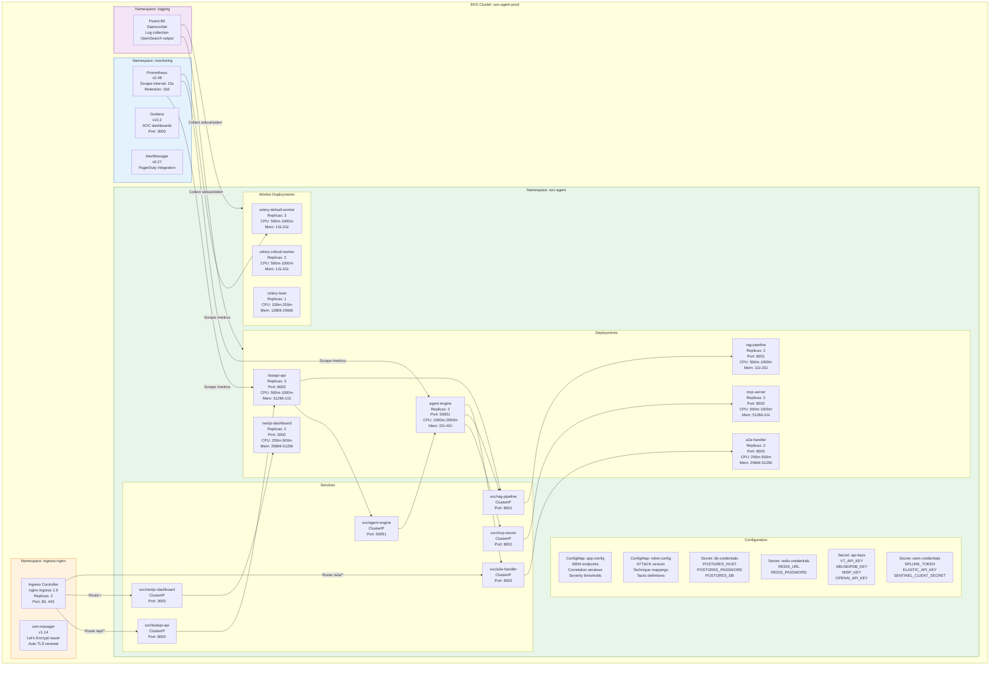
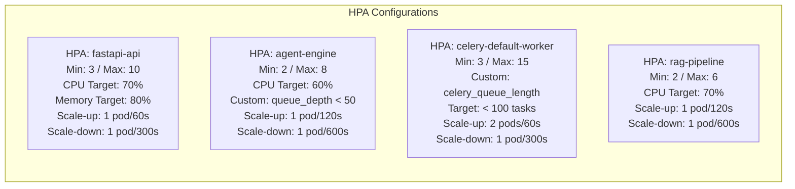
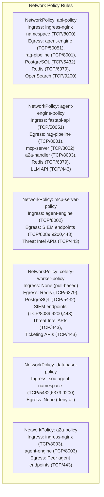
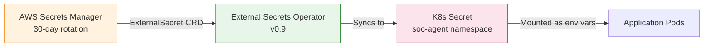

# Kubernetes Architecture

## Overview

The SOC Analyst Agent is deployed on a managed Kubernetes cluster (EKS) with strict namespace isolation, network policies, horizontal pod autoscaling, and security-hardened configurations. Each component runs as a separate Deployment with dedicated ServiceAccounts, resource limits, and pod disruption budgets.

## Namespace Architecture



## Deployment Specifications

### FastAPI API Gateway

```yaml
apiVersion: apps/v1
kind: Deployment
metadata:
  name: fastapi-api
  namespace: soc-agent
spec:
  replicas: 3
  strategy:
    type: RollingUpdate
    rollingUpdate:
      maxSurge: 1
      maxUnavailable: 0
  template:
    spec:
      serviceAccountName: fastapi-api-sa
      securityContext:
        runAsNonRoot: true
        runAsUser: 1000
        fsGroup: 1000
      containers:
        - name: api
          image: <ecr>/soc-agent/api:1.0.0
          ports:
            - containerPort: 8000
              protocol: TCP
          resources:
            requests:
              cpu: 500m
              memory: 512Mi
            limits:
              cpu: "1"
              memory: 1Gi
          livenessProbe:
            httpGet:
              path: /health
              port: 8000
            initialDelaySeconds: 10
            periodSeconds: 15
            failureThreshold: 3
          readinessProbe:
            httpGet:
              path: /ready
              port: 8000
            initialDelaySeconds: 5
            periodSeconds: 10
          envFrom:
            - configMapRef:
                name: app-config
            - secretRef:
                name: db-credentials
            - secretRef:
                name: redis-credentials
```

## Horizontal Pod Autoscaler (HPA) Configuration



| Deployment | Min | Max | CPU Target | Custom Metric | Scale-Up Rate | Scale-Down Rate |
|------------|-----|-----|------------|---------------|---------------|-----------------|
| fastapi-api | 3 | 10 | 70% | Request latency p99 < 500ms | 1 pod / 60s | 1 pod / 300s |
| agent-engine | 2 | 8 | 60% | Investigation queue depth < 50 | 1 pod / 120s | 1 pod / 600s |
| celery-default-worker | 3 | 15 | - | Celery queue length < 100 | 2 pods / 60s | 1 pod / 300s |
| celery-critical-worker | 2 | 8 | - | Critical queue length < 10 | 1 pod / 30s | 1 pod / 600s |
| rag-pipeline | 2 | 6 | 70% | - | 1 pod / 120s | 1 pod / 600s |
| mcp-server | 2 | 6 | 70% | - | 1 pod / 120s | 1 pod / 600s |
| a2a-handler | 2 | 4 | 70% | - | 1 pod / 120s | 1 pod / 600s |

## Pod Disruption Budgets (PDB)

| Deployment | minAvailable | maxUnavailable | Rationale |
|------------|-------------|----------------|-----------|
| fastapi-api | 2 | - | Maintain API availability during node drain |
| agent-engine | 1 | - | At least one engine instance for active investigations |
| celery-critical-worker | 1 | - | Critical alert processing must continue |
| celery-default-worker | - | 1 | Allow one worker to be drained at a time |
| nextjs-dashboard | 1 | - | Dashboard availability for SOC analysts |
| celery-beat | 1 | 0 | Single instance, must not be disrupted |

## Network Policies



## ServiceAccount and RBAC

| ServiceAccount | Namespace | IAM Role (IRSA) | Permissions |
|----------------|-----------|-----------------|-------------|
| fastapi-api-sa | soc-agent | soc-agent-api-role | Secrets Manager read, S3 read/write, CloudWatch put-metric |
| agent-engine-sa | soc-agent | soc-agent-engine-role | Secrets Manager read, S3 read |
| celery-worker-sa | soc-agent | soc-agent-worker-role | Secrets Manager read, S3 read/write, SES send-email |
| rag-pipeline-sa | soc-agent | soc-agent-rag-role | S3 read (knowledge base bucket), Secrets Manager read |
| mcp-server-sa | soc-agent | soc-agent-mcp-role | Secrets Manager read (SIEM, threat intel credentials) |
| a2a-handler-sa | soc-agent | soc-agent-a2a-role | Secrets Manager read, S3 read |
| prometheus-sa | monitoring | soc-agent-monitoring-role | CloudWatch read, EKS read |
| fluentbit-sa | logging | soc-agent-logging-role | OpenSearch write, CloudWatch put-log |

## ConfigMaps

### app-config

| Key | Value | Description |
|-----|-------|-------------|
| `SIEM_POLL_INTERVAL` | `60` | Seconds between SIEM polling cycles |
| `CORRELATION_WINDOW` | `14400` | Correlation time window in seconds (4 hours) |
| `SEVERITY_THRESHOLD_CRITICAL` | `90` | Score threshold for Critical severity |
| `SEVERITY_THRESHOLD_HIGH` | `70` | Score threshold for High severity |
| `SEVERITY_THRESHOLD_MEDIUM` | `40` | Score threshold for Medium severity |
| `DEDUP_WINDOW` | `900` | Deduplication window in seconds (15 minutes) |
| `MAX_CONCURRENT_ENRICHMENTS` | `20` | Maximum parallel IOC enrichment requests |
| `IOC_CACHE_TTL` | `3600` | IOC enrichment cache TTL in seconds |
| `LLM_MODEL` | `gpt-4o` | Primary LLM model for agent reasoning |
| `LLM_FALLBACK_MODEL` | `gpt-4o-mini` | Fallback model on primary failure |
| `LLM_MAX_TOKENS` | `4096` | Maximum output tokens per LLM call |
| `RAG_TOP_K` | `5` | Number of RAG retrieval results |

### mitre-config

| Key | Value | Description |
|-----|-------|-------------|
| `ATTACK_VERSION` | `15.1` | MITRE ATT&CK version for technique data |
| `ATTACK_STIX_URL` | `https://raw.githubusercontent.com/mitre/cti/master/enterprise-attack/enterprise-attack.json` | STIX data source |
| `CONFIDENCE_HIGH_THRESHOLD` | `0.8` | Minimum confidence for High mapping |
| `CONFIDENCE_MEDIUM_THRESHOLD` | `0.5` | Minimum confidence for Medium mapping |

## Secrets Management

All secrets are stored in AWS Secrets Manager and synced to Kubernetes Secrets via External Secrets Operator (ESO) with a 60-second refresh interval.



| Secret Name | Keys | Rotation |
|-------------|------|----------|
| db-credentials | `POSTGRES_HOST`, `POSTGRES_PORT`, `POSTGRES_DB`, `POSTGRES_USER`, `POSTGRES_PASSWORD` | 30 days |
| redis-credentials | `REDIS_URL`, `REDIS_PASSWORD` | 30 days |
| api-keys | `VT_API_KEY`, `ABUSEIPDB_KEY`, `MISP_KEY`, `MISP_URL`, `SHODAN_API_KEY`, `OTX_API_KEY` | 90 days |
| siem-credentials | `SPLUNK_URL`, `SPLUNK_TOKEN`, `ELASTIC_URL`, `ELASTIC_API_KEY`, `SENTINEL_TENANT_ID`, `SENTINEL_CLIENT_ID`, `SENTINEL_CLIENT_SECRET` | 90 days |
| llm-credentials | `OPENAI_API_KEY`, `OPENAI_ORG_ID` | 90 days |
| jwt-secrets | `JWT_SECRET_KEY`, `JWT_REFRESH_SECRET` | 30 days |

## Ingress Configuration

| Host | Path | Service | Port | TLS | Rate Limit |
|------|------|---------|------|-----|------------|
| `soc.example.com` | `/` | nextjs-dashboard | 3000 | Yes (cert-manager) | 200 req/min |
| `soc.example.com` | `/api/v1/*` | fastapi-api | 8000 | Yes (cert-manager) | 100 req/min |
| `soc.example.com` | `/ws/*` | fastapi-api | 8000 | Yes (WebSocket upgrade) | 50 conn/min |
| `soc.example.com` | `/a2a/*` | a2a-handler | 8003 | Yes (mTLS) | 50 req/min |
| `soc.example.com` | `/metrics` | Deny (internal only) | - | - | - |
