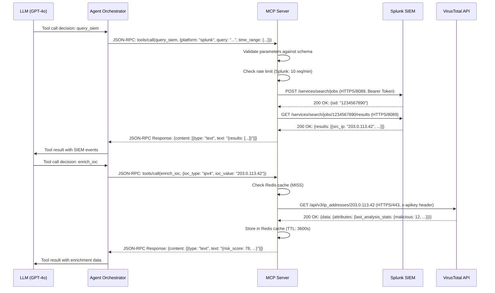

# MCP Integration Architecture

## Overview

The SOC Analyst Agent exposes its security operations capabilities through the Model Context Protocol (MCP), enabling the LLM-powered Agent Engine to invoke SOC-specific tools in a structured, type-safe manner. The MCP Server acts as a tool registry and execution layer, translating JSON-RPC tool calls into actual SIEM queries, threat intelligence lookups, and incident management operations.

## MCP Tool Registry Diagram

```mermaid
graph TB
    subgraph Agent_Engine["Agent Engine (LLM + Orchestrator)"]
        llm["LLM (GPT-4o)<br/>Decides which tools to call<br/>based on investigation context"]
        orchestrator["Agent Orchestrator<br/>Manages tool call sequencing<br/>and result aggregation"]
    end

    subgraph MCP_Server["MCP Server (FastMCP, Port 8002)"]
        registry["Tool Registry<br/>JSON Schema definitions<br/>Parameter validation<br/>Rate limiting"]

        subgraph Tools["Registered Tools"]
            query_siem["query_siem<br/>Execute SPL/KQL/EQL queries<br/>against configured SIEM platforms"]
            enrich_ioc["enrich_ioc<br/>Query threat intelligence APIs<br/>for IOC reputation and context"]
            correlate_events["correlate_events<br/>Find related alerts by shared<br/>IOCs, assets, and timeframes"]
            generate_investigation["generate_investigation<br/>Create step-by-step investigation<br/>playbook for the current alert"]
            create_incident_report["create_incident_report<br/>Compile findings into structured<br/>incident report (HTML/PDF/JSON)"]
            lookup_asset["lookup_asset<br/>Query CMDB for asset ownership,<br/>criticality, and network zone"]
            check_reputation["check_reputation<br/>Check domain/IP/hash against<br/>internal watchlists and blocklists"]
            submit_ioc["submit_ioc<br/>Submit new IOC to MISP and<br/>internal blocklist for sharing"]
            isolate_endpoint["isolate_endpoint<br/>Send isolation command to EDR<br/>platform for compromised host"]
            create_ticket["create_ticket<br/>Create incident ticket in<br/>ServiceNow or Jira"]
        end
    end

    subgraph External["External Systems"]
        splunk["Splunk<br/>REST API<br/>Port 8089"]
        elastic["Elastic SIEM<br/>REST API<br/>Port 9200"]
        sentinel["Microsoft Sentinel<br/>Graph API<br/>Port 443"]
        vt["VirusTotal<br/>API v3<br/>Port 443"]
        abuse["AbuseIPDB<br/>API v2<br/>Port 443"]
        misp_ext["MISP<br/>REST API<br/>Port 443"]
        shodan_ext["Shodan<br/>REST API<br/>Port 443"]
        cmdb["ServiceNow CMDB<br/>REST API<br/>Port 443"]
        crowdstrike["CrowdStrike<br/>OAuth2 API<br/>Port 443"]
        snow["ServiceNow ITSM<br/>REST API<br/>Port 443"]
        jira_ext["Jira<br/>REST API v3<br/>Port 443"]
    end

    llm -->|JSON-RPC 2.0<br/>tools/call| registry
    orchestrator -->|Sequences tool calls| llm

    registry --> query_siem
    registry --> enrich_ioc
    registry --> correlate_events
    registry --> generate_investigation
    registry --> create_incident_report
    registry --> lookup_asset
    registry --> check_reputation
    registry --> submit_ioc
    registry --> isolate_endpoint
    registry --> create_ticket

    query_siem -->|SPL query| splunk
    query_siem -->|EQL query| elastic
    query_siem -->|KQL query| sentinel

    enrich_ioc --> vt
    enrich_ioc --> abuse
    enrich_ioc --> misp_ext
    enrich_ioc --> shodan_ext

    correlate_events -->|Historical query| elastic
    correlate_events -->|Historical query| splunk

    lookup_asset --> cmdb
    submit_ioc --> misp_ext
    isolate_endpoint --> crowdstrike
    create_ticket --> snow
    create_ticket --> jira_ext

    style Agent_Engine fill:#e8f5e9,stroke:#388e3c
    style MCP_Server fill:#e3f2fd,stroke:#1565c0
    style External fill:#fff3e0,stroke:#f57c00
```



## Tool Definitions

### query_siem

Executes a search query against the configured SIEM platform and returns matching events.

**Schema:**
```json
{
  "name": "query_siem",
  "description": "Execute a search query against the configured SIEM platform (Splunk SPL, Elastic EQL, or Sentinel KQL). Returns matching events with timestamps, source IPs, destination IPs, event types, and raw log data.",
  "inputSchema": {
    "type": "object",
    "properties": {
      "platform": {
        "type": "string",
        "enum": ["splunk", "elastic", "sentinel"],
        "description": "Target SIEM platform"
      },
      "query": {
        "type": "string",
        "description": "Search query in the platform's native language (SPL for Splunk, EQL for Elastic, KQL for Sentinel)"
      },
      "time_range": {
        "type": "object",
        "properties": {
          "start": { "type": "string", "format": "date-time" },
          "end": { "type": "string", "format": "date-time" }
        },
        "required": ["start", "end"]
      },
      "max_results": {
        "type": "integer",
        "default": 100,
        "maximum": 1000,
        "description": "Maximum number of events to return"
      },
      "fields": {
        "type": "array",
        "items": { "type": "string" },
        "description": "Specific fields to return (reduces payload size)"
      }
    },
    "required": ["platform", "query", "time_range"]
  }
}
```

**Example Invocation:**
```json
{
  "method": "tools/call",
  "params": {
    "name": "query_siem",
    "arguments": {
      "platform": "splunk",
      "query": "index=main sourcetype=syslog src_ip=203.0.113.42 | stats count by dest_ip, dest_port, action",
      "time_range": {
        "start": "2026-07-03T00:00:00Z",
        "end": "2026-07-04T00:00:00Z"
      },
      "max_results": 50
    }
  }
}
```

### enrich_ioc

Queries multiple threat intelligence sources for a given indicator of compromise and returns aggregated reputation data.

**Schema:**
```json
{
  "name": "enrich_ioc",
  "description": "Query VirusTotal, AbuseIPDB, MISP, and Shodan for reputation and context data on an IOC. Returns composite risk score, individual source scores, and contextual metadata.",
  "inputSchema": {
    "type": "object",
    "properties": {
      "ioc_type": {
        "type": "string",
        "enum": ["ipv4", "ipv6", "domain", "url", "md5", "sha1", "sha256", "email"],
        "description": "Type of indicator"
      },
      "ioc_value": {
        "type": "string",
        "description": "The indicator value (IP address, domain, hash, etc.)"
      },
      "sources": {
        "type": "array",
        "items": {
          "type": "string",
          "enum": ["virustotal", "abuseipdb", "misp", "shodan"]
        },
        "default": ["virustotal", "abuseipdb", "misp", "shodan"],
        "description": "Threat intelligence sources to query"
      },
      "bypass_cache": {
        "type": "boolean",
        "default": false,
        "description": "Skip Redis cache and force fresh queries"
      }
    },
    "required": ["ioc_type", "ioc_value"]
  }
}
```

### correlate_events

Finds alerts related to the current investigation by searching for shared IOCs, common assets, and temporal proximity.

**Schema:**
```json
{
  "name": "correlate_events",
  "description": "Find related security alerts by searching for shared IOCs, common affected assets, temporal proximity, and kill chain progression patterns. Returns a list of correlated alerts with relationship types and confidence scores.",
  "inputSchema": {
    "type": "object",
    "properties": {
      "alert_id": {
        "type": "string",
        "description": "ID of the current alert to correlate from"
      },
      "iocs": {
        "type": "array",
        "items": {
          "type": "object",
          "properties": {
            "type": { "type": "string" },
            "value": { "type": "string" }
          }
        },
        "description": "IOCs to search for across historical alerts"
      },
      "time_window_hours": {
        "type": "integer",
        "default": 4,
        "maximum": 168,
        "description": "Hours to look back for correlated events"
      },
      "correlation_types": {
        "type": "array",
        "items": {
          "type": "string",
          "enum": ["ioc_overlap", "temporal", "asset_affinity", "kill_chain", "campaign"]
        },
        "default": ["ioc_overlap", "temporal", "asset_affinity"]
      },
      "min_confidence": {
        "type": "number",
        "default": 0.5,
        "minimum": 0.0,
        "maximum": 1.0,
        "description": "Minimum correlation confidence threshold"
      }
    },
    "required": ["alert_id"]
  }
}
```

### generate_investigation

Creates a step-by-step investigation playbook tailored to the current alert and its context.

**Schema:**
```json
{
  "name": "generate_investigation",
  "description": "Generate a step-by-step investigation playbook based on the alert type, MITRE ATT&CK mapping, IOC enrichment results, and correlation findings. Returns ordered investigation steps with SIEM queries, evidence collection commands, and decision points.",
  "inputSchema": {
    "type": "object",
    "properties": {
      "alert_id": {
        "type": "string",
        "description": "ID of the alert to generate a playbook for"
      },
      "alert_type": {
        "type": "string",
        "enum": ["malware", "phishing", "intrusion", "data_exfiltration", "privilege_escalation", "lateral_movement", "c2_communication", "policy_violation", "reconnaissance", "denial_of_service"],
        "description": "Classification of the alert"
      },
      "mitre_techniques": {
        "type": "array",
        "items": { "type": "string" },
        "description": "MITRE ATT&CK technique IDs mapped to this alert (e.g., T1566.001)"
      },
      "affected_assets": {
        "type": "array",
        "items": {
          "type": "object",
          "properties": {
            "hostname": { "type": "string" },
            "ip": { "type": "string" },
            "asset_type": { "type": "string" },
            "criticality": { "type": "string", "enum": ["critical", "high", "medium", "low"] }
          }
        }
      },
      "output_format": {
        "type": "string",
        "enum": ["json", "markdown"],
        "default": "json"
      }
    },
    "required": ["alert_id", "alert_type"]
  }
}
```

### create_incident_report

Compiles all investigation findings into a structured incident report.

**Schema:**
```json
{
  "name": "create_incident_report",
  "description": "Compile investigation findings into a structured incident report including executive summary, IOC table, MITRE mapping, timeline, and recommended actions. Supports HTML, PDF, and JSON output formats.",
  "inputSchema": {
    "type": "object",
    "properties": {
      "investigation_id": {
        "type": "string",
        "description": "ID of the investigation to compile a report for"
      },
      "report_type": {
        "type": "string",
        "enum": ["full", "executive_summary", "ioc_report", "timeline"],
        "default": "full",
        "description": "Type of report to generate"
      },
      "output_format": {
        "type": "string",
        "enum": ["html", "pdf", "json"],
        "default": "html"
      },
      "include_raw_logs": {
        "type": "boolean",
        "default": false,
        "description": "Whether to include raw SIEM log excerpts in appendix"
      },
      "classification": {
        "type": "string",
        "enum": ["public", "internal", "confidential", "restricted"],
        "default": "confidential",
        "description": "Data classification label for the report"
      }
    },
    "required": ["investigation_id"]
  }
}
```

### Additional Tools

| Tool | Description | Primary External System |
|------|-------------|------------------------|
| `lookup_asset` | Query ServiceNow CMDB for asset ownership, criticality rating, business service, and network zone by hostname or IP address | ServiceNow CMDB (HTTPS/443) |
| `check_reputation` | Check an IOC against internal watchlists, blocklists, and known-good allowlists stored in PostgreSQL | PostgreSQL (TCP/5432) |
| `submit_ioc` | Submit a new IOC to MISP for threat intelligence sharing and add to internal blocklist | MISP (HTTPS/443) |
| `isolate_endpoint` | Send a network isolation command to CrowdStrike Falcon to quarantine a compromised endpoint | CrowdStrike (HTTPS/443, OAuth2) |
| `create_ticket` | Create an incident ticket in ServiceNow ITSM or Jira Service Management with populated fields | ServiceNow/Jira (HTTPS/443) |

## MCP Protocol Flow



## Rate Limiting Configuration

| Tool | External API | Rate Limit | Burst Limit | Backoff Strategy |
|------|-------------|------------|-------------|------------------|
| query_siem (Splunk) | Splunk REST | 10 req/min | 3 concurrent | Exponential, base 5s, max 60s |
| query_siem (Elastic) | Elasticsearch | 30 req/min | 5 concurrent | Exponential, base 2s, max 30s |
| query_siem (Sentinel) | Graph API | 20 req/min | 4 concurrent | Exponential, base 3s, max 45s |
| enrich_ioc (VT) | VirusTotal v3 | 4 req/min (free) | 1 concurrent | Linear, 15s delay |
| enrich_ioc (AbuseIPDB) | AbuseIPDB v2 | 1000 req/day | 5 concurrent | Linear, 1s delay |
| enrich_ioc (MISP) | MISP REST | 60 req/min | 10 concurrent | Exponential, base 1s, max 15s |
| enrich_ioc (Shodan) | Shodan REST | 1 req/sec | 1 concurrent | Linear, 1s delay |
| isolate_endpoint | CrowdStrike | 10 req/min | 2 concurrent | Exponential, base 5s, max 60s |
| create_ticket | ServiceNow | 30 req/min | 5 concurrent | Exponential, base 2s, max 30s |

## Error Handling

| Error Type | HTTP Code | MCP Response | Recovery |
|------------|-----------|--------------|----------|
| Invalid parameters | - | `{error: {code: -32602, message: "Invalid params"}}` | Return validation errors to LLM |
| Rate limit exceeded | 429 | `{error: {code: -32000, message: "Rate limited"}}` | Queue and retry after backoff |
| External API timeout | 504 | `{error: {code: -32001, message: "Upstream timeout"}}` | Retry with exponential backoff |
| Authentication failure | 401/403 | `{error: {code: -32002, message: "Auth failed"}}` | Refresh credentials from Secrets Manager |
| External API error | 500 | `{error: {code: -32003, message: "Upstream error"}}` | Retry, then return partial results |
| Tool not found | - | `{error: {code: -32601, message: "Method not found"}}` | Log error, inform LLM |
