# Network Topology

## Overview

The SOC Analyst Agent network architecture implements defense-in-depth with four distinct network zones: a public-facing DMZ for ingress traffic, a private application tier for compute workloads, an isolated data tier for databases and caches, and a management tier for administrative access. A site-to-site VPN connects the cloud infrastructure to on-premises SIEM platforms.

## Network Topology Diagram

```mermaid
graph TB
    subgraph Internet["Internet (Untrusted)"]
        analysts["SOC Analysts<br/>Remote / Office<br/>Browser + VPN Client"]
        threat_apis["Threat Intel APIs<br/>VirusTotal, AbuseIPDB<br/>MISP, Shodan"]
        llm_endpoint["LLM Provider<br/>OpenAI API<br/>api.openai.com:443"]
        peer_agents["Peer Security Agents<br/>Threat Hunter, IR, Vuln Mgmt<br/>mTLS over HTTPS:443"]
    end

    subgraph AWS_VPC["AWS VPC: 10.0.0.0/16"]
        subgraph DMZ["DMZ / Public Subnet"]
            direction TB
            alb["Application Load Balancer<br/>Ports: 443 (HTTPS)<br/>IP: 10.0.1.10, 10.0.2.10<br/>TLS 1.3 termination<br/>WAF v2 attached<br/>ACM certificate"]
            nat_a["NAT Gateway A<br/>EIP: 52.x.x.1<br/>Subnet: 10.0.1.0/24<br/>AZ: us-east-1a"]
            nat_b["NAT Gateway B<br/>EIP: 52.x.x.2<br/>Subnet: 10.0.2.0/24<br/>AZ: us-east-1b"]
        end

        subgraph App_Tier["Application Tier / Private Subnet"]
            direction TB
            subgraph AZ_A["AZ: us-east-1a (10.0.10.0/24)"]
                api_a["FastAPI API Pod<br/>10.0.10.x:8000"]
                agent_a["Agent Engine Pod<br/>10.0.10.x:50051"]
                worker_a["Celery Worker Pod<br/>10.0.10.x"]
                dashboard_a["Dashboard Pod<br/>10.0.10.x:3000"]
            end
            subgraph AZ_B["AZ: us-east-1b (10.0.11.0/24)"]
                api_b["FastAPI API Pod<br/>10.0.11.x:8000"]
                agent_b["Agent Engine Pod<br/>10.0.11.x:50051"]
                worker_b["Celery Worker Pod<br/>10.0.11.x"]
                mcp_b["MCP Server Pod<br/>10.0.11.x:8002"]
            end
        end

        subgraph Data_Tier["Data Tier / Isolated Subnet"]
            direction TB
            subgraph AZ_A_Data["AZ: us-east-1a (10.0.20.0/24)"]
                rds_primary["RDS PostgreSQL Primary<br/>10.0.20.10:5432<br/>db.r6g.xlarge"]
                redis_a["ElastiCache Redis<br/>10.0.20.20:6379<br/>Shard 1 Primary"]
                os_a["OpenSearch Node 1<br/>10.0.20.30:9200<br/>Data + Master"]
            end
            subgraph AZ_B_Data["AZ: us-east-1b (10.0.21.0/24)"]
                rds_standby["RDS PostgreSQL Standby<br/>10.0.21.10:5432<br/>Synchronous Replica"]
                redis_b["ElastiCache Redis<br/>10.0.21.20:6379<br/>Shard 1 Replica"]
                os_b["OpenSearch Node 2<br/>10.0.21.30:9200<br/>Data + Master"]
            end
        end

        subgraph Mgmt_Tier["Management Tier / Management Subnet (10.0.30.0/24)"]
            bastion["Bastion Host<br/>10.0.30.10<br/>t3.micro<br/>SSH: 22 (from VPN only)<br/>Session Manager enabled"]
            vpn_endpoint["Client VPN Endpoint<br/>10.0.30.0/24<br/>OpenVPN compatible<br/>Certificate + MFA auth"]
        end

        subgraph VPN_Tunnel["Site-to-Site VPN"]
            vgw["Virtual Private Gateway<br/>BGP ASN: 64512<br/>IPsec IKEv2<br/>AES-256-GCM<br/>SHA-384"]
        end

        subgraph VPC_Endpoints["VPC Endpoints (Private Link)"]
            ep_s3["S3 Gateway Endpoint<br/>pl-63a5400a"]
            ep_ecr["ECR Interface Endpoint<br/>10.0.10.50:443"]
            ep_sm["Secrets Manager Endpoint<br/>10.0.10.51:443"]
            ep_cw["CloudWatch Endpoint<br/>10.0.10.52:443"]
            ep_sts["STS Interface Endpoint<br/>10.0.10.53:443"]
            ep_kms["KMS Interface Endpoint<br/>10.0.10.54:443"]
        end
    end

    subgraph OnPrem["On-Premises Data Center"]
        splunk_onprem["Splunk Enterprise<br/>10.100.1.10:8089<br/>On-prem deployment"]
        elastic_onprem["Elastic SIEM<br/>10.100.1.20:9200<br/>On-prem cluster"]
        ad_onprem["Active Directory<br/>10.100.2.10:636<br/>LDAPS"]
        cmdb_onprem["ServiceNow CMDB<br/>10.100.3.10:443<br/>On-prem instance"]
    end

    analysts -->|HTTPS/443| alb
    analysts -->|OpenVPN/443| vpn_endpoint

    alb -->|Target Group| api_a
    alb -->|Target Group| api_b
    alb -->|Target Group| dashboard_a

    api_a -->|gRPC/50051| agent_a
    api_b -->|gRPC/50051| agent_b
    agent_a -->|HTTP/8002| mcp_b

    api_a -->|TCP/5432| rds_primary
    api_b -->|TCP/5432| rds_primary
    api_a -->|TCP/6379| redis_a
    api_b -->|TCP/6379| redis_a
    worker_a -->|TCP/5432| rds_primary
    worker_b -->|TCP/5432| rds_primary
    worker_a -->|TCP/6379| redis_a
    agent_a -->|HTTPS/9200| os_a

    worker_a -->|NAT Gateway| nat_a
    worker_b -->|NAT Gateway| nat_b
    nat_a -->|Outbound| threat_apis
    nat_b -->|Outbound| llm_endpoint
    nat_a -->|Outbound| peer_agents

    vgw <-->|IPsec Tunnel| splunk_onprem
    vgw <-->|IPsec Tunnel| elastic_onprem
    vgw <-->|IPsec Tunnel| ad_onprem
    vgw <-->|IPsec Tunnel| cmdb_onprem

    worker_a -->|VPN Tunnel| splunk_onprem
    worker_b -->|VPN Tunnel| elastic_onprem
    agent_a -->|VPN Tunnel| ad_onprem

    bastion -->|SSH/22| api_a
    bastion -->|SSH/22| agent_a
    vpn_endpoint --> bastion

    style DMZ fill:#fff3e0,stroke:#f57c00
    style App_Tier fill:#e8f5e9,stroke:#388e3c
    style Data_Tier fill:#fce4ec,stroke:#c62828
    style Mgmt_Tier fill:#e3f2fd,stroke:#1565c0
    style OnPrem fill:#f3e5f5,stroke:#7b1fa2
    style Internet fill:#f5f5f5,stroke:#616161
```

## Security Group Rules

### ALB Security Group (sg-alb)

| Direction | Protocol | Port | Source/Destination | Description |
|-----------|----------|------|-------------------|-------------|
| Inbound | TCP | 443 | 0.0.0.0/0 | HTTPS from internet (WAF filtered) |
| Outbound | TCP | 8000 | sg-app | Forward to API pods |
| Outbound | TCP | 3000 | sg-app | Forward to Dashboard pods |

### Application Security Group (sg-app)

| Direction | Protocol | Port | Source/Destination | Description |
|-----------|----------|------|-------------------|-------------|
| Inbound | TCP | 8000 | sg-alb | API traffic from ALB |
| Inbound | TCP | 3000 | sg-alb | Dashboard traffic from ALB |
| Inbound | TCP | 50051 | sg-app | Internal gRPC (Agent Engine) |
| Inbound | TCP | 8001-8003 | sg-app | Internal HTTP (RAG, MCP, A2A) |
| Inbound | TCP | 22 | sg-mgmt | SSH from bastion |
| Outbound | TCP | 5432 | sg-data | PostgreSQL access |
| Outbound | TCP | 6379 | sg-data | Redis access |
| Outbound | TCP | 9200 | sg-data | OpenSearch access |
| Outbound | TCP | 443 | 0.0.0.0/0 | External APIs (via NAT) |
| Outbound | TCP | 8089 | 10.100.1.10/32 | Splunk API (via VPN) |
| Outbound | TCP | 9200 | 10.100.1.20/32 | Elastic API (via VPN) |
| Outbound | TCP | 636 | 10.100.2.10/32 | LDAPS (via VPN) |

### Data Security Group (sg-data)

| Direction | Protocol | Port | Source/Destination | Description |
|-----------|----------|------|-------------------|-------------|
| Inbound | TCP | 5432 | sg-app | PostgreSQL from app tier |
| Inbound | TCP | 6379 | sg-app | Redis from app tier |
| Inbound | TCP | 9200 | sg-app | OpenSearch from app tier |
| Inbound | TCP | 22 | sg-mgmt | SSH from bastion (emergency) |
| Outbound | - | - | Deny All | No outbound (databases are sinks) |

### Management Security Group (sg-mgmt)

| Direction | Protocol | Port | Source/Destination | Description |
|-----------|----------|------|-------------------|-------------|
| Inbound | TCP | 22 | VPN CIDR (10.0.30.0/24) | SSH from VPN clients |
| Inbound | TCP | 443 | VPN CIDR (10.0.30.0/24) | HTTPS for management interfaces |
| Outbound | TCP | 22 | sg-app, sg-data | SSH to application and data tiers |
| Outbound | TCP | 443 | 0.0.0.0/0 | AWS API access (via NAT) |

## Network ACL Rules

### Public Subnet NACL

| Rule # | Direction | Protocol | Port Range | Source/Dest | Action |
|--------|-----------|----------|------------|-------------|--------|
| 100 | Inbound | TCP | 443 | 0.0.0.0/0 | ALLOW |
| 200 | Inbound | TCP | 1024-65535 | 10.0.0.0/16 | ALLOW (return traffic) |
| * | Inbound | All | All | 0.0.0.0/0 | DENY |
| 100 | Outbound | TCP | 8000 | 10.0.10.0/23 | ALLOW |
| 200 | Outbound | TCP | 3000 | 10.0.10.0/23 | ALLOW |
| 300 | Outbound | TCP | 443 | 0.0.0.0/0 | ALLOW (NAT return) |
| 400 | Outbound | TCP | 1024-65535 | 0.0.0.0/0 | ALLOW (ephemeral return) |
| * | Outbound | All | All | 0.0.0.0/0 | DENY |

### Isolated Subnet NACL

| Rule # | Direction | Protocol | Port Range | Source/Dest | Action |
|--------|-----------|----------|------------|-------------|--------|
| 100 | Inbound | TCP | 5432 | 10.0.10.0/23 | ALLOW (Postgres from app) |
| 200 | Inbound | TCP | 6379 | 10.0.10.0/23 | ALLOW (Redis from app) |
| 300 | Inbound | TCP | 9200 | 10.0.10.0/23 | ALLOW (OpenSearch from app) |
| * | Inbound | All | All | 0.0.0.0/0 | DENY |
| 100 | Outbound | TCP | 1024-65535 | 10.0.10.0/23 | ALLOW (return traffic) |
| * | Outbound | All | All | 0.0.0.0/0 | DENY |

## VPN Configuration

### Site-to-Site VPN (On-Premises SIEM Access)

| Parameter | Value |
|-----------|-------|
| Type | AWS Site-to-Site VPN |
| Tunnel Protocol | IPsec IKEv2 |
| Encryption | AES-256-GCM |
| Integrity | SHA-384 |
| DH Group | 20 (384-bit ECDH) |
| Lifetime (Phase 1) | 28800 seconds (8 hours) |
| Lifetime (Phase 2) | 3600 seconds (1 hour) |
| Dead Peer Detection | 10-second interval, 3 retries |
| Routing | BGP (ASN 64512 cloud, ASN 65001 on-prem) |
| Redundancy | 2 tunnels (active/passive) across AZs |
| On-Prem Networks | 10.100.0.0/16 |

### Client VPN (SOC Analyst Remote Access)

| Parameter | Value |
|-----------|-------|
| Type | AWS Client VPN |
| Protocol | OpenVPN (UDP/443) |
| Authentication | Mutual TLS + SAML (Okta IdP) |
| Client CIDR | 10.0.40.0/22 |
| Target Network | Management subnet (10.0.30.0/24) |
| Split Tunnel | Enabled (only SOC traffic through VPN) |
| Connection Logging | CloudWatch Logs |
| Self-Service Portal | Enabled for certificate download |

## DNS Resolution

| Zone | Type | Records |
|------|------|---------|
| `soc-agent.internal` | Private Hosted Zone | Internal service discovery |
| `api.soc-agent.internal` | A | ALB internal IP (10.0.1.10) |
| `postgres.soc-agent.internal` | CNAME | RDS endpoint |
| `redis.soc-agent.internal` | CNAME | ElastiCache configuration endpoint |
| `opensearch.soc-agent.internal` | CNAME | OpenSearch domain endpoint |
| `splunk.soc-agent.internal` | A | 10.100.1.10 (on-prem, via VPN) |
| `elastic.soc-agent.internal` | A | 10.100.1.20 (on-prem, via VPN) |
| `soc.example.com` | Public Zone | External DNS |
| `soc.example.com` | A (Alias) | ALB public DNS |
