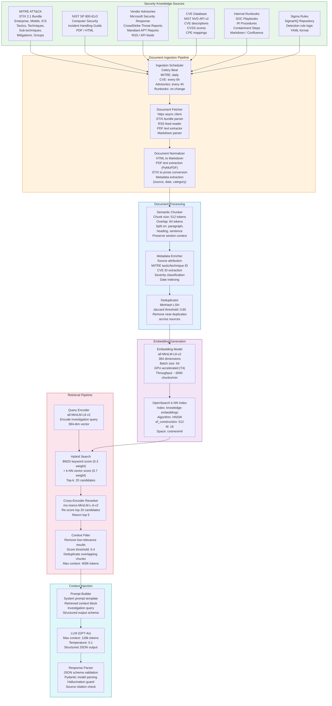
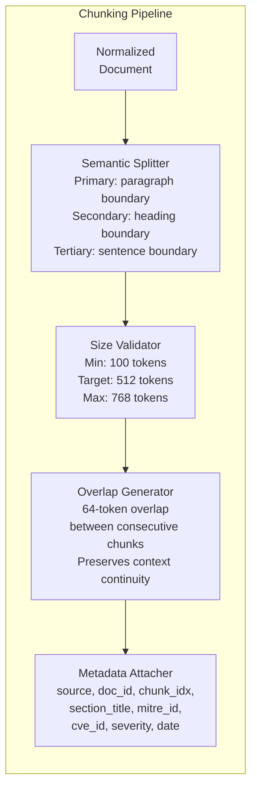
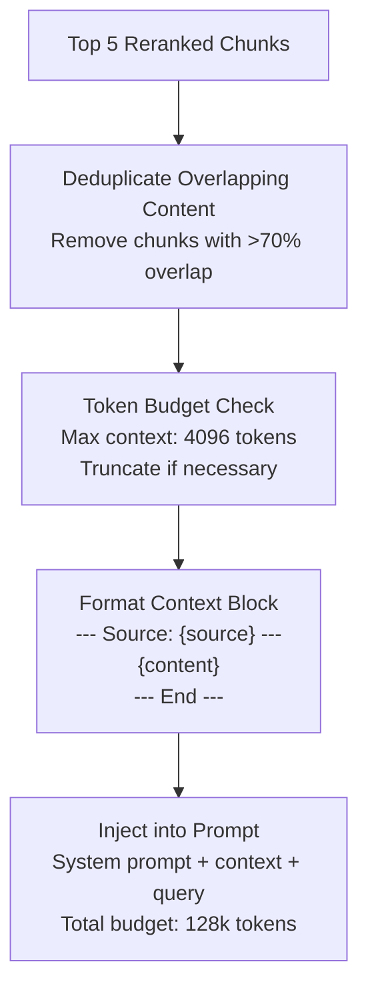

# RAG Pipeline Architecture

## Overview

The Retrieval-Augmented Generation (RAG) pipeline provides the SOC Analyst Agent with grounded, up-to-date security knowledge. It ingests authoritative security knowledge bases -- MITRE ATT&CK, NIST incident response guidelines, vendor security advisories, and internal runbooks -- chunks and embeds them into OpenSearch, and retrieves contextually relevant passages to augment LLM prompts during alert investigation.

## RAG Pipeline Diagram



## Knowledge Sources

### MITRE ATT&CK

| Parameter | Value |
|-----------|-------|
| Format | STIX 2.1 JSON Bundle |
| Source URL | `https://raw.githubusercontent.com/mitre/cti/master/enterprise-attack/enterprise-attack.json` |
| Update Frequency | Daily at 02:00 UTC |
| Content | 14 tactics, 201 techniques, 424 sub-techniques, 138 groups, 680 software entries |
| Processing | STIX objects converted to prose descriptions with technique ID, tactic phase, procedure examples |
| Chunk Strategy | One chunk per technique/sub-technique (avg. 300-500 tokens each) |

### NIST SP 800-61r3

| Parameter | Value |
|-----------|-------|
| Format | PDF (converted to Markdown) |
| Source URL | `https://csrc.nist.gov/pubs/sp/800/61/r3/final` |
| Update Frequency | On publication (manual trigger) |
| Content | Incident handling lifecycle: preparation, detection, analysis, containment, eradication, recovery |
| Processing | PDF text extraction via PyMuPDF, section-aware chunking |
| Chunk Strategy | Section-based splitting with heading hierarchy preserved |

### Vendor Security Advisories

| Source | Format | Update Frequency | Content |
|--------|--------|------------------|---------|
| Microsoft Security Response Center | RSS/API | Every 4 hours | CVE advisories, patch Tuesday bulletins |
| CrowdStrike Threat Intel | API | Every 4 hours | APT group reports, malware analyses |
| Mandiant Threat Intel | RSS | Every 4 hours | Campaign reports, IOC publications |
| CISA Known Exploited Vulnerabilities | JSON | Every 6 hours | KEV catalog with exploitation status |
| US-CERT Alerts | RSS | Every 4 hours | Critical vulnerability alerts |

### CVE Database (NIST NVD)

| Parameter | Value |
|-----------|-------|
| Source API | `https://services.nvd.nist.gov/rest/json/cves/2.0` |
| Update Frequency | Every 6 hours (modified date filter) |
| Content | CVE descriptions, CVSS v3.1 scores, CWE mappings, CPE applicability |
| Processing | JSON response parsed, descriptions chunked with CVE ID as metadata |
| Retention | Last 2 years of CVEs (configurable) |

### Sigma Rules

| Parameter | Value |
|-----------|-------|
| Source | `https://github.com/SigmaHQ/sigma` (Git clone) |
| Update Frequency | Daily at 03:00 UTC |
| Content | Detection rules in YAML format with title, description, detection logic, ATT&CK tags |
| Processing | YAML parsed, rule description + detection logic converted to prose |
| Chunk Strategy | One chunk per Sigma rule |

## Chunking Strategy



| Parameter | Value | Rationale |
|-----------|-------|-----------|
| Target Chunk Size | 512 tokens | Balances retrieval precision with sufficient context |
| Chunk Overlap | 64 tokens | Prevents information loss at chunk boundaries |
| Minimum Chunk Size | 100 tokens | Avoids fragments that lack semantic meaning |
| Maximum Chunk Size | 768 tokens | Prevents dilution of retrieval relevance |
| Split Boundaries | Paragraph > Heading > Sentence | Preserves logical structure of security documentation |
| Tokenizer | tiktoken (cl100k_base) | Matches GPT-4o tokenization for accurate sizing |

## Embedding Model

| Parameter | Value |
|-----------|-------|
| Model | `sentence-transformers/all-MiniLM-L6-v2` |
| Dimensions | 384 |
| Max Sequence Length | 256 tokens |
| Inference Device | NVIDIA T4 GPU (g4dn.xlarge) |
| Batch Size | 64 |
| Throughput | ~3000 chunks/minute (GPU) |
| Normalization | L2 normalized embeddings |
| Similarity Metric | Cosine similarity |

## OpenSearch Index Configuration

```json
{
  "settings": {
    "index": {
      "knn": true,
      "knn.algo_param.ef_search": 256,
      "number_of_shards": 3,
      "number_of_replicas": 1
    }
  },
  "mappings": {
    "properties": {
      "embedding": {
        "type": "knn_vector",
        "dimension": 384,
        "method": {
          "name": "hnsw",
          "space_type": "cosinesimil",
          "engine": "nmslib",
          "parameters": {
            "ef_construction": 512,
            "m": 16
          }
        }
      },
      "content": { "type": "text", "analyzer": "standard" },
      "source": { "type": "keyword" },
      "doc_id": { "type": "keyword" },
      "chunk_index": { "type": "integer" },
      "section_title": { "type": "text" },
      "mitre_technique_id": { "type": "keyword" },
      "mitre_tactic": { "type": "keyword" },
      "cve_id": { "type": "keyword" },
      "severity": { "type": "keyword" },
      "ingested_at": { "type": "date" },
      "source_updated_at": { "type": "date" }
    }
  }
}
```

## Retrieval Pipeline

### Hybrid Search

The retrieval pipeline uses a hybrid search strategy combining lexical (BM25) and semantic (k-NN vector) search to maximize recall for security-specific terminology.

| Component | Weight | Purpose |
|-----------|--------|---------|
| BM25 Keyword Search | 0.3 | Exact match on technical terms: CVE IDs, technique IDs, IP addresses, hash values |
| k-NN Vector Search | 0.7 | Semantic similarity for conceptual matches: attack patterns, investigation procedures |
| Combined Score | `0.3 * bm25_score + 0.7 * knn_score` | Normalized to [0, 1] range |
| Initial Candidates | 20 | Retrieved before reranking |

### Cross-Encoder Reranker

| Parameter | Value |
|-----------|-------|
| Model | `cross-encoder/ms-marco-MiniLM-L-6-v2` |
| Input | Query + candidate chunk pairs (top 20) |
| Output | Relevance score per pair |
| Final Selection | Top 5 by reranker score |
| Score Threshold | 0.4 (chunks below this are discarded) |
| Latency | ~50ms for 20 candidates (GPU) |

### Context Assembly



## Prompt Template Structure

```
SYSTEM: You are an expert SOC analyst assistant. Use ONLY the provided context
to answer questions about security incidents, MITRE ATT&CK techniques, and
investigation procedures. If the context does not contain relevant information,
state that clearly. Always cite the source of your information.

CONTEXT:
--- Source: MITRE ATT&CK T1566.001 ---
[Retrieved chunk about spearphishing attachment technique...]
--- End ---

--- Source: NIST SP 800-61r3 Section 3.2 ---
[Retrieved chunk about initial analysis procedures...]
--- End ---

--- Source: CrowdStrike Threat Report 2024-0892 ---
[Retrieved chunk about related APT campaign...]
--- End ---

USER: {investigation_query}

Respond in the following JSON format:
{structured_output_schema}
```

## Pipeline Metrics

| Metric | Target | Measurement |
|--------|--------|-------------|
| Ingestion Throughput | > 1000 chunks/min | Chunks indexed per minute during sync |
| Embedding Latency | < 5ms per chunk | Average embedding generation time |
| Retrieval Latency (p95) | < 200ms | Time from query to top-5 results |
| Reranking Latency (p95) | < 100ms | Time for cross-encoder reranking |
| End-to-End RAG Latency (p95) | < 500ms | Query to formatted context block |
| Knowledge Base Freshness | < 6 hours | Maximum staleness for any source |
| Index Size | < 50 GB | Total OpenSearch index storage |
| Retrieval Recall@5 | > 0.85 | Relevant chunks in top 5 results (evaluated quarterly) |
