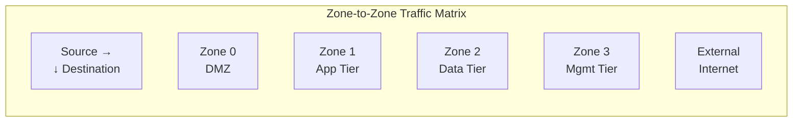

# Security Zones Architecture

## Overview

The SOC Analyst Agent infrastructure is partitioned into four security zones with strict network segmentation and firewall rules between zones. Each zone has a defined trust level, and traffic between zones is controlled by security groups, network ACLs, and application-level authentication. This defense-in-depth approach ensures that a breach in one zone does not automatically grant access to other zones.

## Security Zone Diagram

```mermaid
graph TB
    subgraph Zone_0["Zone 0: DMZ (Trust Level: None)"]
        direction TB
        alb["Application Load Balancer<br/>10.0.1.0/24, 10.0.2.0/24<br/>Ports: 443 (HTTPS)<br/>TLS 1.3 termination<br/>WAF v2 (OWASP Core Rules)"]
        nat["NAT Gateways<br/>Outbound-only internet access<br/>for application tier"]
        waf_rules["WAF Rules:<br/>- Rate limit: 1000 req/5min per IP<br/>- SQL injection detection<br/>- XSS filter<br/>- Path traversal block<br/>- Geographic IP block (configurable)<br/>- Bot control (CAPTCHA challenge)<br/>- IP reputation list"]
    end

    subgraph Zone_1["Zone 1: Application Tier (Trust Level: Low)"]
        direction TB
        subgraph Frontends["Frontend Layer"]
            dashboard["Next.js Dashboard<br/>10.0.10.x:3000<br/>Server-side rendered<br/>CSP headers enforced<br/>httpOnly secure cookies"]
        end
        subgraph API_Layer["API Layer"]
            api["FastAPI API<br/>10.0.10.x:8000<br/>JWT validation<br/>Rate limiting<br/>Input validation (Pydantic)<br/>CORS: soc.example.com only"]
            a2a["A2A Handler<br/>10.0.10.x:8003<br/>mTLS client cert required<br/>Agent allowlist enforced"]
        end
        subgraph Processing["Processing Layer"]
            engine["Agent Engine<br/>10.0.10.x:50051<br/>gRPC with TLS<br/>Internal-only access"]
            rag["RAG Pipeline<br/>10.0.10.x:8001<br/>Internal HTTP<br/>No external access"]
            mcp["MCP Server<br/>10.0.10.x:8002<br/>Internal HTTP<br/>Secret rotation enforcement"]
            workers["Celery Workers<br/>No exposed ports<br/>Pull-based task execution<br/>Least-privilege IRSA"]
        end
    end

    subgraph Zone_2["Zone 2: Data Tier (Trust Level: Medium)"]
        direction TB
        postgres["PostgreSQL 16<br/>10.0.20.10:5432<br/>TLS 1.3 required (sslmode=verify-full)<br/>Row-level security<br/>Connection via PgBouncer<br/>Max connections: 200<br/>Audit logging enabled"]
        redis["Redis 7.2<br/>10.0.20.20:6379<br/>TLS in-transit encryption<br/>AUTH password required<br/>ACL: per-service user<br/>No KEYS command allowed<br/>maxmemory-policy: allkeys-lru"]
        opensearch["OpenSearch 2.11<br/>10.0.20.30:9200<br/>TLS node-to-node encryption<br/>Fine-grained access control<br/>SAML/IAM role mapping<br/>Field-level security"]
        s3["S3 Bucket<br/>VPC endpoint access only<br/>No public access<br/>SSE-S3 encryption<br/>Bucket policy: VPC-only<br/>Access logging enabled<br/>Object lock (compliance mode)"]
    end

    subgraph Zone_3["Zone 3: Management Tier (Trust Level: High)"]
        direction TB
        bastion["Bastion Host<br/>10.0.30.10:22<br/>MFA required (TOTP)<br/>SSH key + certificate auth<br/>Session recording enabled<br/>30-min idle timeout<br/>No root login"]
        vpn["Client VPN<br/>10.0.30.0/24<br/>OpenVPN over UDP/443<br/>Mutual TLS + SAML auth<br/>MFA enforced via IdP<br/>Split tunnel enabled<br/>Connection logging"]
        secrets_mgr["AWS Secrets Manager<br/>VPC endpoint access<br/>30-day auto-rotation<br/>KMS CMK encryption<br/>IAM policy: IRSA only<br/>Access logging to CloudTrail"]
        monitoring["Monitoring Access<br/>Grafana: OIDC SSO<br/>Prometheus: internal only<br/>OpenSearch Dashboards: VPN only<br/>Read-only for most users"]
    end

    subgraph Firewall_Rules["Inter-Zone Firewall Rules"]
        direction TB
        fw_01["Zone 0 → Zone 1<br/>ALLOW TCP/8000 (API)<br/>ALLOW TCP/3000 (Dashboard)<br/>DENY all other"]
        fw_12["Zone 1 → Zone 2<br/>ALLOW TCP/5432 (PostgreSQL)<br/>ALLOW TCP/6379 (Redis)<br/>ALLOW TCP/9200 (OpenSearch)<br/>ALLOW HTTPS/443 (S3 endpoint)<br/>DENY all other"]
        fw_13["Zone 1 → Zone 3<br/>DENY all<br/>(no app-tier to mgmt access)"]
        fw_21["Zone 2 → Zone 1<br/>ALLOW TCP/1024-65535 (return traffic)<br/>DENY initiated connections"]
        fw_31["Zone 3 → Zone 1<br/>ALLOW TCP/22 (SSH from bastion)<br/>ALLOW TCP/8000 (API health checks)<br/>DENY all other"]
        fw_32["Zone 3 → Zone 2<br/>ALLOW TCP/5432 (DB admin from bastion)<br/>ALLOW TCP/9200 (OpenSearch admin)<br/>DENY all other"]
        fw_ext["Zone 1 → External (via NAT)<br/>ALLOW TCP/443 (Threat Intel APIs)<br/>ALLOW TCP/443 (LLM API)<br/>ALLOW TCP/443 (Ticketing APIs)<br/>ALLOW TCP/8089 (Splunk via VPN)<br/>DENY all other outbound"]
    end

    Zone_0 -->|fw_01| Zone_1
    Zone_1 -->|fw_12| Zone_2
    Zone_1 -.->|fw_13 DENY| Zone_3
    Zone_2 -->|fw_21 return only| Zone_1
    Zone_3 -->|fw_31| Zone_1
    Zone_3 -->|fw_32| Zone_2

    style Zone_0 fill:#fce4ec,stroke:#c62828
    style Zone_1 fill:#fff3e0,stroke:#f57c00
    style Zone_2 fill:#e3f2fd,stroke:#1565c0
    style Zone_3 fill:#e8f5e9,stroke:#388e3c
```

## Zone Definitions

### Zone 0: DMZ (Demilitarized Zone)

| Property | Value |
|----------|-------|
| Trust Level | None (untrusted) |
| CIDR | 10.0.1.0/24, 10.0.2.0/24 |
| Purpose | Terminate external TLS connections, filter malicious traffic |
| Components | ALB, NAT Gateways, WAF v2 |
| Inbound Sources | Internet (0.0.0.0/0) |
| Outbound Destinations | Zone 1 (application ports only) |
| Security Controls | WAF rules, TLS 1.3 only, rate limiting, IP reputation filtering |
| Monitoring | ALB access logs, WAF logs, VPC flow logs |

### Zone 1: Application Tier

| Property | Value |
|----------|-------|
| Trust Level | Low |
| CIDR | 10.0.10.0/24, 10.0.11.0/24 |
| Purpose | Run application logic, process alerts, execute investigations |
| Components | API, Dashboard, Agent Engine, RAG, MCP, A2A, Celery Workers |
| Inbound Sources | Zone 0 (ALB), Zone 3 (bastion SSH) |
| Outbound Destinations | Zone 2 (databases), External (via NAT), On-prem (via VPN) |
| Security Controls | JWT auth, API key validation, mTLS for A2A, input validation, CORS |
| Monitoring | Application metrics (Prometheus), structured JSON logs (Fluent Bit) |

### Zone 2: Data Tier

| Property | Value |
|----------|-------|
| Trust Level | Medium (stores sensitive data) |
| CIDR | 10.0.20.0/24, 10.0.21.0/24 |
| Purpose | Persist alerts, investigations, IOC data, security knowledge |
| Components | PostgreSQL, Redis, OpenSearch, S3 |
| Inbound Sources | Zone 1 (application ports only), Zone 3 (admin from bastion) |
| Outbound Destinations | None (no outbound internet access) |
| Security Controls | TLS required, authentication required, encryption at rest, row-level security, audit logging |
| Monitoring | RDS Performance Insights, ElastiCache CloudWatch, OpenSearch slow logs |

### Zone 3: Management Tier

| Property | Value |
|----------|-------|
| Trust Level | High (administrative access) |
| CIDR | 10.0.30.0/24 |
| Purpose | Secure administrative access, secrets management, monitoring |
| Components | Bastion host, Client VPN, Secrets Manager, Monitoring dashboards |
| Inbound Sources | VPN clients (authenticated SOC admins only) |
| Outbound Destinations | Zone 1 (SSH, health checks), Zone 2 (database admin) |
| Security Controls | MFA required, session recording, IP allowlist, certificate auth |
| Monitoring | SSH session logs, VPN connection logs, Secrets Manager access logs |

## Traffic Flow Matrix

| Source \ Destination | Zone 0 (DMZ) | Zone 1 (App) | Zone 2 (Data) | Zone 3 (Mgmt) | External |
|---------------------|--------------|--------------|---------------|----------------|----------|
| **Zone 0 (DMZ)** | N/A | TCP/8000, TCP/3000 | DENY | DENY | N/A |
| **Zone 1 (App)** | DENY | Internal (gRPC/50051, HTTP/8001-8003) | TCP/5432, TCP/6379, TCP/9200, HTTPS/443 (S3) | DENY | TCP/443 (APIs via NAT) |
| **Zone 2 (Data)** | DENY | TCP/1024-65535 (return) | Internal replication | DENY | DENY |
| **Zone 3 (Mgmt)** | DENY | TCP/22 (SSH) | TCP/5432, TCP/9200 | Internal | TCP/443 (AWS APIs) |
| **External** | TCP/443 (HTTPS) | DENY | DENY | UDP/443 (VPN) | N/A |
| **On-Prem (VPN)** | DENY | TCP/8089 (Splunk), TCP/9200 (Elastic), TCP/636 (LDAPS) | DENY | DENY | N/A |

## Security Controls by Zone

### WAF Rules (Zone 0)

| Rule | Action | Priority | Description |
|------|--------|----------|-------------|
| IP Reputation | Block | 1 | Block known malicious IPs (AWS IP Reputation List) |
| Rate Limit | Block (429) | 2 | 1000 requests per 5 minutes per source IP |
| SQL Injection | Block | 3 | AWS Managed SQLi Rule Set |
| XSS | Block | 4 | AWS Managed XSS Rule Set |
| Path Traversal | Block | 5 | Block `../` and encoded variants |
| Bad Bot | Challenge (CAPTCHA) | 6 | AWS Bot Control |
| Geo Restriction | Block | 7 | Block configurable country list |
| Size Constraint | Block | 8 | Max body size: 10 MB |
| Default | Allow | 99 | Pass to application |

### Application Security (Zone 1)

| Control | Implementation | Component |
|---------|---------------|-----------|
| Authentication | JWT RS256 (15-min TTL) | API middleware |
| Authorization | RBAC with 5 roles | API middleware |
| Input Validation | Pydantic v2 strict mode | All API endpoints |
| CORS | `soc.example.com` only | API config |
| CSP | `default-src 'self'; script-src 'self'` | Dashboard headers |
| HSTS | `max-age=31536000; includeSubDomains; preload` | Ingress annotation |
| X-Frame-Options | `DENY` | All responses |
| X-Content-Type-Options | `nosniff` | All responses |
| Referrer-Policy | `strict-origin-when-cross-origin` | All responses |
| Rate Limiting | Sliding window (Redis-backed) | API middleware |
| Pod Security | `runAsNonRoot`, `readOnlyRootFilesystem`, `allowPrivilegeEscalation: false` | Pod security context |

### Data Security (Zone 2)

| Control | Implementation | Component |
|---------|---------------|-----------|
| Encryption at Rest | AES-256 via KMS CMK | All data stores |
| Encryption in Transit | TLS 1.3 required | All connections |
| Access Authentication | Password + certificate | PostgreSQL, Redis |
| Row-Level Security | PostgreSQL RLS policies | Multi-tenant isolation |
| Field-Level Security | OpenSearch FLS | PII field masking |
| Connection Limits | PgBouncer: max 100 per service | PostgreSQL |
| Audit Logging | `pgaudit` extension | PostgreSQL |
| Backup Encryption | KMS CMK | RDS snapshots, S3 objects |
| No Public Access | VPC endpoint only, no internet route | S3 bucket |

### Management Security (Zone 3)

| Control | Implementation | Component |
|---------|---------------|-----------|
| Multi-Factor Auth | TOTP + certificate | Bastion SSH, VPN |
| Session Recording | AWS SSM Session Manager | Bastion host |
| Idle Timeout | 30 minutes | SSH, VPN |
| Certificate Auth | X.509 from internal PKI | VPN, bastion |
| IP Allowlist | VPN CIDR only | Security groups |
| Secret Rotation | 30-day automatic | Secrets Manager |
| Access Logging | CloudTrail + CloudWatch | All management operations |
| Break-Glass Access | Dual-approval required, time-limited | Emergency admin access |

## Compliance Mapping

| Security Control | SOC 2 Type II | ISO 27001 | NIST CSF |
|-----------------|---------------|-----------|----------|
| Network Segmentation | CC6.1 | A.13.1.3 | PR.AC-5 |
| Encryption at Rest | CC6.1 | A.10.1.1 | PR.DS-1 |
| Encryption in Transit | CC6.1 | A.10.1.1 | PR.DS-2 |
| Access Control (RBAC) | CC6.3 | A.9.4.1 | PR.AC-4 |
| MFA | CC6.1 | A.9.4.2 | PR.AC-7 |
| Audit Logging | CC7.2 | A.12.4.1 | DE.CM-3 |
| Incident Detection | CC7.3 | A.16.1.4 | DE.AE-2 |
| Secret Management | CC6.1 | A.10.1.2 | PR.DS-6 |
| Vulnerability Management | CC7.1 | A.12.6.1 | ID.RA-1 |
| Backup and Recovery | CC7.5 | A.12.3.1 | PR.IP-4 |
