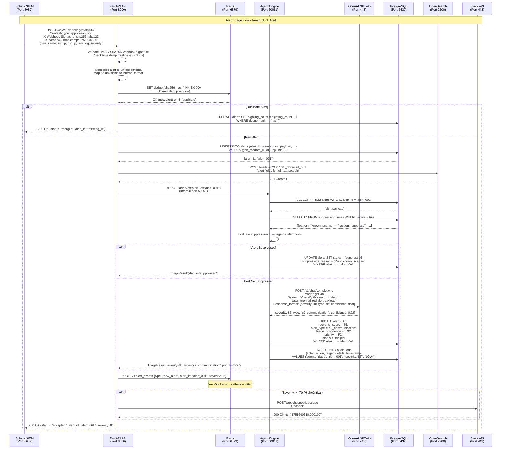
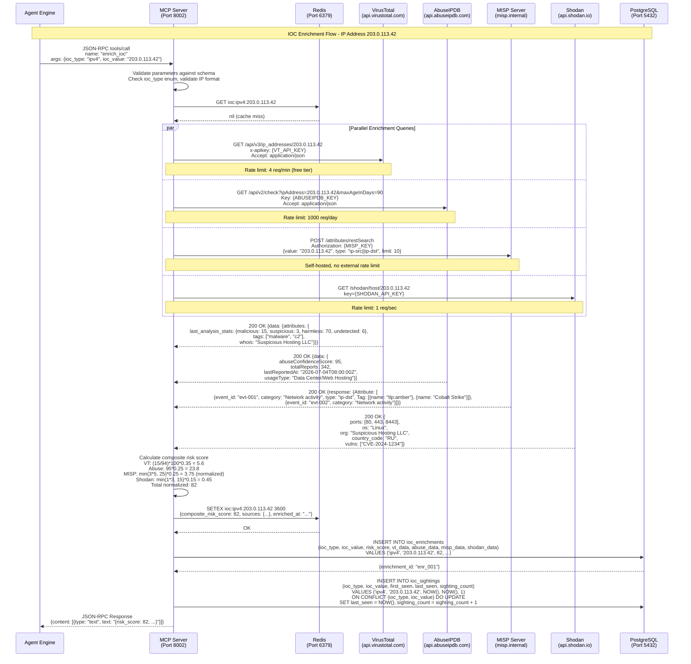
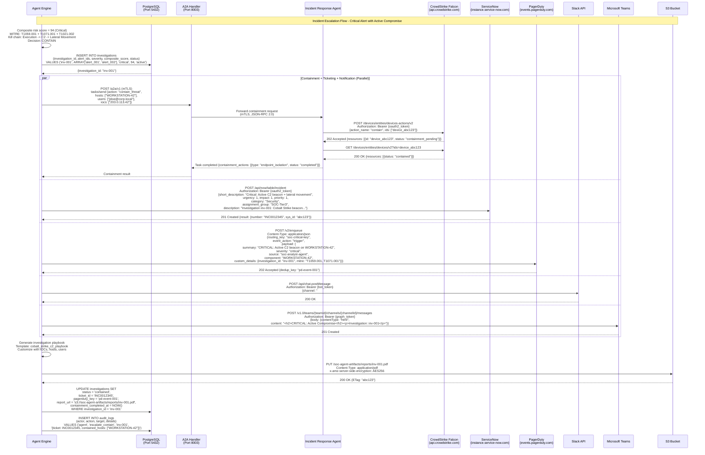
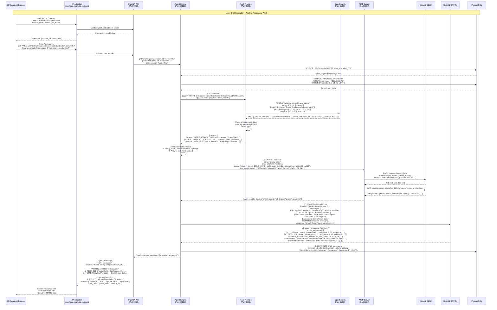

# Sequence Diagrams

## Overview

This document contains detailed sequence diagrams for the four primary interaction flows of the SOC Analyst Agent: alert triage, IOC enrichment, incident escalation, and user chat interaction. Each diagram traces the complete message flow between components with protocols, ports, and data formats.

## 1. Alert Triage Flow

## 2. IOC Enrichment Flow

## 3. Incident Escalation Flow

## 4. User Chat Interaction Flow

## Sequence Diagram Summary

| Flow | Components Involved | Avg Duration (p95) | Key Protocol |
|------|--------------------|--------------------|--------------|
| Alert Triage | Splunk -> API -> Redis -> Engine -> LLM -> PG -> Slack | 3.5s | HTTPS, gRPC, JSON-RPC |
| IOC Enrichment | Engine -> MCP -> VT/Abuse/MISP/Shodan -> Redis -> PG | 8.2s | HTTPS, JSON-RPC |
| Incident Escalation | Engine -> A2A/IR -> EDR + SNOW + PD + Slack + Teams | 12.5s | mTLS, OAuth2, REST |
| User Chat | Browser -> WS -> API -> Engine -> RAG/MCP -> LLM | 6.8s | WebSocket, gRPC, HTTPS |
