# System Context Diagram

## Overview

The SOC Analyst Agent operates as an AI-powered Security Operations Center analyst that ingests alerts from multiple SIEM platforms, enriches indicators of compromise (IOCs) with threat intelligence feeds, correlates events across data sources, maps attacker behavior to the MITRE ATT&CK framework, and generates actionable investigation playbooks. This diagram shows all external systems the agent interacts with.

## System Context Diagram

```mermaid
C4Context
    title SOC Analyst Agent - System Context

    Person(soc_analyst, "SOC Analyst", "Security analyst who reviews triaged alerts, investigation reports, and escalation recommendations")
    Person(soc_manager, "SOC Manager", "Manages SOC operations, reviews metrics dashboards and agent performance")
    Person(ir_lead, "Incident Response Lead", "Receives escalated incidents with full investigation context")

    System(soc_agent, "SOC Analyst Agent", "AI-powered SOC analyst that triages alerts, enriches IOCs, correlates events, maps to MITRE ATT&CK, and generates investigation playbooks")

    System_Ext(splunk, "Splunk SIEM", "Primary SIEM platform for log aggregation and alerting via REST API on port 8089")
    System_Ext(elastic, "Elastic SIEM", "Elasticsearch-based SIEM with Kibana dashboards, REST API on port 9200")
    System_Ext(sentinel, "Microsoft Sentinel", "Cloud-native SIEM on Azure, accessed via Microsoft Graph Security API")

    System_Ext(crowdstrike, "CrowdStrike Falcon", "EDR platform providing endpoint telemetry and threat detections via OAuth2 API")
    System_Ext(defender, "Microsoft Defender for Endpoint", "EDR providing endpoint alerts and device inventory via Microsoft Graph API")
    System_Ext(carbon_black, "VMware Carbon Black", "EDR platform for endpoint detection and response via REST API on port 443")

    System_Ext(virustotal, "VirusTotal", "Malware and URL analysis service, queried via REST API v3 with API key authentication")
    System_Ext(abuseipdb, "AbuseIPDB", "IP address abuse reporting and lookup service via REST API v2")
    System_Ext(misp, "MISP", "Malware Information Sharing Platform for threat intelligence sharing via REST API on port 443")
    System_Ext(otx, "AlienVault OTX", "Open Threat Exchange for IOC enrichment via DirectConnect API")
    System_Ext(shodan, "Shodan", "Internet-wide scanning data for IP reconnaissance via REST API")

    System_Ext(cmdb, "ServiceNow CMDB", "Configuration Management Database for asset context and ownership lookup via REST API")
    System_Ext(ad, "Active Directory", "Directory service for user and device identity resolution via LDAP on port 636")

    System_Ext(servicenow, "ServiceNow ITSM", "IT Service Management for incident ticket creation and tracking via REST API")
    System_Ext(jira, "Jira Service Management", "Issue tracking for security incident workflow management via REST API v3")
    System_Ext(pagerduty, "PagerDuty", "Incident alerting and on-call management via Events API v2 on port 443")

    System_Ext(slack, "Slack", "Team messaging for real-time alert notifications via Bot API and Webhooks")
    System_Ext(teams, "Microsoft Teams", "Enterprise messaging for escalation notifications via Graph API and Webhooks")
    System_Ext(email, "SMTP Email Gateway", "Email notifications for daily summary reports and critical escalations via SMTP on port 587")

    Rel(soc_analyst, soc_agent, "Reviews triaged alerts, initiates investigations", "HTTPS/443")
    Rel(soc_manager, soc_agent, "Monitors dashboards, configures policies", "HTTPS/443")
    Rel(ir_lead, soc_agent, "Receives escalated incidents", "HTTPS/443")

    Rel(soc_agent, splunk, "Queries logs, retrieves alerts", "HTTPS/8089, REST API")
    Rel(soc_agent, elastic, "Searches events, retrieves detections", "HTTPS/9200, REST API")
    Rel(soc_agent, sentinel, "Fetches security incidents", "HTTPS/443, Graph API")

    Rel(soc_agent, crowdstrike, "Retrieves endpoint detections", "HTTPS/443, OAuth2")
    Rel(soc_agent, defender, "Queries endpoint alerts", "HTTPS/443, Graph API")
    Rel(soc_agent, carbon_black, "Fetches endpoint events", "HTTPS/443, REST API")

    Rel(soc_agent, virustotal, "Submits hashes, URLs, IPs for analysis", "HTTPS/443, API Key")
    Rel(soc_agent, abuseipdb, "Checks IP reputation scores", "HTTPS/443, API Key")
    Rel(soc_agent, misp, "Queries and shares IOCs", "HTTPS/443, Auth Key")
    Rel(soc_agent, otx, "Retrieves pulse indicators", "HTTPS/443, API Key")
    Rel(soc_agent, shodan, "Queries IP and host data", "HTTPS/443, API Key")

    Rel(soc_agent, cmdb, "Resolves asset ownership and criticality", "HTTPS/443, OAuth2")
    Rel(soc_agent, ad, "Resolves user identities and group memberships", "LDAPS/636")

    Rel(soc_agent, servicenow, "Creates and updates incident tickets", "HTTPS/443, OAuth2")
    Rel(soc_agent, jira, "Creates security issues and tracks workflow", "HTTPS/443, API Token")
    Rel(soc_agent, pagerduty, "Triggers on-call escalations", "HTTPS/443, Events API v2")

    Rel(soc_agent, slack, "Sends alert notifications and summaries", "HTTPS/443, Bot Token")
    Rel(soc_agent, teams, "Posts escalation cards and updates", "HTTPS/443, Graph API")
    Rel(soc_agent, email, "Sends daily reports and critical alerts", "SMTP/587, TLS")
```

## External System Details

### SIEM Platforms

| System | Protocol | Port | Authentication | Purpose |
|--------|----------|------|----------------|---------|
| Splunk | HTTPS REST API | 8089 | Bearer Token / Basic Auth | Primary alert source, SPL query execution, notable event retrieval |
| Elastic SIEM | HTTPS REST API | 9200 | API Key / Basic Auth | Detection rule alerts, EQL queries, event correlation |
| Microsoft Sentinel | Microsoft Graph Security API | 443 | OAuth2 Client Credentials | Cloud-native incident ingestion, KQL query execution |

### EDR Platforms

| System | Protocol | Port | Authentication | Purpose |
|--------|----------|------|----------------|---------|
| CrowdStrike Falcon | HTTPS REST API | 443 | OAuth2 Client Credentials | Endpoint detections, device context, IOC submission |
| Microsoft Defender | Microsoft Graph Security API | 443 | OAuth2 Client Credentials | Endpoint alerts, device inventory, automated investigation |
| Carbon Black | HTTPS REST API | 443 | API Key + Custom Auth | Process events, binary analysis, device quarantine |

### Threat Intelligence

| System | Protocol | Port | Authentication | Purpose |
|--------|----------|------|----------------|---------|
| VirusTotal | HTTPS REST API v3 | 443 | x-apikey Header | File hash analysis, URL scanning, IP/domain reputation |
| AbuseIPDB | HTTPS REST API v2 | 443 | Key Header | IP abuse confidence scoring, report submission |
| MISP | HTTPS REST API | 443 | Authorization Header | IOC sharing, event correlation, galaxy cluster enrichment |
| AlienVault OTX | HTTPS DirectConnect API | 443 | X-OTX-API-KEY Header | Pulse-based IOC enrichment, threat context |
| Shodan | HTTPS REST API | 443 | API Key Parameter | Internet-facing asset reconnaissance, port/service data |

### Asset and Identity

| System | Protocol | Port | Authentication | Purpose |
|--------|----------|------|----------------|---------|
| ServiceNow CMDB | HTTPS REST API | 443 | OAuth2 | Asset ownership, criticality classification, business service mapping |
| Active Directory | LDAPS | 636 | Kerberos / LDAP Bind | User identity resolution, group membership, OU hierarchy |

### Ticketing and Incident Management

| System | Protocol | Port | Authentication | Purpose |
|--------|----------|------|----------------|---------|
| ServiceNow ITSM | HTTPS REST API | 443 | OAuth2 Client Credentials | Incident ticket creation, SLA tracking, workflow automation |
| Jira Service Management | HTTPS REST API v3 | 443 | API Token (Basic Auth) | Security issue tracking, custom workflow transitions |
| PagerDuty | HTTPS Events API v2 | 443 | Routing Key | On-call escalation, incident acknowledgment, severity routing |

### Notification Channels

| System | Protocol | Port | Authentication | Purpose |
|--------|----------|------|----------------|---------|
| Slack | HTTPS Bot API | 443 | Bot OAuth Token | Real-time alert notifications, interactive message buttons |
| Microsoft Teams | HTTPS Graph API / Webhooks | 443 | OAuth2 / Webhook URL | Adaptive card notifications, channel-based escalation |
| SMTP Email Gateway | SMTP over TLS | 587 | SASL Authentication | Daily summary reports, critical alert emails, PDF attachments |

## Data Flow Summary

1. **Inbound**: SIEM alerts and EDR detections flow into the SOC Analyst Agent via scheduled polling and webhook-triggered ingestion.
2. **Enrichment**: The agent queries threat intelligence APIs to score and contextualize IOCs extracted from alerts.
3. **Context**: Asset and identity systems provide ownership, criticality, and organizational context for affected entities.
4. **Outbound**: Triaged alerts generate tickets in ITSM platforms, trigger on-call escalations, and push notifications to messaging channels.
