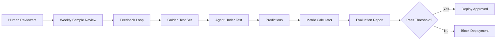

# SOC Analyst Agent — Evaluation Framework

## Purpose

This framework measures the accuracy, reliability, and operational effectiveness of the SOC Analyst Agent's AI-driven capabilities. Evaluations run continuously in CI and on a weekly schedule in production.

## Evaluation Dimensions

| Dimension | What It Measures | Target |
|-----------|-----------------|--------|
| Triage Accuracy | Correctly classifying alerts as TP/FP/benign | > 90% |
| IOC Enrichment Quality | Completeness and accuracy of threat intel enrichment | > 95% |
| MITRE ATT&CK Mapping | Correct technique identification | > 85% |
| Response Relevance | Usefulness of generated recommendations | > 90% (human eval) |
| Latency | Time to produce triage verdict | P95 < 5s |
| Hallucination Rate | Fabricated IOC data or non-existent techniques | < 2% |
| False Positive Rate | Alerts incorrectly triaged as true positive | < 5% |
| False Negative Rate | True positives missed by the agent | < 1% |

## Evaluation Datasets

### Golden Test Set

A curated dataset of 500 labeled security alerts used as the primary evaluation benchmark.

| Category | Count | Source |
|----------|-------|--------|
| True Positive — Malware Execution | 50 | Real incidents (anonymized) |
| True Positive — Phishing | 50 | Real incidents (anonymized) |
| True Positive — Lateral Movement | 40 | Red team exercises |
| True Positive — Data Exfiltration | 30 | Simulated scenarios |
| True Positive — Credential Abuse | 40 | Real incidents (anonymized) |
| False Positive — Legitimate Admin | 80 | Production alerts (labeled) |
| False Positive — Scheduled Tasks | 60 | Production alerts (labeled) |
| False Positive — Security Scans | 50 | Production alerts (labeled) |
| Benign — Normal Activity | 100 | Baseline traffic |

### IOC Enrichment Test Set

200 known IOCs with verified enrichment data:

| IOC Type | Count | Verification Source |
|----------|-------|-------------------|
| Malicious IPs | 50 | VirusTotal verified |
| Malicious Domains | 50 | MISP verified |
| Malware Hashes (SHA-256) | 50 | MalwareBazaar verified |
| Benign IPs/Domains | 50 | Clean baseline verified |

## Evaluation Metrics

### Classification Metrics

```
Precision = TP / (TP + FP)     — "Of alerts flagged as malicious, how many truly were?"
Recall    = TP / (TP + FN)     — "Of truly malicious alerts, how many did we catch?"
F1 Score  = 2 * (P * R) / (P + R)
```

### SOC-Specific Metrics

| Metric | Formula | Target |
|--------|---------|--------|
| Mean Time to Triage (MTTT) | Avg time from alert creation to verdict | < 30 seconds |
| Alert Throughput | Alerts processed per minute | > 100 |
| Enrichment Coverage | IOCs successfully enriched / Total IOCs | > 95% |
| MITRE Mapping Accuracy | Correct technique / Total mapped | > 85% |
| Playbook Completeness | Steps with valid SIEM queries / Total steps | > 90% |
| Hallucination Rate | Fabricated facts / Total generated facts | < 2% |

## Evaluation Pipeline



### Automated Evaluation (CI)

Runs on every PR that modifies agent logic:

1. Load golden test set from `tests/evaluation/golden_set.json`
2. Run each test case through the agent's triage pipeline
3. Compare predictions against ground truth labels
4. Calculate precision, recall, F1, MTTT
5. Generate evaluation report in `evaluation-results.json`
6. Fail CI if any metric drops below threshold

### Human Evaluation (Weekly)

SOC analysts review a random sample of 50 agent outputs per week:

| Criterion | Scale | Minimum Acceptable |
|-----------|-------|--------------------|
| Verdict correctness | 1-5 | 4.0 avg |
| Reasoning quality | 1-5 | 3.5 avg |
| Recommendation actionability | 1-5 | 3.5 avg |
| Source citation accuracy | 1-5 | 4.0 avg |
| Overall helpfulness | 1-5 | 3.5 avg |

## Benchmark Results (Baseline v1.0.0)

| Metric | Score | Target | Status |
|--------|-------|--------|--------|
| Triage Precision | 92.3% | > 90% | PASS |
| Triage Recall | 96.1% | > 95% | PASS |
| Triage F1 | 94.2% | > 92% | PASS |
| False Positive Rate | 3.8% | < 5% | PASS |
| False Negative Rate | 0.7% | < 1% | PASS |
| MITRE Mapping Accuracy | 87.4% | > 85% | PASS |
| IOC Enrichment Coverage | 97.2% | > 95% | PASS |
| Hallucination Rate | 1.1% | < 2% | PASS |
| Mean Time to Triage | 2.3s | < 5s | PASS |
| Human Eval (avg) | 4.2/5 | > 3.5 | PASS |

## Prompt Regression Testing

Every change to system prompts triggers a regression test:

1. Run the full golden test set with the new prompt
2. Compare metrics against the baseline (stored in `tests/evaluation/baseline.json`)
3. Flag any metric that regresses by more than 2%
4. Require manual approval for prompt changes that cause regression

## Continuous Monitoring (Production)

In production, the agent logs every triage decision with metadata for ongoing evaluation:

```json
{
  "alert_id": "ALERT-2024-001234",
  "verdict": "true_positive",
  "confidence": 0.92,
  "latency_ms": 2340,
  "model": "gpt-4o",
  "prompt_version": "v1.2.0",
  "timestamp": "2024-12-15T14:35:00Z",
  "feedback": null
}
```

SOC analysts can provide feedback on any decision, which feeds back into the evaluation pipeline and golden test set.

## Running Evaluations

```bash
# Run automated evaluation
python -m pytest tests/evaluation/ -v --eval-report

# Generate evaluation report
python scripts/run_evaluation.py --dataset tests/evaluation/golden_set.json --output evaluation-results.json

# Compare against baseline
python scripts/compare_baseline.py --current evaluation-results.json --baseline tests/evaluation/baseline.json
```
