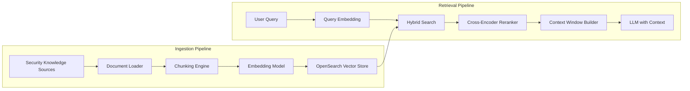

# SOC Analyst Agent — RAG Pipeline Documentation

## Overview

The RAG (Retrieval-Augmented Generation) pipeline augments the SOC Analyst Agent's LLM responses with retrieved context from a curated security knowledge base. This ensures the agent's analysis is grounded in verified security intelligence rather than relying solely on the LLM's training data.

## Architecture



## Data Sources

| Source | Content | Format | Update Schedule | Document Count |
|--------|---------|--------|-----------------|---------------|
| MITRE ATT&CK | Techniques, tactics, mitigations, detections | JSON/STIX | Monthly | ~800 |
| NIST SP 800-61 | Incident response guidelines | PDF | Annually | ~50 pages |
| NIST SP 800-53 | Security controls catalog | JSON | Annually | ~1000 controls |
| CIS Benchmarks | Configuration hardening guides | PDF | Quarterly | ~200 per OS |
| NVD/CVE Database | Vulnerability descriptions and scores | JSON | Daily | ~250,000 |
| Internal Playbooks | SOC standard operating procedures | Markdown | Monthly | ~50 |
| Past Incident Reports | Historical investigation findings | JSON | As created | ~500 |
| Vendor Advisories | Security bulletins from Microsoft, Cisco, Palo Alto | HTML/PDF | Daily | ~5,000 |
| Threat Intel Reports | APT campaign analysis (CISA, Mandiant, CrowdStrike) | PDF | Weekly | ~200 |

## Ingestion Pipeline

### Document Loading

```python
# Document loaders by source type
LOADERS = {
    "pdf": PyPDFLoader,          # NIST, CIS, vendor advisories
    "json": JSONLoader,          # MITRE ATT&CK, NVD, STIX
    "markdown": MarkdownLoader,  # Internal playbooks
    "html": BeautifulSoupLoader, # Vendor advisories
}
```

### Chunking Strategy

| Content Type | Chunk Size | Overlap | Strategy |
|-------------|-----------|---------|----------|
| MITRE Techniques | 1 technique per chunk | 0 | Semantic (one technique = one chunk) |
| NIST Controls | 1 control per chunk | 0 | Semantic (one control = one chunk) |
| Incident Reports | 512 tokens | 64 tokens | Recursive text splitter |
| Vendor Advisories | 512 tokens | 64 tokens | Recursive text splitter |
| SOC Playbooks | 1 step per chunk | 0 | Semantic (one step = one chunk) |
| CVE Descriptions | 1 CVE per chunk | 0 | Semantic (one CVE = one chunk) |

### Embedding Model

| Setting | Value |
|---------|-------|
| Model | `text-embedding-3-large` (OpenAI) or `amazon.titan-embed-text-v2:0` (Bedrock) |
| Dimensions | 1536 (OpenAI) or 1024 (Titan) |
| Batch Size | 100 documents per batch |
| Rate Limit | 3000 RPM (OpenAI) or 1000 RPM (Bedrock) |

### Metadata

Every chunk is stored with metadata for filtered retrieval:

```json
{
  "source": "mitre_attack",
  "technique_id": "T1059.001",
  "tactic": "Execution",
  "title": "PowerShell",
  "last_updated": "2024-12-01",
  "confidence": "high",
  "document_type": "technique_description"
}
```

## Vector Store (OpenSearch)

### Index Configuration

```json
{
  "settings": {
    "index": {
      "knn": true,
      "number_of_shards": 3,
      "number_of_replicas": 1
    }
  },
  "mappings": {
    "properties": {
      "embedding": {
        "type": "knn_vector",
        "dimension": 1536,
        "method": {
          "name": "hnsw",
          "space_type": "cosinesimil",
          "engine": "nmslib",
          "parameters": {
            "ef_construction": 256,
            "m": 48
          }
        }
      },
      "content": { "type": "text", "analyzer": "standard" },
      "title": { "type": "text" },
      "source": { "type": "keyword" },
      "document_type": { "type": "keyword" },
      "technique_id": { "type": "keyword" },
      "tactic": { "type": "keyword" },
      "last_updated": { "type": "date" },
      "confidence": { "type": "keyword" }
    }
  }
}
```

### Index Statistics

| Metric | Value |
|--------|-------|
| Total Documents | ~260,000 |
| Index Size | ~4.2 GB |
| Average Query Latency | 12ms (P50), 35ms (P95) |
| Refresh Interval | 30 seconds |

## Retrieval Pipeline

### Step 1: Query Embedding

The user's query is embedded using the same model as ingestion to ensure vector space alignment.

### Step 2: Hybrid Search

Combines vector similarity search with BM25 keyword search for optimal recall:

```python
hybrid_query = {
    "size": 20,
    "query": {
        "hybrid": {
            "queries": [
                {
                    "knn": {
                        "embedding": {
                            "vector": query_embedding,
                            "k": 20
                        }
                    }
                },
                {
                    "match": {
                        "content": user_query
                    }
                }
            ]
        }
    }
}
```

Weight distribution: 70% vector similarity, 30% BM25 keyword match.

### Step 3: Metadata Filtering

Filters are applied based on the query context:

- Alert triage queries filter by `document_type: ["technique_description", "playbook"]`
- IOC enrichment queries filter by `document_type: ["threat_intel", "cve"]`
- Compliance queries filter by `source: ["nist_800_53", "cis_benchmarks"]`

### Step 4: Cross-Encoder Reranking

Top 20 candidates are reranked using a cross-encoder model for higher precision:

| Setting | Value |
|---------|-------|
| Reranker Model | `cross-encoder/ms-marco-MiniLM-L-12-v2` |
| Input | Query + each candidate passage |
| Output | Relevance score (0-1) |
| Top K after reranking | 5 |

### Step 5: Context Window Building

The top 5 reranked documents are formatted into the context window:

```
[1] PowerShell (T1059.001) - MITRE ATT&CK
Adversaries may abuse PowerShell commands and scripts for execution...

[2] Encoded Command Execution - SOC Playbook
When encountering base64-encoded PowerShell, decode the command first...
```

## Evaluation Metrics

| Metric | Definition | Target | Current |
|--------|-----------|--------|---------|
| Recall@5 | Relevant docs in top 5 / Total relevant | > 80% | 84.2% |
| Recall@20 | Relevant docs in top 20 / Total relevant | > 95% | 96.7% |
| MRR | Mean Reciprocal Rank of first relevant doc | > 0.7 | 0.78 |
| NDCG@5 | Normalized Discounted Cumulative Gain | > 0.75 | 0.81 |
| Latency (P95) | End-to-end retrieval time | < 200ms | 142ms |

## Ingestion Commands

```bash
# Ingest MITRE ATT&CK
python scripts/ingest.py --source mitre_attack --format stix

# Ingest NVD/CVE database
python scripts/ingest.py --source nvd --format json --since 2024-01-01

# Ingest internal playbooks
python scripts/ingest.py --source playbooks --path docs/playbooks/

# Full reindex
python scripts/ingest.py --reindex --confirm

# Check index health
python scripts/ingest.py --health
```
